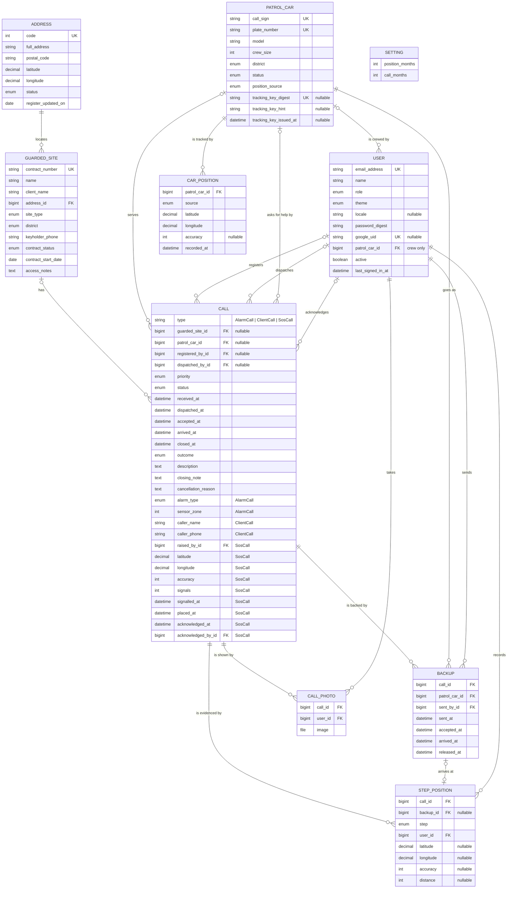
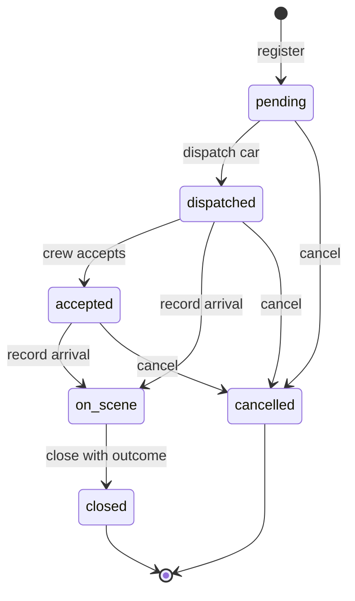

# Patrol Car Call Management System — Specification

## 1. Subject area

### 1.1 Overview

A private security company runs a monitoring centre that operates around the clock. Its clients include households, shops, offices and warehouses. Each client has an alarm system connected to the centre under a monitoring contract. Calls reach the centre in two ways:

- the **alarm system** at the site sends a signal: intrusion sensor, fire detector, panic button, tampering or power failure;
- a **client phones** the centre, for example to ask for a check of the premises.

The dispatcher registers the call and sends a free **patrol car** to the site. The crew reports its arrival, checks the premises and reports the result. The dispatcher then closes the call with an outcome, which ranges from a false alarm to a confirmed intrusion.

### 1.2 Problem

The dispatcher needs the following information on one screen:

- which calls are still waiting;
- which call has waited the longest;
- which cars are free;
- where the sites of the waiting calls are.

Management needs to know how fast crews reach the sites and which sites keep producing false alarms. The system keeps the register of sites, cars and calls, takes site addresses from the national address register, shows sites and active calls on a map, supports the whole life of a call from registration to closing, and calculates these figures.

### 1.3 Users

- **Dispatcher (monitoring centre operator)** — Registers calls, dispatches cars, records arrival and outcome, maintains the lists of sites and cars
- **Shift supervisor** — Reviews statistics and deletes outdated call records
- **Administrator** — Manages users, chooses each car's position source, issues the cars' identifiers for Traccar Client and sets how long car positions and calls are kept (TRK-01, TRK-02, TRK-05, DEL-09), and loads updates of the address register with a command (ADD-09)
- **Patrol crew** — Sees the call of its own car on a phone, gets a notice when the car is sent and reminders until it accepts the call, records the arrival and the closing itself with the position of its phone, takes photos on site, and opens the route to the site (CRW-01 … CRW-10); its phone can be the source of the car's position (TRK-04)

Every user signs in (3.8). The administrator creates the accounts and gives each a role (BR-14); there is no self-registration.

### 1.4 Out of scope

- Automatic reception of signals from alarm panels. The dispatcher enters every call manually.
- Route planning inside the system: the route opens in the phone's own navigation (CRW-08). Between the steps of a call a car is tracked by the source the administrator chose for it, the free Traccar Client app or the crew's phone (TRK-01 … TRK-04).
- Billing and contract fees.
- SMS and e-mail notifications. The only notice is the one on the crew's phone (CRW-04).
- Self-registration and password reset by e-mail. The administrator creates accounts and sets passwords; a user of the staff changes their own (USR-06).

### 1.5 Platform

Web application built with Ruby on Rails, Hotwire and PostgreSQL. The map is drawn with the MapLibre GL library from the system's own copy of OpenStreetMap data. Sign-in is built on the Rails authentication generator, with ALTCHA on the password form and sign-in with Google. The system runs on one server: the application, PostgreSQL and the proxy run in Docker containers deployed with Kamal, and the proxy serves HTTPS with a Let's Encrypt certificate. The image of the application is built on GitHub after every push to `main` and kept in the container registry of GitHub under the name of the record it is built from; a deploy takes the image of the record it deploys and builds nothing. Demo data uses real addresses of public buildings from the address register together with fictitious client names and phone numbers; the repository and the demo database contain no real client data.

### 1.6 External data

- **State Address Register** open data, published daily by the State Land Service of Latvia on data.gov.lv (dataset `varis-atvertie-dati`, licence CC BY 4.0). The system uses the file of building and land addresses `aw_eka.csv`: UTF-8 with a byte order mark, comma-separated, every value in quotes. The file is downloaded when the system is set up and is never stored in the repository.
- **OpenStreetMap data for Latvia**: the extract `latvia-latest.osm.pbf` from Geofabrik, updated daily, licence ODbL. The system keeps its own copies and never calls public OpenStreetMap tile or search servers. It uses the data in two ways:
  - **map** — one vector tile file (PMTiles) of Latvia, built on the server by tilemaker from the extract, with the sea from the OSM water polygons (`water-polygons-split-4326.zip` from osmdata.openstreetmap.de, ODbL); both are downloaded when the map is built, and the file is served with the application; MapLibre GL draws it in the browser (STO-06);
  - **place search** — a Nominatim service loaded with the same extract (Docker image `mediagis/nominatim`), used to find emergency services near a site (FLT-08). The administrator of the machine sets its address.
- **Google sign-in** (OAuth 2.0): the application is registered in Google Cloud. Its client secret is kept only in the encrypted Rails credentials; the key that opens them is never in the repository.
- **ALTCHA**: an open-source check against bots that runs in the browser and on the application's own server, without an external service.
- **Heroicons**: an open set of icons, MIT licence. Twelve of its outline icons are drawn in the header by their paths, kept in the application beside the copyright line of the set; nothing is loaded from outside.
- **Gravatar**: the server asks gravatar.com for the picture of a user's e-mail address only when that user presses _Take from Gravatar_ (USR-07), and keeps the answer. The address leaves the system as its SHA-256; no page of the system loads anything from Gravatar.
- Every map shows "© OpenMapTiles © OpenStreetMap contributors" in its corner, as the OpenMapTiles licence (CC BY 4.0, for the layer schema of the map) and the ODbL ask; every page with an address search shows the State Address Register as the source.

---

## 2. Objects and attributes

### 2.1 Classes

- `GuardedSite` — Premises under a monitoring contract. Own attributes: 10.
- `PatrolCar` — Patrol car with its crew. Own attributes: 10.
- `Address` — Building or land address from the State Address Register. Own attributes: 7.
- `User` — Person who signs in and works with the system. Own attributes: 11.
- `Call` — **Abstract** base for any call to the centre. Own attributes: 15.
  - `AlarmCall` — Call raised by the site's alarm system, **inherits** `Call`. Own attributes: 2.
  - `ClientCall` — Call made by the client by phone, **inherits** `Call`. Own attributes: 2.
  - `SosCall` — Call raised by a crew that asks for help, **inherits** `Call`. Own attributes: 9.
- `Backup` — A further car sent to a call that has its car. Own attributes: 7.
- `StepPosition` — Where the crew's phone was at a step of a call. Own attributes: 8.
- `CallPhoto` — A photo the crew took on site of a call. Own attributes: 3.
- `CarPosition` — A position of a patrol car from its position source. Own attributes: 6.
- `Setting` — What the administrator sets for the whole system. Own attributes: 2.

Together: 10 object types stored in 10 database tables, 13 classes and 92 attributes, not counting `id`, `created_at` and `updated_at`. The technical tables `sessions` of the sign-in, `push_subscriptions` of the notices, and the three tables of Active Storage that keep the photos' files are not subject-area objects. `AlarmCall`, `ClientCall` and `SosCall` share the `calls` table: Rails single-table inheritance stores the class name in a `type` column.

### 2.2 `GuardedSite` — guarded premises

Examples are synthetic.

- `contract_number` — string, required. Unique regardless of letter case. Format `C-` followed by 5 digits. Example: `C-00042`.
- `name` — string, required. 2–100 characters. Example: `Warehouse No. 3`.
- `client_name` — string, required. 2–100 characters. Example: `Example Trade Ltd`.
- `address` — reference → `Address`, required. Chosen from the register by search (FLT-07). Only an address with status `existing` can be chosen (BR-11).
- `site_type` — enum `SiteType`, required. See 2.7. Example: `warehouse`.
- `district` — enum `District`, required. See 2.7. Example: `north`.
- `keyholder_phone` — string, required. `+` followed by 8–15 digits. Example: `+37100000001`.
- `contract_status` — enum `ContractStatus`, required. Default `active`. Example: `active`.
- `contract_start_date` — date, required. Must be a real calendar date. Example: `01.03.2026`.
- `access_notes` — text, optional. Up to 500 characters. Example: `Key box at the gate`.

### 2.3 `PatrolCar` — patrol car

Examples are synthetic.

- `call_sign` — string, required. Unique. 1–3 capital letters, a hyphen, then 1–3 digits. Example: `P-12`.
- `plate_number` — string, required. Unique. 2–10 characters: capital Latin letters, digits and hyphens. Stored in upper case. Example: `ZZ-0001`.
- `model` — string, required. 2–50 characters. Example: `Skoda Octavia`.
- `crew_size` — integer, required. 1–4. Example: `2`.
- `district` — enum `District`, required. Home district of the car. Example: `centre`.
- `status` — enum `CarStatus`, required. Default `available`. Only call operations set `dispatched` and `on_scene` (BR-5). Example: `available`.
- `position_source` — enum `PositionSource`, required. Default `not_tracked`. Where the car's position comes from (BR-20). Example: `traccar`.
- `tracking_key_digest` — string, optional. Unique. The SHA-256 digest of the car's identifier for Traccar Client; the identifier itself is not kept (BR-20).
- `tracking_key_hint` — string, optional. Its first and last four characters, to tell it on the tracking page. Example: `7f3a…c912`.
- `tracking_key_issued_at` — datetime, optional. When the identifier was issued.

`CarPosition` — a position of a patrol car from its position source (TRK-03, BR-20):

- `patrol_car` — reference → `PatrolCar`, required.
- `source` — enum `PositionSource`, required: `traccar` or `crew_phone`, the source it came from.
- `latitude`, `longitude` — decimal, required. Latitude −90…90, longitude −180…180. Example: `56.949600`, `24.105200`.
- `accuracy` — integer, optional. Metres, 0 or more, as the phone reports it. Example: `9`.
- `recorded_at` — datetime, required. When the phone took the position, as Traccar Client reports it; the time it arrived when the phone gives none, and for the crew's phone.

`Setting` — what the administrator sets for the whole system; there is one (TRK-05, DEL-09):

- `position_months` — integer, required. For how many months car positions are kept: 3 to 1200, 24 unless changed (BR-20). Example: `24`.
- `call_months` — integer, required. For how many months a call is kept before it can be deleted: 3 to 1200, 24 unless changed (BR-23). Example: `24`.

### 2.4 `Address` — address from the State Address Register

Records are loaded from the register file (ADD-09) and are not edited by users. The register column is given in brackets. Examples are the first record of the register file.

- `code` — integer, required. Unique. Register code of the address, 9 digits (`KODS`). Example: `101000034`.
- `full_address` — string, required. Full address as written by the register (`STD`). Example: `"Riņņi", Vecates pag., Valmieras nov., LV-4211`.
- `postal_code` — string, optional. Format `LV-` followed by 4 digits (`ATRIB`). Example: `LV-4211`.
- `latitude` — decimal, required. Degrees, 6 decimal places, 55.6–58.1 (`DD_N`). Example: `57.769418`.
- `longitude` — decimal, required. Degrees, 6 decimal places, 20.9–28.3 (`DD_E`). Example: `25.156929`.
- `status` — enum `AddressStatus`, required. See 2.7 (`STATUSS`). Example: `existing`.
- `register_updated_on` — date, required. Last change of the record in the register (`DAT_MOD`, format `yyyy.mm.dd`). Example: `30.06.2021`.

### 2.5 `User` — person who works with the system

The administrator creates the accounts (BR-15). Examples are synthetic.

- `email_address` — string, required. Unique; stored in lower case. Must look like an e-mail address. Example: `dispatcher@example.com`.
- `name` — string, required. 2–100 characters. Example: `Demo Dispatcher`.
- `role` — enum `Role`, required. Default `dispatcher`. See 2.7. Example: `dispatcher`.
- `patrol_car` — reference → `PatrolCar`. Required for the role `crew`, empty for every other role: the car whose calls the crew works. Example: `P-12`.
- `password` — string, stored only as a hash. 12–72 characters, and not more than 72 bytes. Needed for sign-in with a password (AUTH-01).
- `google_uid` — string, optional. Unique. Identifier of the Google account, stored at the first sign-in with Google and cleared when the e-mail address changes (BR-15).
- `active` — boolean, required. Default `true`. An inactive user cannot sign in (BR-13). Example: `true`.
- `theme` — enum `Theme`, required. Default `system`. See 2.7. How the pages look for the user: `system` as the device asks, `light` or `dark` (USR-09). Example: `dark`.
- `locale` — string, optional. The language the user chose for the pages: `en`, `lv` or `ru`; empty until they choose (USR-10). Example: `lv`.
- `last_signed_in_at` — datetime, optional. Filled automatically at every sign-in.
- `avatar` — file, optional. The user's picture: a JPEG, PNG or WebP image of at most 2 MB, kept by Active Storage (USR-07).

`Session` — a technical record of one signed-in browser, created at sign-in and deleted at sign-out, when the user is made inactive, and when the user's password changes (BR-13).

`PushSubscription` — a technical record of one phone that receives the crew's notices (CRW-04), belonging to the crew's sign-in on that phone (`Session`): the address its push service gave it, the two keys that encrypt a notice for it, and the language of the crew screen that last sent it (USR-10). Deleted when the crew turns the notices off on that phone or signs out on it, or when the push service no longer knows the phone.

### 2.6 `Call` (abstract) and its subclasses

Common attributes of `Call`:

- `guarded_site` — reference → `GuardedSite`, required; an `SosCall` has none (BR-21). The site's contract must be `active` when the call is registered (BR-1).
- `patrol_car` — reference → `PatrolCar`, optional. Set when a car is dispatched.
- `priority` — enum `Priority`, required. The default depends on the subclass (BR-2). The dispatcher may change it.
- `status` — enum `CallStatus`, required. Default `pending`. Changes only through the operations in 2.10.
- `received_at` — datetime, required. Default is the current time. Cannot be in the future.
- `dispatched_at` — datetime, optional. Filled automatically. Not earlier than `received_at`.
- `accepted_at` — datetime, optional. Filled automatically when the crew accepts the call, or at the arrival if it was not accepted before (UPD-12, UPD-08). Not earlier than `dispatched_at`.
- `arrived_at` — datetime, optional. Filled automatically. Not earlier than `dispatched_at`.
- `closed_at` — datetime, optional. Filled automatically when the call is closed or cancelled. Not earlier than `received_at`.
- `outcome` — enum `Outcome`. Required when the status becomes `closed`; empty otherwise.
- `description` — text, optional. Up to 1000 characters.
- `closing_note` — text, optional. Up to 1000 characters. What was noted when the call was closed (UPD-09). Example: `Sensor fault in zone 7`.
- `cancellation_reason` — text, optional. Up to 1000 characters. Why the call was cancelled (UPD-10). Example: `Client called back`.
- `registered_by` — reference → `User`, required; empty for an `SosCall` sent by Traccar Client (BR-21). Filled automatically with the signed-in user when the call is registered.
- `dispatched_by` — reference → `User`, optional. Filled automatically with the signed-in user at dispatch.

`AlarmCall` — call raised by the site's alarm system:

- `alarm_type` — enum `AlarmType`, required. See 2.7.
- `sensor_zone` — integer, required. 1–99. Zone number on the alarm panel.

`ClientCall` — call made by the client by phone:

- `caller_name` — string, required. 2–100 characters.
- `caller_phone` — string, required. Same format as `keyholder_phone`.

`SosCall` — call raised by a crew that asks for help (BR-21):

- `raised_by` — reference → `PatrolCar`, required. The car whose crew asks.
- `latitude`, `longitude` — decimal, optional, both or neither: empty when the signal brought no place. Where the last signal with a place came from. Latitude −90…90, longitude −180…180. Example: `56.949600`, `24.105200`.
- `accuracy` — integer, optional. Metres, 0 or more, as the phone reports it. Example: `12`.
- `placed_at` — datetime, optional. When the place was taken: the time of the signal, or earlier when the place is the car's last kept position (ADD-12).
- `signals` — integer, required. 1 or more: how many signals the call has taken. Example: `2`.
- `signalled_at` — datetime, required. When the last signal came.
- `acknowledged_at` — datetime, optional. When a dispatcher acknowledged the signal (UPD-13); emptied by a further signal.
- `acknowledged_by` — reference → `User`, optional. Who acknowledged it.

An object of the base class `Call` cannot be created. Every call is an `AlarmCall`, a `ClientCall` or an `SosCall`.

`Backup` — a further car sent to a call that has its car (BR-22):

- `call` — reference → `Call`, required.
- `patrol_car` — reference → `PatrolCar`, required. A car is a further car of one call at a time (BR-4).
- `sent_by` — reference → `User`, required. Filled automatically with the signed-in user.
- `sent_at` — datetime, required. Filled automatically.
- `accepted_at` — datetime, optional. When its crew accepted the call, or at its arrival if it was not accepted before.
- `arrived_at` — datetime, optional. When it arrived.
- `released_at` — datetime, optional. When the car became free again: released by the dispatcher, or at the end of the call.

`StepPosition` — where the crew's phone was at a step of a call (CRW-07, BR-18):

- `call` — reference → `Call`, required.
- `step` — enum `StepName`, required. Example: `arrival`.
- `user` — reference → `User`, required: the crew user whose phone it was.
- `latitude`, `longitude` — decimal, optional, both or neither: empty when the position is unknown. Latitude −90…90, longitude −180…180. Example: `56.949600`, `24.105200`.
- `accuracy` — integer, optional. Metres, 0 or more, as the phone reports it. Example: `12`.
- `backup` — reference → `Backup`, optional. The further car whose crew marked the step; empty for the call's own car.
- `distance` — integer, optional. Metres from the site's address, or from the place of the signal of a crew's SOS, worked out when the step is recorded. Example: `35`.

`CallPhoto` — a photo the crew took on site of a call (CRW-10, BR-19); its time is when it reached the server (`created_at`):

- `call` — reference → `Call`, required.
- `user` — reference → `User`, required: the crew user who sent it.
- `image` — file, required. A JPEG, PNG or WebP image of at most 5 MB, as the phone sent it after shrinking it to at most 1600 px on its longer side. Kept by Active Storage on the server's disk.

### 2.7 Enumerations

- **`SiteType`** — apartment, house, office, shop, warehouse
- **`District`** — centre, north, south, east, west
- **`ContractStatus`** — active, suspended
- **`CarStatus`** — available, dispatched, on_scene, out_of_service
- **`Priority`** — low, normal, high, critical (the last value is the most urgent)
- **`CallStatus`** — pending, dispatched, accepted, on_scene, closed, cancelled
- **`StepName`** — arrival, closing
- **`PositionSource`** — not_tracked, traccar, crew_phone
- **`AlarmType`** — intrusion, fire, panic, tamper, power_failure
- **`Outcome`** — false_alarm, intrusion_confirmed, fire_confirmed, technical_fault, other, help_given (the last only for a crew's SOS)
- **`AddressStatus`** — existing, deleted, erroneous (register values `EKS`, `DEL`, `ERR`)
- **`Role`** — dispatcher, supervisor, administrator, crew
- **`Theme`** — system, light, dark (the first follows the device)

### 2.8 Relationships

- `Address` — `GuardedSite` (`1 — 0..*`): Every site is at exactly one address. Several sites can share an address, for example shops in one building.
- `GuardedSite` — `Call` (`0..1 — 0..*`): Every call belongs to exactly one site, except a crew's SOS, which has none (BR-21). The site keeps its call history.
- `PatrolCar` — `Call` (`0..1 — 0..*`): A call is served by at most one car. A car serves many calls over time, but at most one active call at a time (BR-4).
- `GuardedSite` — `PatrolCar` (`* — *` through `Call`): Which cars have visited a site, and which sites a car has visited.
- `User` — `Call` as the registering user (`0..1 — 0..*`): Every call records who registered it, except a crew's SOS sent by Traccar Client; one sent from the crew screen records the crew user.
- `User` — `Call` as the dispatching user (`0..1 — 0..*`): A dispatched call records who dispatched the car.
- `Call` — `StepPosition` (`1 — 0..*`): A call keeps where the phone of its car's crew was at its arrival and at its closing, and where that of each further car's crew was at its arrival, when the crew recorded them.
- `Call` — `Backup` (`1 — 0..*`): A call keeps the further cars sent to it, each with the times of its steps (BR-22).
- `PatrolCar` — `Backup` (`1 — 0..*`): A car is sent as a further car to many calls over time, to one at a time (BR-4).
- `User` — `Backup` as the sending user (`1 — 0..*`): Every further car records who sent it.
- `Backup` — `StepPosition` (`0..1 — 0..1`): The arrival of a further car keeps where its crew's phone was.
- `User` — `StepPosition` (`1 — 0..*`): Every position records the crew user whose phone it was.
- `Call` — `CallPhoto` (`1 — 0..*`): A call keeps the photos its crew took on site.
- `User` — `CallPhoto` (`1 — 0..*`): Every photo records the crew user who sent it.
- `PatrolCar` — `User` as its crew (`0..1 — 0..*`): A crew user belongs to exactly one car; a car can have several crew users, one per member or one shared.
- `PatrolCar` — `CarPosition` (`1 — 0..*`): A car keeps the positions its phone sent for the period the administrator sets (TRK-05).
- `PatrolCar` — `SosCall` as the car that asks (`1 — 0..*`): A crew's SOS records the car that raised it; a car has at most one active SOS at a time (BR-21).
- `User` — `SosCall` as the acknowledging user (`0..1 — 0..*`): An acknowledged SOS records who acknowledged it.
- `Call` ◁— `AlarmCall`, `ClientCall`, `SosCall` (inheritance): The subclasses share the common attributes and add their own.
- `GuardedSite.district` ~ `PatrolCar.district` (logical, no foreign key): When dispatching, free cars from the site's district are listed first.

### 2.9 Business rules

- **BR-1** — A call can be registered only for a site whose contract is `active`
- **BR-2** — Default priority. For an `AlarmCall`: panic or fire → critical, intrusion → high, tamper → normal, power_failure → low. For a `ClientCall`: normal. An `SosCall` is critical
- **BR-3** — Only a car with status `available` can be dispatched
- **BR-4** — A car has at most one active call at a time. A call is active while its status is `pending`, `dispatched`, `accepted` or `on_scene`. A car that is a further car of a call (BR-22) is busy with that call the same way
- **BR-5** — The car's status follows its call: dispatch → `dispatched`, arrival → `on_scene`, close or cancel → `available`
- **BR-6** — A car can be put `out_of_service` only when it has no active call
- **BR-7** — Closed and cancelled calls are read-only. They cannot be edited, and can be deleted once the period they are kept for has passed (BR-23)
- **BR-8** — Active calls are never deleted. They must be closed or cancelled first
- **BR-9** — A site or car that has calls cannot be deleted. The contract can be suspended or the car put out of service instead. A car with crew users cannot be deleted until they are moved to another car, and a car whose positions are kept not until their period has passed (BR-20)
- **BR-10** — Times are stored in UTC and displayed in Riga local time as `DD.MM.YYYY HH:MM`
- **BR-11** — Only an address with status `existing` can be chosen for a site
- **BR-12** — A register update never removes an address that a site uses. If the register marks it `deleted` or `erroneous`, the site keeps it and the site page shows a warning
- **BR-13** — Every page and every API request needs a signed-in, active user. Only the sign-in page, the app manifest, the Home Screen icon, the service worker that shows the crew's notices and the address that receives Traccar Client (API-11) are open to everyone; the manifest, the icon and the service worker hold no data, and the receiver gives none. A page knows the user by the browser session, an API request by the user's personal API key (USR-04). A session ends at sign-out, when the user is made inactive (USR-02), and when the user's password changes, whoever changes it (USR-06, USR-08); only the session that changed the user's own password stays. An API key stops working when a new one is issued (USR-04), when its user is made inactive (USR-02), and when the user's password changes, whoever changes it (USR-06, USR-08)
- **BR-14** — Rights by role. A **dispatcher** works with calls (register, edit, dispatch, acceptance by radio, arrival, close, cancel) and maintains sites and cars. A **supervisor** can also delete calls (DEL-05 … DEL-08). An **administrator** can also manage users (USR-01 … USR-03, USR-08) and car tracking (TRK-01, TRK-02, TRK-05), set how long calls are kept (DEL-09) and load the address register (ADD-09). Every signed-in user but the crew can see all lists, pages, the map and the statistics. A **crew** user sees only the crew screen of its car, its own profile (USR-05) and the users' pictures (USR-07), and accepts that car's call and records its arrival and closing (CRW-01 … CRW-03), and turns on the notices of that car on its phone (CRW-04, CRW-05); nothing else, on the pages or through the API. Only a crew user turns notices on
- **BR-15** — There is no self-registration. Sign-in with Google succeeds only for an existing active user whose e-mail address equals the verified Google address; the first such sign-in stores `google_uid`, and afterwards only that Google account signs the user in. A change of the user's e-mail address clears `google_uid` in the same save: the Google account of the new address is stored at its first sign-in, and the one of the old address is refused
- **BR-16** — The password form needs a solved ALTCHA check; the server verifies the solution before it checks the password. More than 10 sign-in attempts from one address within 3 minutes are refused, and so are more than 10 attempts of a user to change their password and more than 10 presses of _Take from Gravatar_; all are counted in the cache all server processes share
- **BR-17** — A user who registered or dispatched a call, acknowledged a crew's SOS or sent a further car cannot be deleted while those calls exist. The administrator makes the user inactive instead
- **BR-18** — The position of a crew's phone at a step is a record of the service: the crews' phones belong to the company. It is recorded at the crew's own Arrived and Close (CRW-07), kept with its call and deleted with it, also by the clean-up (DEL-07), and shown in full to the staff on the board, the map and the call page; the crew screen says that it is recorded. A step marked farther than 200 m from the site is shown as a warning (CRW-09). A crew user whose positions calls keep cannot be deleted; the administrator makes the user inactive instead
- **BR-19** — A photo of a call is a record of the service, like a position (BR-18). The crew of the call's car takes it while the car is on site, also from the closing dialog (CRW-10); it is kept with its call and deleted with it, also by the clean-up (DEL-07). Every signed-in user but the crew sees the photos on the call page; the crew sees those of its car's active call on its screen. The system sends a photo only to such a user, never at an open address (BR-13). A crew user whose photos calls keep cannot be deleted; the administrator makes the user inactive instead
- **BR-20** — A car's position comes only from the source the administrator chose for that car: none (the car is not tracked), Traccar Client with the car's own identifier, or the crew's phone through the crew screen; a position from any other source is not kept, and each kept one records its source. An identifier is long and random, shown once when issued and kept only as its digest; a new one replaces the old at once. The application's log shows it masked among the parameters of a position; sent in a query, it stays in the logged address (API-11). Positions are records of the service: kept for the period the administrator sets, 24 months unless changed and never less than 3, counted from the day a position came whatever the phone's clock said, and deleted once a night when older than it (TRK-05); a car is not deleted while its positions are kept (BR-9); the main map shows each car at its last position of the last 30 days
- **BR-21** — A crew that asks for help raises a call of its own kind, a crew's SOS: it has no site, only the car that raised it and the place its signal came from. It is raised by _Send SOS_ of Traccar Client with the car's identifier, whatever the car's position source, and only with a place on the earth; or by the SOS button of the crew screen, which is guarded against a press by mistake and sends also when the phone gives no position. The crew sees on its screen, without any sound, what became of its SOS, and cannot cancel it. A car has one active SOS at a time: a further signal gives that call its new place and time, counts the signals, and makes it to be acknowledged again. The call is critical and comes first on the board. Dispatchers are told of it on every page until one of them acknowledges it or sends a car; who did and when is kept. The car that asks is never sent to its own call
- **BR-22** — A call that has its car can take further cars, of any kind of call. The call's own car leads: only its crew or the dispatcher closes the call. A further car has its own steps — sent, accepted, arrived — and does not close the call; it is free again when the dispatcher releases it, or when the call is closed or cancelled. The car that asked for help by an SOS is never sent to its own call
- **BR-23** — A finished call is kept for the period the administrator sets, 24 months unless changed and never less than 3, counted in calendar months from the day it was received, in Riga time (DEL-09). While it is kept it cannot be deleted — not from its page, not by criteria, not through the API — and its page tells a user who may delete calls until which day it is kept. A refusal touches nothing of the call. Nothing deletes a call by itself: the period only allows a deletion by hand

### 2.10 Life of a call

**Acceptance time** is `accepted_at − dispatched_at`: how long the crew took to accept the call.

**Response time** is the arrival of the first car − `received_at`: how long the client waited until a crew arrived, the call's own car or a further one (BR-22).

**Handling time** is `closed_at − received_at`: how long the call took from receipt to its closing or cancellation. For an active call it is the time from receipt until now.

---

## 3. Functional requirements: operation → input data → expected result

Rows marked _(neg)_ or _(boundary)_ describe invalid or boundary input.

### 3.1 Add

- **ADD-01** Add a guarded site
  - Input data: `contract_number`, `name`, `client_name`, `address` (chosen from the register, FLT-07), `site_type`, `district`, `keyholder_phone`, `contract_start_date`, `access_notes` (optional). `contract_status` defaults to active
  - Expected result: The site is saved. Its page opens with the message "Site created", and the site appears in the site list
- **ADD-02** Add a site _(neg)_
  - Input data: The contract number already exists in any letter case, the name is empty, the phone is `12345`, or no address is chosen from the register
  - Expected result: Nothing is saved. The form is shown again with the entered values kept and an error message next to each wrong field
- **ADD-03** Add a patrol car
  - Input data: `call_sign`, `plate_number`, `model`, `crew_size`, `district`
  - Expected result: The car is saved with status `available` and appears in the car list and in the free-cars panel of the board
- **ADD-04** Add a car _(boundary)_
  - Input data: `crew_size` = 0 / 1 / 4 / 5
  - Expected result: 1 and 4 are accepted. 0 and 5 are rejected with the message "must be between 1 and 4"
- **ADD-05** Register an alarm call
  - Input data: Site (active contract), `alarm_type`, `sensor_zone`, `received_at` (default: now), `description` (optional)
  - Expected result: The call is saved with status `pending` and a priority set by BR-2 (e.g. panic → critical). It appears on the active-calls board of every open dispatcher screen without a page reload
- **ADD-06** Register an alarm call _(boundary)_
  - Input data: `sensor_zone` = 0 / 1 / 99 / 100; `received_at` = now + 1 minute
  - Expected result: Zones 1 and 99 are accepted. Zones 0 and 100 and a time in the future are rejected with a message
- **ADD-07** Register a client call
  - Input data: Site (active contract), `caller_name`, `caller_phone`, `priority` (default normal), `description`
  - Expected result: The call is saved with status `pending` and the chosen priority, and it appears on the board
- **ADD-08** Register a call for a suspended site _(neg)_
  - Input data: A site whose contract is `suspended`
  - Expected result: Rejected with the message "Contract C-00042 is suspended — call cannot be registered". Nothing is saved (BR-1)
- **ADD-09** Load the address register
  - Input data: A command run by the administrator with the register file `aw_eka.csv` and a city (default Riga)
  - Expected result: Addresses of the city are created or updated by `code`, and their status follows the register. The command prints "N added, M updated, K marked deleted or erroneous, S skipped". Addresses used by sites are never removed (BR-12). A second run with the same file reports 0 added and 0 updated
- **ADD-10** Load the address register _(neg / boundary)_
  - Input data: A file without a required column; a row without coordinates
  - Expected result: A missing column stops the load before any change, and the message lists the missing columns. A row without coordinates for a new address is skipped and counted in S. For an address already loaded, only its status follows the register: the register drops the coordinates of deleted and erroneous addresses, and BR-12 needs the new status
- **ADD-11** Register a crew's SOS
  - Input data: A message of Traccar Client with `alarm` = `sos` (API-11): the car's identifier and the place
  - Expected result: A call "Crew's SOS" is registered: critical, `pending`, at the place sent, raised by the car of the identifier, with one signal, whatever the car's position source (BR-21). While that call is active, a further signal registers no new call: the call takes the new place and time, counts the signal, and is to be acknowledged again; signals that come at once are counted one after another, and a signal that meets the end of its call registers a new one (STO-03). A signal without a place on the earth, with an identifier no car has, or with another alarm word registers nothing. Every open page of the staff shows the signal at once (DSP-06, DYN-19)
- **ADD-12** Send an SOS from the crew screen
  - Input data: On the crew screen, _SOS_, then _Send SOS_ in the question "Send SOS?" (CRW-11); the phone's position, waited for 3 seconds at most, one up to a minute old accepted
  - Expected result: A crew's SOS of the crew's car is registered as by ADD-11, by the crew user, or the active one takes the signal. Its place is where the phone is; when the phone gives no position, the newest position of the car of the last 30 days, with the time of that position, told as "Last position of the car, at 19:35" when it is more than a minute older than the signal; when there is none, the call has no place and says "Place unknown", and a further signal without a place, or with a place older than the one the call has, leaves the place as it was, so that the car sent to help is never led back. At most 10 signals a minute are taken from one user; beyond that the crew is told that the dispatcher has its SOS. A signal that could not be registered, or that got no answer from the server, is told to the crew in words, with the advice to press again or to call the dispatcher by radio. Only a crew user can send

### 3.2 Delete

- **DEL-01** Delete a site without calls
  - Input data: Site + confirmation
  - Expected result: The site is deleted, the message "Site deleted" is shown, and the site is gone from the list
- **DEL-02** Delete a site that has calls _(neg)_
  - Input data: Site with N calls
  - Expected result: Refused with the message "Site has N calls and cannot be deleted; suspend the contract instead". Nothing is deleted (BR-9)
- **DEL-03** Delete a car without calls, crew users or kept positions
  - Input data: Car + confirmation
  - Expected result: The car is deleted and is gone from the list and the board
- **DEL-04** Delete a car that has calls, crew users or kept positions _(neg)_
  - Input data: Car with calls, with crew users, or with positions still kept
  - Expected result: Refused with "Car has N calls and cannot be deleted; put it out of service instead", or "Car has N crew users and cannot be deleted; move them to another car first", or, for a car kept only by its positions, "Car has positions kept since DD.MM.YYYY and cannot be deleted; put it out of service instead". Nothing is deleted (BR-9, BR-20)
- **DEL-05** Delete one finished call
  - Input data: Call in status `closed` or `cancelled`, received before the period calls are kept for (BR-23), + confirmation, from the call page
  - Expected result: The call is deleted with the message "Call deleted". Its site and car remain
- **DEL-06** Delete an active call, or a finished one still kept _(neg)_
  - Input data: Call in status `pending`, `dispatched`, `accepted` or `on_scene`; or a finished call received within the period calls are kept for
  - Expected result: An active call is refused with the message "Active call cannot be deleted; cancel or close it first" (BR-8). A finished call still kept has no _Delete_ on its page, which says "Kept until DD.MM.YYYY" instead, and a request to delete it is refused with "Call is kept until DD.MM.YYYY and cannot be deleted" (BR-23)
- **DEL-07** **Delete calls by criteria** (clean-up of old records)
  - Input data: On the clean-up page, linked from the call list: "Received before" date D (required, the first day whose calls are still kept or earlier, as the page names it; calls received before 00:00 Riga time of D); statuses `closed` and/or `cancelled` (at least one); call type (optional); outcome (optional)
  - Expected result: Step 1: a preview shows "N calls match". Step 2: after confirmation exactly those N calls are deleted, with their positions and photos (BR-18, BR-19), and the message "N calls deleted" is shown. If the matching calls have changed since the preview, even to as many other calls, nothing is deleted and the new number is shown. Active calls are never deleted, even if they match the date, and no call still kept is ever matched (BR-23)
- **DEL-08** Delete by criteria _(neg / boundary)_
  - Input data: D is tomorrow; D is later than the first day whose calls are still kept; no status is chosen; nothing matches
  - Expected result: A future date gives "Received before cannot be in the future", a day within the period "Calls received from DD.MM.YYYY on are kept; choose DD.MM.YYYY or an earlier day", a missing status "Choose closed, cancelled or both". When nothing matches, the message "No calls match" is shown and nothing is deleted
- **DEL-09** Set how long calls are kept
  - Input data: On the settings page, opened from the account menu of the administrator only, the field _Keep calls for_ in months, 3 to 1200 and 24 unless changed, and _Save_
  - Expected result: The period is saved and told by "Calls are kept for N months"; less than 3 months, or no whole number, is refused beside the field with "Keep calls for at least 3 months", more than 1200 with "Keep calls for at most 1200 months", and what was typed stays. The settings page and the clean-up page tell the period and the first day whose calls are still kept: "Calls are kept for N months: a call received on DD.MM.YYYY or later cannot be deleted"; the clean-up page has no field, leads an administrator to the settings page and tells a supervisor that the administrator sets the period. A shorter period deletes nothing and asks nothing (BR-23)

### 3.3 Update

- **UPD-01** Edit a site
  - Input data: Changed attributes
  - Expected result: The changes are saved. The same checks apply as in ADD-01/02
- **UPD-02** Suspend a contract
  - Input data: `contract_status` = suspended
  - Expected result: The change is saved. New calls for the site are refused (ADD-08). Active calls already in progress continue
- **UPD-03** Edit a car
  - Input data: Changed attributes
  - Expected result: The changes are saved. The same checks apply as in ADD-03/04
- **UPD-04** Put a car out of service
  - Input data: `status` = out_of_service
  - Expected result: Allowed only if the car has no active call. Otherwise it is refused with a reference to that call (BR-6). The car leaves the free-cars panel
- **UPD-05** Edit call details
  - Input data: `priority`, `description`, and the subclass attributes (`alarm_type`, `sensor_zone` / `caller_name`, `caller_phone`)
  - Expected result: Allowed while the call is active. For a closed or cancelled call, editing is refused (BR-7)
- **UPD-06** **Dispatch a car**
  - Input data: Call in status `pending`, and a car chosen from the list of available cars (cars from the site's district come first); for a crew's SOS the cars of the district of the car that asks come first, and that car is not in the list
  - Expected result: The call becomes `dispatched`, `dispatched_at` = now and the car is set. The car becomes `dispatched`. Both changes are saved together (STO-02), and the board updates without a reload. Sending a car to a crew's SOS acknowledges it (UPD-13). The car that asks is refused with "P-12 raised this call and cannot be sent to it"
- **UPD-07** Dispatch a car that is not free _(neg)_
  - Input data: The car is `dispatched`, `on_scene` or `out_of_service`, or another dispatcher took it a moment earlier
  - Expected result: Refused with the message "Car P-12 is not available". The call stays `pending` and nothing changes (BR-3, BR-4)
- **UPD-08** Record arrival
  - Input data: Call in status `dispatched` or `accepted`
  - Expected result: The call becomes `on_scene` and `arrived_at` = now; `accepted_at` = now too if the call was not accepted before. The car becomes `on_scene`. The response time is shown
- **UPD-09** Close a call
  - Input data: Call in status `on_scene`, `outcome` (required), closing note (optional, kept as `closing_note`); for a crew's SOS the outcomes offered are help given, false alarm and other, for any other call all but help given
  - Expected result: The call becomes `closed` and `closed_at` = now. The car becomes `available`. Without an outcome, or with an outcome of another kind of call, closing is refused
- **UPD-10** Cancel a call
  - Input data: Call in status `pending`, `dispatched` or `accepted`, reason (optional, kept as `cancellation_reason`)
  - Expected result: The call becomes `cancelled` and `closed_at` = now. If a car was dispatched, it becomes `available`
- **UPD-11** Wrong order of steps _(neg)_
  - Input data: For example, closing a `pending` call or recording arrival for a `cancelled` call
  - Expected result: Refused with a message that lists the actions allowed in the current status. Nothing changes
- **UPD-12** Record acceptance
  - Input data: Call in status `dispatched`; the crew presses _Accept the call_ on its screen (CRW-02), or the dispatcher presses _Accepted_ when the crew answers by radio
  - Expected result: The call becomes `accepted` and `accepted_at` = now; the car stays `dispatched`. A second acceptance of an accepted call, from a second phone of the crew or a second tap, is answered as the first and changes nothing. The reminders stop (CRW-06), and every open board, map and crew screen follows
- **UPD-13** Acknowledge a crew's SOS
  - Input data: _Acknowledge_ on the strip of a crew's SOS (DSP-06), by a dispatcher, a supervisor or an administrator
  - Expected result: The call keeps who acknowledged it and when, with the message "SOS of P-12 acknowledged"; the strip leaves every open page (DYN-19), and the call goes on as before. A second _Acknowledge_ changes nothing: who saw the signal first stays. A finished call is refused (BR-7); the crew cannot acknowledge
- **UPD-14** Send a further car
  - Input data: An active call that has its car (`dispatched`, `accepted` or `on_scene`), _Send another car_, and a car chosen from the free ones (cars of the call's district first; without the car that asked by an SOS)
  - Expected result: The car becomes `dispatched` and is kept as a further car of the call with who sent it and when, with the message "P-15 sent to Demo Shop 10 as a further car"; its crew gets the notice of the call (CRW-04) and sees the call on its screen (CRW-12). A call without its car is refused with "The call has no car yet; dispatch one first"; a car that is not free with "Car P-15 is not available" (STO-03); a finished call as in UPD-11. For a call without its car the choice of a further car is not opened
- **UPD-15** Steps of a further car
  - Input data: _Accept the call_ and _Arrived_ on the crew screen of the further car, or _Accepted_ and _Arrived_ by the dispatcher, beside the car's line on the board or on the call page, when the crew answers by radio
  - Expected result: The acceptance is kept with its time; a second one changes nothing. The arrival is kept with its time, once — a second one changes neither the time nor the place — also as the acceptance if there was none, and the car becomes `on_scene`; the crew's arrival keeps where its phone was and how far from the site (CRW-07), and one farther than 200 m is a warning (CRW-09). The status of the call does not change: it follows the call's own car. A crew takes the steps of its own car only
- **UPD-16** Release a further car
  - Input data: _Release_ by the dispatcher, beside the car's line on the board or on the call page; or the call is closed or cancelled
  - Expected result: The further car is free again: `available`, with the time of its release, "P-15 released". The end of the call releases every further car not released before. A released car takes no further step: "P-15 is released from this call"

### 3.4 Filter, search, sort

- **FLT-01** **Filter calls** (7 criteria)
  - Input data: Any combination of: status, priority, call type (alarm, client call or crew's SOS), district of the site, period (from–to, by `received_at`), site, car; and a text of at least 2 characters searched in the site name, contract number, caller name and, for a crew's SOS, the call sign of the car that raised it, regardless of letter case and Latvian diacritics
  - Expected result: The table shows only the calls that match all the chosen criteria, together with the number found. The statistics (3.7) are calculated for the same calls: the list links to them with its filter, and a filter without a period gives the current month. The filter is kept in the page address, so it survives a reload. The list follows typing and every filter change without a button, and _Clear_ drops the filter
- **FLT-02** Filter by period _(boundary)_
  - Input data: from = to (one day); from is later than to
  - Expected result: For one day, all calls of that day from 00:00 to 23:59 Riga time are included. If from is later than to, the message "Period start is after period end" is shown and the list is not filtered
- **FLT-03** Filter with no matches
  - Input data: Criteria that no call matches
  - Expected result: An empty table with the message "No calls match the filter" and a link that resets the filter
- **FLT-04** Search sites by text
  - Input data: Text of at least 2 characters
  - Expected result: Sites whose contract number, name, client or address contains the text, regardless of letter case and Latvian diacritics. For a shorter text, the hint "Enter at least 2 characters" is shown
- **FLT-05** Filter sites
  - Input data: `site_type`, `district`, `contract_status`, combinable with FLT-04
  - Expected result: Only matching sites are listed, together with their count
- **FLT-06** Filter cars
  - Input data: `status`, `district`, and a text of at least 2 characters searched in the call sign, plate number and model regardless of letter case
  - Expected result: Only matching cars are listed, together with their count. The list follows typing and every filter change without a button, as DYN-05 does for sites, and _Clear_ drops the search and the filters
- **FLT-07** Search addresses in the register
  - Input data: Text of at least 3 characters
  - Expected result: Up to 10 addresses with status `existing` whose street and house (the part of the full address before the first comma, so not the city or the postal code) contain every word of the text, regardless of letter case and Latvian diacritics (`brivibas 1` finds `Brīvības iela 1`). An address where a word is a whole word of the street and house comes first (`kalpaka 1` lists `Kalpaka bulvāris 1` before `Kalpaka bulvāris 10`); then the order is by full address, `214` before `214A`. For a shorter text, the hint "Enter at least 3 characters" is shown
- **FLT-08** Nearby emergency services
  - Input data: A site, on the call page or the site page
  - Expected result: Up to 3 police stations, 3 fire stations and 3 hospitals within 10 km of the site, each with name, address and straight-line distance in km with one decimal, nearest first
- **FLT-09** Nearby services not available _(neg)_
  - Input data: The place search does not answer within 5 seconds, or finds nothing
  - Expected result: The message "Nearby services are not available now" or "None within 10 km". The rest of the page works as usual
- **SRT-01** **Sort calls** (9 criteria)
  - Input data: Any column: received time (default, newest first), priority (critical first), site name, call type, status, car, outcome, handling time, response time. Direction: ascending or descending
  - Expected result: The table is re-ordered. Call type, status and outcome follow the alphabetical order of their names. Calls without a car, an outcome or an arrival come last in either direction. Equal values are ordered by received time, newest first. Sorting combines with the active filter
- **SRT-02** Sort sites
  - Input data: Any column: contract number, name, client, address, type, district, contract status, contract start date; ascending or descending
  - Expected result: The table is re-ordered, and the order combines with the search and filter. Type, district and contract status follow the alphabetical order of their names
- **SRT-03** Sort cars
  - Input data: Any column: call sign, plate number, model, crew size, district, status; ascending or descending
  - Expected result: The table is re-ordered, and the order combines with the search and filters. District and status follow the alphabetical order of their names

### 3.5 Store

- **STO-01** Keep data
  - Input data: Any successful add, update or delete
  - Expected result: The change is written to PostgreSQL immediately. It is visible after a page reload and after the application restarts
- **STO-02** Change a call and its car together
  - Input data: Dispatch, arrival, close or cancel
  - Expected result: The call and the car change together or not at all. If saving fails, both stay as they were and an error message is shown
- **STO-03** Two dispatchers take the same car _(neg)_
  - Input data: Two dispatchers send the same car to two different calls at the same moment
  - Expected result: The first dispatch succeeds. The second is refused as in UPD-07. A car is never on two active calls
- **STO-04** Database refuses invalid records
  - Input data: A duplicate contract number, call sign or plate, a call other than a crew's SOS without a site or a registering user, or a crew's SOS without its car or signals, or with half a place, a period of car positions or of calls outside 3 to 1200 months, or a second row of settings, stored without going through the forms
  - Expected result: The database refuses the record (unique indexes, required columns, check constraints, foreign keys). The application shows an error, and no partial record remains
- **STO-05** Load demo data
  - Input data: `bin/rails demo:load`, on top of the seeds (`bin/rails db:seed`, which it runs first)
  - Expected result: The database is filled with sites at real addresses of public buildings from the register, with fictitious client names and phones, synthetic cars and 150 finished calls of the last 60 days, and three demo users, one for each role but the crew, with `example.com` addresses. The command prints the password of each user it creates. No real client data. The calls go to the seed and demo sites and cars only. Running it again adds nothing and prints no password; open boards are not refreshed by the load. A demo e-mail address held by a user of another role, or a demo contract number held by another site, stops the command with the reason, and nothing is loaded
- **STO-06** Build the map file
  - Input data: Every night at 03:00 Riga time, a recurring task, which builds when the map file is missing or 30 days old or older; or `bin/rails map:build`, which builds whatever the age; or the main screen when there is no map file, at most once an hour
  - Expected result: The Latvia extract is downloaded, the water polygons only when the last download is a year old or older; a new file, named by the time of the build, is published only after a successful build, and the file before it stays for pages opened earlier, older ones are removed; on any failure the previous file and the previous sea stay and the failure is recorded with its reason. Two builds never run at the same time. The map file is served only to signed-in users (BR-13)

### 3.6 Display

- **DSP-01** Several objects as a table
  - Input data: The sections Sites / Cars / Calls, and Users in the account menu of the administrator
  - Expected result: A table with the main attributes in each row. Enum values are shown in plain words, times in Riga local time. The call list also shows the handling time in whole minutes and the response time in minutes with one decimal (2.10); the handling time of an active call grows every minute without a reload
- **DSP-02** One object
  - Input data: Click on a table row
  - Expected result: **Site:** all attributes, a small map with its location and, under an active contract, a link that opens the main screen on the site, its call history as a table, the number of calls, and a warning when the register marks its address deleted or erroneous (BR-12). **Car:** all attributes, its current call, and its recent calls, with those its crew raised by an SOS. **Call:** all attributes, the description followed by the note of the closing as "Closing note: …" or the reason of the cancellation as "Cancelled: …"; the timeline received → dispatched → accepted → arrived → closed with the time between steps and the handling time; who registered the call and who dispatched the car; the response time of a call that only a further car has reached; when further cars were sent, the table _Cars sent_ with the call's own car first and for each car the times of its sending, acceptance, arrival and release, who sent it, and for a further car the dispatcher's _Accepted_, _Arrived_ and _Release_ (UPD-15, UPD-16); for a crew's SOS, in place of the site, the car that raised it, the place and accuracy of its last signal, with the time of the place when it was taken earlier than the signal, the number of signals and who acknowledged it and when (BR-21); where the crew's phone was at Arrived and Close and how far from the site, or from the place of the signal, in red with a ! sign when farther than 200 m (CRW-09), or "position unknown" (CRW-07); the crew's photos with their time and user, each opening in full (CRW-10); links to the site and the car; nearby emergency services (FLT-08)
- **DSP-03** Main screen: the active-calls board over the map (home page)
  - Input data: Open the application
  - Expected result: The map of DSP-05 fills the window under the header. Over it, a panel lists the calls in status `pending`, `dispatched`, `accepted` or `on_scene` as cards, a crew's SOS first, then ordered by priority (critical first) and then by waiting time (longest first), with the waiting time of each call and its state of arrival: waiting for a car; the car sent and the call not accepted, with the minutes since the dispatch, framed in red after 5 minutes without acceptance; the call accepted and the car on the way, with the time of acceptance and the minutes since; or the car on site, with the time of arrival and how far from the site the crew's phone was (farther than 200 m, a warning of how far instead of the time of arrival), "by radio, no position" for an arrival the dispatcher recorded, or that the phone gave no position, each in words with its own sign; an arrival marked farther than 200 m from the site is framed in red (CRW-09); a call sent and not accepted has the step _Accepted_ for an acceptance by radio (UPD-12); a second panel shows every car, its status and how long ago its last position came (TRK-03). Each panel and the legend can be minimized to a label and opened again; the label of the calls shows their number and how many are critical, and the choice stays across refreshes and visits. Choosing a call's site shows the site on the map with its details; clicking a marker opens the calls panel if it was minimized and marks the site's calls. A message after an action fades after a few seconds. In a window narrower than 48 rem or lower than 32 rem both panels are one sheet at the bottom with the tabs Calls and Cars, which the user raises and lowers. Every open screen updates without a reload when any dispatcher changes a call or a car. The card of a crew's SOS says SOS, names the crew by its car — as a button that shows its place on the map, or as plain words when it has no place — and says whether the signal is acknowledged and by whom; the car that asks comes first in the cars panel, marked SOS with the time of its signal (BR-21). A call that has its car offers _Send another car_ (UPD-14). The steps of each car stand beside its own line — _Accepted_ and _Arrived_, for a further car also _Release_ — and the steps of the call itself, _Dispatch_, _Close_, _Send another car_, _Cancel_ and _Edit_, below them. Every further car has its own line on the card: sent and not accepted, accepted and on the way, on site with how far from the site, or the warning of a far arrival (BR-22)
- **DSP-04** Hints and messages
  - Input data: Any form or action
  - Expected result: Every field has a label and a hint with an example of the format. Every action ends with a confirmation or an error message
- **DSP-05** Map of sites and calls
  - Input data: Open the application (the map of the main screen, DSP-03); or "Show on the big map" on a site page; the old address `/map` leads to the main screen
  - Expected result: A map of Latvia that opens on Riga, with a marker for every site with an active contract. A site with an active call is marked in the colour of the call's priority and its letter (C, H, N, L), with a dashed ring while the call waits for a car, a ? sign while the car is sent and the call not accepted (red after 5 minutes), a → sign while the call is accepted and the car on the way, and a ✓ sign once it is on site, amber when the crew's phone gave no position, or a red ! sign when the crew marked Arrived farther than 200 m from the site (CRW-09); any other marker is white. Each tracked car with a position is marked at its last one by its call sign, framed in the colour of its status, and named with the time of that position (TRK-03). A legend explains the colours and the signs of arrival and the car's mark; the counts of the sites on the map and of those with an active call are shown. Street and place names are drawn in the browser's own font. Clicking a marker shows the site name with a link, its contract number and address, and its active call: priority, status, state of arrival, waiting time and a link. The attribution of 1.6 is shown. Opened from a site page, the map is centred on that site with its details shown. Without a map file yet the board still works, the map area says "Map is being prepared", and the screen starts the first build, unless one started within the last hour (STO-06). The place of an active crew's SOS is marked "SOS · P-12" in red, whatever the priority of the call, with the same signs of arrival and the details of the call; the legend explains it (BR-21). A crew's SOS without a place has no mark
- **DSP-06** Strip of a crew's SOS
  - Input data: Any page opened by a dispatcher, a supervisor or an administrator while a crew's SOS is active and not acknowledged
  - Expected result: A red strip under the header for each such call, the oldest first: "SOS from P-12" and the time of the call, read out when the strip comes, the minutes since, the accuracy of the place, the number of signals and the time of the last when there are several, and the call the asking car has, if any. _Show on map_ opens the main screen on the place of the signal; _Acknowledge_ records who saw it (UPD-13); _Dispatch a car_, until a car is sent, opens the dialog of UPD-06. The crew sees no strip. For a call without a place the strip says "Place unknown" and has no _Show on map_; a place taken from the car's last kept position is told with its time. Each page shows the strip in its own language (USR-10)

### 3.7 Calculations

- **CALC-01** Calls by status and by outcome
  - Input data: Period (default: the current month) and optionally the FLT-01 filters
  - Expected result: The number of calls in each status and each outcome, plus the total
- **CALC-02** Average response time
  - Input data: Period and filters
  - Expected result: The average of the response time (2.10), to the first car that arrived, over the calls of the period that have an arrival, in minutes with one decimal. Shown overall, per priority and per car; per car, each car has its own arrivals, as the own car of a call or as a further car, from the receipt of the call. With no arrivals in the period, "—" is shown, not an error. Next to it, the number of accepted calls and their average acceptance time `accepted_at − dispatched_at` (2.10), with "—" when none was accepted
- **CALC-03** Share of false alarms
  - Input data: Period and filters
  - Expected result: Closed calls with outcome `false_alarm` ÷ all closed calls × 100 %, with one decimal, and both counts. With no closed calls, "—" is shown
- **CALC-04** Sites with the most false alarms _(boundary)_
  - Input data: Period, filters, N from 1 to 50 (default 5)
  - Expected result: The N sites with the most `false_alarm` outcomes in the period, with their counts. Sites with equal counts are ordered by name; a site without a false alarm is not listed. An N outside 1–50 gives the message "Number of sites must be from 1 to 50", and 5 is used

### 3.8 Sign-in and users

- **AUTH-01** Sign in with a password
  - Input data: `email_address`, `password`, the solved ALTCHA check
  - Expected result: The board opens, or the crew screen for a crew user. `last_signed_in_at` is set
- **AUTH-02** Sign in with a password _(neg)_
  - Input data: A wrong password, an unknown address, an inactive user, or no ALTCHA solution
  - Expected result: A wrong password, an unknown address and an inactive user all get the same message "Try another email address or password." A missing or wrong ALTCHA solution gets "Verification failed. Try again." Nobody is signed in
- **AUTH-03** Too many sign-in attempts _(boundary)_
  - Input data: The 10th and the 11th attempt from one address within 3 minutes
  - Expected result: The 10th attempt is checked as usual. The 11th is refused with "Try again later." (BR-16)
- **AUTH-04** Sign in with Google
  - Input data: The Google account of an existing active user
  - Expected result: The board opens, or the crew screen for a crew user. At the first sign-in `google_uid` is stored (BR-15)
- **AUTH-05** Sign in with Google _(neg)_
  - Input data: A Google account whose address belongs to no active user
  - Expected result: Refused with "No account for this address. Ask the administrator." No user is created
- **AUTH-06** Sign out
  - Input data: _Sign out_ in the account menu
  - Expected result: The session ends and the sign-in page opens. Any other page now leads to the sign-in page
- **AUTH-07** Action not allowed for the role _(neg)_
  - Input data: A dispatcher tries to delete calls by criteria or to open the users page
  - Expected result: Refused with "Not allowed for your role". Nothing changes (BR-14)
- **USR-01** Create a user
  - Input data: `email_address`, `name`, `role`, `password` (administrator only); a `patrol_car` for the role `crew`
  - Expected result: The user is saved and can sign in. A crew user without a car, or another role with a car, is refused with the reason at the field
- **USR-02** Change the role or deactivate a user
  - Input data: A new `role`, or `active` = false, on the form of the user, which holds no password
  - Expected result: The change is saved. An inactive user's sessions end, the API key stops working for good, and further sign-in is refused (BR-13). No password changes by this form, whatever is sent with it (USR-08)
- **USR-03** Delete a user _(neg)_
  - Input data: A user who registered or dispatched calls, acknowledged a crew's SOS or sent a further car, or a crew user whose positions or photos calls keep
  - Expected result: Refused with "User has N calls and cannot be deleted; make the user inactive instead", each call counted once; for a user kept only by positions or photos, "User has positions or photos kept at N calls and cannot be deleted; make the user inactive instead". Nothing is deleted (BR-17, BR-18, BR-19)
- **USR-04** Issue an API key
  - Input data: _Issue a new key_ on the API key page, opened from the account menu (every signed-in user but the crew, for themselves)
  - Expected result: A new key is shown once; afterwards the page shows only when it was issued, or "No valid key" when none is in force. The previous key stops working. The page says that a key stops working at once when a new one is issued, when the password changes, and when the account is made inactive (BR-13). Only a digest of the key is stored
- **USR-05** See one's own profile
  - Input data: _Profile_, the first item of the account menu (every signed-in user)
  - Expected result: The page shows the user's initials, name, e-mail address and role, and says that an administrator changes them on the users page. It leads to the change of the password and to the API key page, and says when the key was issued, or "No valid key" when none is in force. The crew's profile has neither and says "The password of a crew is changed by an administrator"
- **USR-06** Change one's own password
  - Input data: On the page opened by _Change password_ from the profile (every signed-in user but the crew): the current password, the new password of 12 to 72 characters, and the new password once more. The 72 are bytes: a letter with a mark or of another alphabet (ā, ж) takes two or more, as the hint of the field says. A user with an API key is told beforehand that the change voids it
  - Expected result: The password is changed and told by "Password changed. Other devices are signed out": the user's other sessions end and the present one stays, by the same rule as when an administrator sets the password (USR-08). The user's API key stops working in the same save (BR-13), and the telling then ends ", and the API key is void". A wrong or missing current password is refused beside its field with "Current password is wrong", a new password that is too short with "Password is too short (minimum is 12 characters)", too long with "Password is too long", none with "Password can't be blank", and two that differ with "The two new passwords differ"; nothing changes, and no typed password is shown again. More than 10 attempts of a user within 3 minutes are refused with "Try again later." (BR-16)
- **USR-07** Give oneself a picture
  - Input data: In the dialog opened by _Change picture_ on the profile (every signed-in user): a photo to upload, a JPEG, PNG or WebP image of at most 2 MB; or _Take from Gravatar_; or _Remove_
  - Expected result: A chosen photo is cut to a square and reduced to 256 × 256 px by the browser before it is sent, and _Save_ waits for that; a browser that cannot do so sends it as it is. The server keeps it and tells "Picture saved", or refuses with "Picture must be a JPEG, PNG or WebP image of at most 2 MB" what is not one by its own first bytes, is larger or has no bytes, and with "Choose a photo" a request without one; the former picture then stays. _Take from Gravatar_ makes the server ask gravatar.com once for the picture of the user's e-mail address, by the SHA-256 of the address, and keep the answer: "Picture taken from Gravatar"; "Gravatar has no picture for your address" when Gravatar says so or sends what is no picture; "Gravatar did not answer. Try again later" when it is silent or answers anything else. A user presses it at most 10 times within 3 minutes (BR-16), and the server asks Gravatar by one request at a time; a press beyond either is refused with "Try again later." No page turns to Gravatar. _Remove_ deletes the picture and its file: "Picture removed". The picture stands where the initials stood, in the header, in the account menu, on the profile and in the list of users, and is sent only to signed-in users
- **USR-08** Set a new password for a user
  - Input data: _Set a new password_ on the page of a user (administrator only, for any user but itself): in a dialog, the new password of 12 to 72 characters and the same once more. The dialog says beforehand that saving signs the user out on every device and, for a crew, stops the notices on its phones until it signs in again and turns them on; for a user with an API key, that the key stops working too
  - Expected result: The password is saved and told on the user's page by "Password of NAME changed; the user is signed out on every device". The sessions of the user end (BR-13), and for a crew the notices on its phones with them, until it signs in again and turns them on. The API key of the user stops working in the same save (BR-13), and the telling then ends ", and the API key is void". A linked Google account is not changed. A password that is too short, too long or none, and two that differ, are refused beside their field in the dialog, which stays open; nothing changes. On its own page an administrator has no such button and is led to the profile, where the current password is asked for (USR-06)
- **USR-09** Choose the theme
  - Input data: The theme button of the header, before the account button (every signed-in user, the crew included): the icon of the present theme and a chevron; a menu with _System_, _Light_ and _Dark_, each after its icon, the present choice heavier and in the accent colour
  - Expected result: The choice is saved with the user and the page is loaded again in it; it applies wherever the user signs in. _System_ follows the device: dark where the device asks for dark, and turning with the device while a page is open. A new user starts with _System_, and a page without a signed-in user follows the device. On a dark page the map is drawn in dark colours. The app icon, the photos of calls and the pictures of users are the same in every theme, and the pages the server shows for an error follow the device, whatever was chosen. A value that is none of the three is refused and changes nothing
- **USR-10** Choose the language
  - Input data: The language button of the header, between the theme button and the account button (every signed-in user, the crew included; shown when more than one language is offered): a globe, the code of the language and a chevron; a menu with the offered languages, each by its own name after an icon, the present one heavier and in the accent colour
  - Expected result: The choice is saved with the user and the page is loaded again in it; it applies wherever the user signs in and goes before what the browser asks for. Until a user chooses, and on a page without a signed-in user, a page is drawn in the offered language the browser asks for first, by the weights it gives among the first ten languages it names, and in English when it asks for none of them. The html element names the language of the page. A text that goes to other people than the one who caused it is worded for each reader: the strip of a crew's SOS in the language of each page that shows it (DSP-06), a notice in the language of each phone (CRW-04). The note of a closing and the reason of a cancellation are data and stay as written; the name each is shown under is of the language of the reader (DSP-02). The REST API answers in English (4.2). A value that is no offered language is refused and changes nothing

- **CRW-01** Crew screen
  - Input data: A crew user signs in, or opens the application
  - Expected result: The crew screen of its car opens, laid out for a phone: the car's call sign and status; the car's active call with its priority, the site's name, address and contract number, the call type with the sensor zone or the caller, the keyholder's phone as a link to call, the access notes, the waiting time and the state of arrival; a small map of the site. _Accept the call_ while the car is sent and the call not accepted, _Arrived_ once accepted, _Close_ while it is on scene. _Route_ opens the phone's navigation at the site (CRW-08). "No call for P-12" when the car has none. The screen follows every change without a reload (DYN-15). Added to the Home Screen from any browser, the application shows the shield: an iPhone adding it from a browser other than Safari asks `/apple-touch-icon.png` or `/apple-touch-icon-precomposed.png`, which answer the icon, kept a day. For a crew's SOS the screen shows, in place of the site, the crew that asks by its car, the time of its signal and of the last one, the accuracy of the place, and the place on the map (BR-21); when that SOS has no place, it says "Place unknown", with no map and no _Route_, and _Arrived_ keeps where the phone is without a distance
- **CRW-02** The crew accepts the call, records the arrival and closes it
  - Input data: _Accept the call_; _Arrived_; _Close_ with the outcome and an optional note
  - Expected result: As UPD-12, UPD-08 and UPD-09: the call and the car change, and every open board, map and crew screen follows
- **CRW-03** The crew outside its screen _(neg)_
  - Input data: A crew user opens any other page, or tries to dispatch, cancel or edit a call, or to step the call of another car, on a page or through the API
  - Expected result: Any other page leads to the crew screen. A step that is not the crew's is refused with "Not allowed for your role" (`403` through the API). Nothing changes
- **CRW-04** Notices on the crew's phone
  - Input data: On the crew screen, _Turn on notices_; the phone asks for permission and the crew allows it. On an iPhone, iOS 17.2 or later (the oldest Safari the application admits) with the application added to the Home Screen; on Android, Chrome. Later the dispatcher sends the car to a call, on a page or through the API
  - Expected result: The screen says "Notices are on for this phone". When the car is sent, every phone of its crew with notices on shows a notice, also with the application closed and the screen locked: "Critical call: Demo Office 1" over the site's address, or, for a crew's SOS, "Critical call: Crew of P-07" over "Crew's SOS" and the accuracy of the place. A tap on it opens the crew screen. A notice waits at most one hour for a phone that is offline. A phone the push service no longer knows is forgotten at the next notice. A phone whose push service fails, or keeps the server waiting more than 10 seconds to connect or to answer, keeps its notices for the next call, and the other phones are told all the same. If the server's two keys are not one pair, no phone is told or forgotten and the failure is recorded. The crew of a further car is told the same way when it is sent (UPD-14), once, without reminders. A notice is worded in the language of the phone it goes to: the choice of the user signed in on it, or without one the language of the crew screen when the phone last opened it, or English; the phones of one car may so differ (USR-10)
- **CRW-05** Notices off, blocked or unavailable _(neg)_
  - Input data: _Turn off notices_; or the crew signs out on the phone; or the crew refuses the permission; or the browser cannot show notices, as on an iPhone where the application is not added to the Home Screen; or a user other than the crew sends a phone's subscription; or a subscription names a push service other than Apple's, Google's, Mozilla's or Microsoft's
  - Expected result: _Turn off notices_ forgets the phone: "Notices are off for this phone". Signing out forgets it too: no new notice is sent to a phone nobody is signed in on (one the push service already took for an offline phone may still arrive within its hour). After a new sign-in on a phone whose browser still allows notices, the screen turns them on for that sign-in and says so. A refused permission: "Notices are blocked on this phone; allow them in the phone's settings". A browser without notices: "This browser cannot show notices. On an iPhone, add the application to the Home Screen and open it from there". The crew screen works as before in every case. A user other than the crew is refused with "Not allowed for your role", and an unknown push service with "Endpoint is not the push service of a known browser"; nothing is stored, and the server sends notices to no other address
- **CRW-06** Reminders until the call is accepted
  - Input data: The car is sent and its crew does not accept the call
  - Expected result: Every minute the phones of the car's crew with notices on get a reminder, each a notice of its own, so that the phone sounds again: "Reminder 2 — Critical call: Demo Office 1" over the site's address and "not accepted for 2 min". At most 5 reminders; they stop as soon as the call is accepted, the arrival is recorded or the call is cancelled, and a reminder waits at most its minute for a phone that is offline. While the call waits, the crew screen says that a reminder sounds every minute while notices are on; after the fifth, that the reminders have stopped. After the fifth, the dispatcher's card is framed in red and says "P-12 has not accepted for 5 min · reminders stopped", and the marker's ? sign turns red on every open screen
- **CRW-07** Where the crew's phone was at its steps
  - Input data: The crew presses _Arrived_ or _Close_ on its screen; the phone asks once for permission to use its position
  - Expected result: The step goes as before, and its call keeps the phone's latitude, longitude and accuracy and the distance from the site in metres (BR-18). Without permission, without a position within 10 seconds, or in a browser without positions, the step goes all the same and is kept as "position unknown". The crew screen says that Arrived and Close record where the phone is. A step the dispatcher records on the board keeps no position
- **CRW-08** Route to the site
  - Input data: _Route_ on the crew screen of a call
  - Expected result: Google Maps opens with directions by car to the site's coordinates, in its app when the phone has it, otherwise in the browser; for a crew's SOS, to the place of the signal
- **CRW-09** Warning when the crew marks a step far from the site
  - Input data: The crew presses _Arrived_ or _Close_ with its phone farther than 200 m from the site's address
  - Expected result: Every open board shows at once, without a reload, the call's card framed in red with "P-12 marked Arrived 1.4 km from the site · accuracy 12 m" and a red ! sign, and the site's marker a red ! sign; the call page shows the step's position in red with "farther than 200 m". At 200 m or nearer the card says "P-12 on site since 10:13 · 40 m from the site" with a green ✓. An arrival whose position is unknown shows an amber ✓ and "the phone gave no position"; an arrival the dispatcher recorded shows a green ✓ and "by radio, no position". A far Close is seen on the call page: the closed call has left the board. The crew screen shows the crew the same line as the card. On the board, the map and the crew screen distances under a kilometre are in metres, longer ones in kilometres with one decimal; the call page gives metres. There is no sound
- **CRW-10** Photos on site
  - Input data: On the crew screen of a call on scene, _Take photo_ (the phone's camera, or several photos from its library at once), or _Add photo_ in the closing dialog
  - Expected result: Each photo is shrunk on the phone to at most 1600 px on its longer side and goes to the call with the time and the crew user (BR-19). The crew screen shows the photos with their time and "N taken"; the closing dialog shows them small with "N photos attached"; the call page shows them to the staff. A file that is not a JPEG, PNG or WebP image of at most 5 MB is refused with "Photo must be a JPEG, PNG or WebP image of at most 5 MB", and nothing of that choice is kept. While photos are on their way the screen says "Sending photos…", the steps wait and a refresh of the screen waits too; photos that did not reach the server stay chosen with "Photos not sent; check the connection and send them again." and _Send again_, also after the screen refreshes. Only the crew of the call's car adds photos, and only while the car is on site
- **CRW-11** SOS on the crew screen
  - Input data: The crew screen. _SOS_ at its foot, apart from the steps of a call; an SOS of the car that is active, however it was raised
  - Expected result: _SOS_ sends nothing itself: it opens the question "Send SOS?" with _Send SOS_ and _Not now_, which closes by itself after 15 seconds without a choice (DYN-20); only _Send SOS_ sends (ADD-12). While the car's SOS is active, a block at the top of the screen says what became of it: "SOS sent at 19:47" and that the dispatcher has not acknowledged it yet; "The dispatcher has seen your SOS" with both times; or "P-03 is sent to you" with the times of its dispatch, acceptance and arrival. The block follows the call without a reload (DYN-15) and without sound: nothing is read out, and no notice goes to the phones of the crew that asked. The button then says _Send SOS again_. The crew has no way to cancel its SOS; the dispatcher cancels it. When further cars are sent to its SOS, the block names them all, "P-03 and P-15 are sent to you", each with the times of its own steps (BR-22)
- **CRW-12** Crew screen of a further car
  - Input data: The crew screen of a car sent as a further car (UPD-14)
  - Expected result: The call it is sent to, as for the call's own car: the priority, the site or the crew that asks, the map and _Route_, and the cars sent with it. Its steps are _Accept the call_ and then _Arrived_, which keeps where the phone is (UPD-15); after that the screen says "On site as a further car" and that the car is free again when the dispatcher releases it or the call ends. It has no _Close_ and takes no photos, and is read its own state, not the call's. Released, the screen says "No call". The crew of the call's own car sees the further cars sent with it
- **TRK-01** Choose a car's position source
  - Input data: On the tracking page, linked from the account menu of the administrator only, the list _Position source_ by a car: Not tracked, Traccar Client or Crew's phone
  - Expected result: The page says beforehand that a choice is saved at once; it is, and is told by a message, for example "P-07 is tracked by the crew's phone". A car not tracked takes no position and leaves every open main screen at once; positions already kept are not deleted by the change (BR-20)
- **TRK-02** Issue a car's identifier for Traccar Client
  - Input data: _Issue identifier_ or _New identifier_ by a car tracked by Traccar Client on the tracking page; _New identifier_ asks first "Replace the identifier of P-12? The current one stops working at once."
  - Expected result: A new identifier of 32 random characters is shown once, in a block "New identifier of P-12 — shown only this once" with _Copy_, the steps — copy it; in Traccar Client paste it as the device identifier, with the server URL `https://patrol.romanov.dev/traccar` and high location accuracy; switch tracking on in the app — and _Done_. _Copy_ answers "Copied"; where the browser refuses, the identifier is selected and the page says "Not copied: the identifier is selected, copy it by hand." After _Done_, or after leaving or reloading the page, it is not shown again, and reloading issues no new one; an identifier whose page did not open is issued again. The page then shows only its first and last four characters and when the car's last position came; the previous identifier stops working at once (BR-20). For a car with another source the column says "not needed" or "—", there is no button, and an identifier asked for all the same is refused with "P-12 is not tracked by Traccar Client"
- **TRK-03** The cars on the main map
  - Input data: Positions sent by Traccar Client (API-11) or by the crew screen (TRK-04), each for a car with that source
  - Expected result: Every open main screen moves the car's mark to its newest position without a reload: the call sign framed in the colour of the car's status, named for example "P-12, available, position 1 min ago"; the cars panel says "Position 1 min ago" and recounts the minutes once a minute in the browser (DYN-03). Changing a car's source to or from Not tracked hides or shows it on every open main screen at once. A car without a position within 30 days is not marked
- **TRK-04** The crew's phone as the position source
  - Input data: The crew screen open on a phone, for a car whose position source is the crew's phone; the phone asks once for permission to use its position
  - Expected result: The screen sends the phone's position at once, again when it comes back in front, and every 30 seconds while it is open, and says "This phone sends the car's position" with the time of the last one sent. Without permission or without a position it says "The phone gives no position" and that location is to be allowed for the app. Nothing is sent while the phone is locked or another app is in front. A position counts as sent once the server has kept it; when sending fails, the time of the last one kept stays. Every phone of the car's crew with the screen open sends, and the map shows the newest position; at most 10 a minute are taken from one user. For a car with another source the screen sends nothing and says nothing of it, also when the source changes while the screen is open
- **TRK-05** Set how long car positions are kept
  - Input data: On the settings page, opened from the account menu of the administrator only, the field _Keep positions for_ in months, 3 to 1200 and 24 unless changed, and _Save_. A shorter period asks first "Keep positions for N months only?", saying that positions older than N months will be deleted that night at 03:30 and cannot be restored, and of which day the oldest kept one is
  - Expected result: The period is saved and told by "Car positions are kept for N months". Less than 3 months, or no whole number, is refused beside the field with "Keep positions for at least 3 months", more than 1200 with "Keep positions for at most 1200 months", and what was typed stays. The settings page and the tracking page say since which day positions are kept and that the main map shows a car at its last position of the last 30 days; the tracking page says the period without a field, leads to the settings page, and shows each car's last position of any age that is kept. Every night at 03:30 Riga time a recurring task deletes the positions that came before the period, of cars tracked and not tracked alike; on the night the clocks go forward that time does not come and the deletion waits for the next night. Nothing is deleted when a position comes or when the period is saved (BR-20)

---

## 4. Web interface, API and data storage

### 4.1 Dynamic elements

A dynamic element is a part of the page that changes in the browser in response to a user action or to new data, without loading a new page.

- **DYN-01** Live active-calls board
  - Event → change on the page: Any dispatcher registers, dispatches, closes or cancels a call → its card appears, changes or disappears on every open screen
  - Related requirement: DSP-03, ADD-05
- **DYN-02** Live cars panel
  - Event → change on the page: A car changes status → its status label changes, and the car enters or leaves the list of free cars on every open screen
  - Related requirement: DSP-03, UPD-06
- **DYN-03** Waiting-time counters
  - Event → change on the page: Once a minute → the waiting time of every active call on the board, its handling time in the call list and the age of each car's position in the cars panel (TRK-03) are recalculated in the browser, without a request to the server; a phone clock a little ahead counts as 0 min
  - Related requirement: DSP-01, DSP-03
- **DYN-04** Call form that follows the call type
  - Event → change on the page: Choosing _alarm_ or _client_ → only the fields of that type are shown. Choosing an alarm type → the priority field takes the BR-2 default
  - Related requirement: ADD-05, ADD-07, BR-2
- **DYN-05** Site search while typing
  - Event → change on the page: Typing 2 or more characters, or changing a filter → the site list and its count are reloaded without pressing a button, and the page address is updated. Fewer characters → the hint from FLT-04. _Clear_ drops the search and the filters
  - Related requirement: FLT-04, FLT-05
- **DYN-06** Filtering and sorting of calls in place
  - Event → change on the page: Changing a filter or clicking a column header → only the table and the count are reloaded, and the page address is updated. On the statistics page a filter change reloads only the results in the same way
  - Related requirement: FLT-01, SRT-01, CALC-01 … CALC-04
- **DYN-07** Dispatch dialog
  - Event → change on the page: Clicking _Dispatch_ → a dialog lists the free cars, the site's district first. After the choice the dialog closes and the call's card changes
  - Related requirement: UPD-06, UPD-07
- **DYN-08** Preview of deletion by criteria
  - Event → change on the page: Changing any criterion → the number "N calls match" is recalculated before the confirmation
  - Related requirement: DEL-07
- **DYN-09** Field checks while typing
  - Event → change on the page: Leaving a field whose value breaks its format or its limits — a site's contract number or keyholder phone, a car's call sign, plate number or crew, a call's sensor zone or caller phone → the message the server would give appears above the field at once, in the language of the page, and the field is framed as wrong; the message goes as soon as the value is mended. A plate number is judged as the server takes it, trimmed and in capitals. An empty field is judged only when the form is sent. The server still checks everything
  - Related requirement: DSP-04, ADD-02
- **DYN-10** Animation of a new critical call
  - Event → change on the page: A call with priority `critical` comes in while the board is open → its card pulses three times within 3 seconds: a frame in the colour of the priority, with a bar of that colour at its left edge, comes and goes, while the ground of the card and the text on it stay as they are, and so does the bar that marks the calls of a site chosen on the map (DSP-03); then it rests as any critical card. A card that was there when the board was opened does not move; nor does any card for a reader whose system asks for less motion
  - Related requirement: DSP-03, BR-2
- **DYN-11** Address suggestions while typing
  - Event → change on the page: Typing 3 or more characters in the address field → up to 10 suggestions appear under the field. Choosing one fills the address and shows the point on a small map
  - Related requirement: FLT-07, ADD-01
- **DYN-12** Live map
  - Event → change on the page: A call is registered, dispatched, closed or cancelled → the colour of its site's marker changes on every open map, the main screen and the small map of a site page. A car's position arrives, or its position source changes → the car's mark moves, appears or goes on every open main screen (TRK-03)
  - Related requirement: DSP-05, DYN-01
- **DYN-13** Nearby services loaded in place
  - Event → change on the page: The call page opens at once → the list of nearby emergency services fills its section when the place search answers. A slow answer never delays the page
  - Related requirement: FLT-08, FLT-09
- **DYN-14** ALTCHA check on the sign-in form
  - Event → change on the page: The sign-in form opens → the browser solves the check and shows a mark; the _Sign in_ button waits for the solution
  - Related requirement: AUTH-01, BR-16
- **DYN-15** Live crew screen
  - Event → change on the page: The dispatcher sends the car, or its call is closed or cancelled anywhere → the crew screen shows the new call, or the note that there is none, without a reload. The screen comes back into view — the phone is unlocked, the application opened again or a notice tapped → the screen asks for the current state, since the changes sent while it was out of view are not sent again. A step still waiting for the server is let finish first. Without the network, or with the server out of reach, the screen keeps what it shows and asks again when the network is back, or after 15 seconds
  - Related requirement: CRW-01, CRW-04, DYN-01
- **DYN-16** Notice switch on the crew screen
  - Event → change on the page: The crew screen opens, or _Turn on notices_ or _Turn off notices_ → the browser asks the phone, and the screen says whether notices are on, off, blocked or unavailable, without a reload
  - Related requirement: CRW-04, CRW-05
- **DYN-17** Position block on the crew screen
  - Event → change on the page: The phone gives or refuses its position, or the server keeps one → the block says that this phone sends the car's position, with the time of the last one kept, or that the phone gives none; the change is read out. The car's source changes to another → the block goes
  - Related requirement: TRK-04
- **DYN-18** Copy of a new identifier
  - Event → change on the page: _Copy_ by a new identifier → the button and a line under it say "Copied", or the identifier is selected and the line says that it is to be copied by hand; the line is read out
  - Related requirement: TRK-02
- **DYN-19** Strip and sound of a crew's SOS
  - Event → change on the page: A crew's SOS is registered, takes a further signal, is acknowledged or ends → the strips on every open page of the staff are replaced without a reload; a change of the call that no strip shows replaces nothing. While a strip is shown, two short tones sound at once and then every 5 seconds; a browser lets a page sound only after a click or a key press on it, and until then a line under the strips says "No sound yet: click or press a key on this page"
  - Related requirement: DSP-06, UPD-13
- **DYN-20** Question that closes by itself
  - Event → change on the page: _SOS_ on the crew screen → the question "Send SOS?" opens as a dialog; 15 seconds without a choice → it closes and nothing is sent; _Send SOS_ → the dialog waits for the signal to go, up to 3 seconds for the phone's position, then closes; no answer from the server → the dialog stays and says that the signal was not sent
  - Related requirement: CRW-11, ADD-12

Technique: Turbo Streams over a WebSocket for DYN-01, DYN-02, DYN-10, DYN-12, DYN-15 and the strips of DYN-19; Turbo Frames for DYN-05 … DYN-08, DYN-11 and DYN-13; Stimulus controllers for DYN-03, DYN-04, DYN-09, DYN-16, DYN-17, DYN-18, the sound of DYN-19, DYN-20, the return of DYN-15 into view and for the MapLibre GL maps; the ALTCHA web component for DYN-14; a service worker and the Web Push protocol (RFC 8030, encrypted by RFC 8291, signed by VAPID, RFC 8292) for the notices of CRW-04.

### 4.2 REST API

Base path `/api/v1`, JSON in and out, in English whatever the language of the user (USR-10); the receiver of Traccar Client (API-11) alone lies outside it and answers without a body. The API applies the same checks and business rules as the pages (2.2–2.9). A site is returned together with its address and coordinates. Every request carries the personal API key of an active user as `Authorization: Bearer <key>` (BR-13, USR-04); without a valid key the answer is `401`, and an action the role may not take gets `403` "Not allowed for your role" (BR-14). An error comes as `{"error": "…"}`, wrong data as `{"errors": {"field": ["message", …]}}`. The fields of a record come at the top level of a JSON body; a body sent as JSON (`Content-Type: application/json`) that cannot be read gets `400` `{"error": "The request body is not valid JSON"}`.

- **API-01** `GET /api/v1/sites`, `/api/v1/patrol_cars`, `/api/v1/calls`
  - Input data: The filter and sort parameters of FLT-01, FLT-04 … FLT-06 and SRT-01 … SRT-03
  - Expected result: `200` and a JSON list together with the number of records found. A search text shorter than 2 characters is left out, as on the pages; a period whose start is after its end gives `422` with the message of FLT-02
- **API-02** `GET /api/v1/{resource}/{id}`
  - Input data: id
  - Expected result: `200` and the object. `404` `{"error": "Not found"}` when it does not exist. A call names its `kind`: `alarm`, `client` or `sos`, and gives `closing_note` and `cancellation_reason` apart from `description`, each `null` until that step says one. A crew's SOS has no `site` and may have no `registered_by`; it gives `raised_by` (the car), `place` (latitude, longitude, accuracy and `placed_at`, the time the place was taken; `null` when the call has no place), `signals`, `signalled_at`, `acknowledged_at` and `acknowledged_by`, which are `null` for any other call. A call gives `backups`: its further cars, each with the car and the times `sent_at`, `accepted_at`, `arrived_at` and `released_at`. Further cars are not sent through the API
- **API-03** `POST /api/v1/sites`, `/api/v1/patrol_cars`, `/api/v1/calls`
  - Input data: The attributes of ADD-01, ADD-03, ADD-05 or ADD-07; for a call also `kind`, `alarm` (the default, as on the form) or `client`. The user of the key registers the call; its status, car, steps and outcome are never taken from the body
  - Expected result: `201` and the created object. `422` with an error for each wrong field and the same messages as the forms (ADD-02, ADD-08). A crew's SOS is not registered through the API
- **API-04** `PATCH /api/v1/{resource}/{id}`
  - Input data: Changed attributes
  - Expected result: `200` and the changed object. `422` for wrong data or for a closed or cancelled call (BR-7)
- **API-05** `DELETE /api/v1/{resource}/{id}`
  - Input data: id
  - Expected result: `204`. `422` `{"error": "…"}` with the reason when BR-8, BR-9, BR-20 or BR-23 forbids the deletion; `403` for a dispatcher deleting a call (BR-14)
- **API-06** `POST /api/v1/calls/{id}/dispatch`, `/accept`, `/arrival`, `/close`, `/cancel`
  - Input data: `patrol_car_id` for dispatch, `outcome` and an optional `note` for close, an optional `reason` for cancel; from the crew, the optional `latitude`, `longitude` and `accuracy` of its phone for arrival and close (CRW-07)
  - Expected result: `200` and the call in its new status. `409` `{"error": "Car P-12 is not available"}` when the car is not available (UPD-07, STO-03). `422` `{"error": "…"}` for a wrong order of steps with the steps possible now (UPD-11), a closing without an outcome, or a note or a reason longer than 1000 characters. `400` without `patrol_car_id` for dispatch, `404` for a car that does not exist
- **API-07** `GET /api/v1/statistics`
  - Input data: Period and the FLT-01 filters; `top`, the N of CALC-04
  - Expected result: `200` and the results of CALC-01 … CALC-04 with the period they cover (the current month in Riga time without one). A value shown as "—" on the page is `null`. A wrong N or a reversed period gives `422` with the message of the page
- **API-08** A change made through the API
  - Input data: Any successful API-03 … API-06
  - Expected result: Every open board is updated exactly as after a change on the pages (DYN-01, DYN-02)
- **API-09** `GET /api/v1/addresses?q=`
  - Input data: Search text, as in FLT-07
  - Expected result: `200` and up to 10 addresses with code, full address, postal code and coordinates. `422` `{"errors": {"q": ["Enter at least 3 characters"]}}` when the text is shorter than 3 characters
- **API-10** `GET /api/v1/sites/{id}/nearby_services`
  - Input data: Site id
  - Expected result: `200` and the lists of FLT-08 by kind. `503` when the place search does not answer (FLT-09). `404` when the site does not exist
- **API-11** `GET` or `POST /traccar`, outside the base path and without a key: the positions the free Traccar Client app on a crew's phone sends, as its _Server URL_ names it
  - Input data: The app's form (or query): `id` the car's identifier, `lat`, `lon`, `timestamp` in seconds, `accuracy` in metres; other fields are ignored; `alarm` = `sos` asks for help. The app sends a form with `POST`; in a query the identifier is part of the address, which the application's log and the log of the proxy in front of it keep as it came
  - Expected result: `200` without a body when the position is kept, and also, keeping nothing, while the car's source is not Traccar Client or for a position off the earth, so that the phone does not pile up positions that sending again cannot mend. `404` for an identifier no car has. A phone time more than 5 minutes ahead of the server's is replaced by the time of arrival. More than 30 requests within a minute for one identifier are answered `429`; those with `alarm` = `sos` are counted apart, at most 10 a minute, so that the positions a phone has piled up never hold up an SOS. Each kept position moves the car on every open main screen (TRK-03); it deletes no older one (TRK-05). With `alarm` = `sos` a crew's SOS is registered or takes the signal, whatever the car's position source (ADD-11); the place has the time the phone took it

### 4.3 Look and stylesheets

**Page frame**

- Every page has a header with the system name, the sign-in page included. The system name leads to the board, or to the crew screen for a crew, and is marked there as the current page for a screen reader; it looks the same on every page. A signed-in user of the staff also sees the menu (DSP-01) with the sections Calls, Sites, Cars and Statistics, and every signed-in user, last in the header, three buttons that look alike — an icon or a picture, what is chosen, and a chevron: the theme button (USR-09), the language button where more than one language is offered (USR-10), and after them a circle with their picture (USR-07) or, without one, with their initials: the first letters of the first two words of their name, where a space, a hyphen, a dot, an underscore or @ ends a word. Each of the three menus opens under its own button where the browser can tie a box to another, and at the right edge of the page elsewhere; in a narrow window the buttons are the icon, the code and the picture alone. The icons of the three buttons and of the rows of their three menus are those of the open set Heroicons (1.6), each 16 px in a row; the sign of the system's name and the Menu button are the application's own drawings. The circle opens the account menu with the name and the role, the links to the profile and to the API key page (the latter not for the crew), for an administrator the group _Administration_ with the pages Users, Tracking and Settings, and _Sign out_. A screen reader names the button by the initials, where they are shown, "Account" and the user's name.
- In a window narrower than 48 rem (768 px) the sections open from a button of three lines, named "Menu" for a screen reader, which stands before the system name, in place of the icon. Both menus open without a script, as cards under the header, and close on Escape, on a click outside and when the other one opens. A card moves with the page and, in a window too low for it, scrolls inside itself.
- The crew has no sections and no such button. Sections that do not fit in the header go on to a second line. At a width of 360 px no page scrolls sideways.
- Text is 16 px in the system font of the device; no web fonts are downloaded. Times and counts use digits of equal width.

**Forms** (DSP-04)

- One column. The label stands above its field, the hint with an example of the format between the label and the field. An optional field says "(optional)" in its label.
- A field is as wide as its expected content: names, e-mail addresses, passwords and searches up to 40 characters; phone numbers 18; codes such as the contract number, the call sign or the sensor zone as wide as their format.
- A wrong field shows its message above the field and a red border; the form starts with a list of all errors, each linked to its field.
- Fields and form buttons are 44 px high, buttons in tables 36 px (WCAG 2.2, 2.5.8 asks for at least 24 px).

**Labels and the board** (DSP-03)

- A priority is a filled rectangle with the priority in words; the status of a call or a car is a rounded outline with the status in words. Colour is never the only sign (WCAG 2.2, 1.4.1).
- A board card holds the priority, the site with its contract number and address, the call type with the sensor zone or the caller, the status, the state of arrival with the car, the waiting time with the time received, and the next action: _Dispatch_; _Accepted_ and _Arrived_ for a call sent and not accepted; _Arrived_; or _Close_. Cards of `critical` calls have a light red background. The calls panel lies over the left side of the map with the legend under it, the cars panel over the right side, leaving the zoom buttons and the credit uncovered.
- In a window narrower than 48 rem or lower than 32 rem the two panels are one sheet at the bottom of the map with the tabs Calls and Cars; the Calls tab counts the calls and the critical ones, and the legend opens only on request, above the sheet.

**Texts.** The languages of the system are English, Latvian and Russian; a language is offered to the users once its own file gives its name in itself, and each of the three has its files (USR-10). The texts of Rails itself in Latvian and Russian come from the gem `rails-i18n`, with the forms of a count for Russian; Latvian counts by a rule of the application's own, in three forms: the genitive after 0, after 10 to 20 and after the tens, the singular after 1, 21, 31 …, the plural after the rest; the application's own files give the same format of a date and a time in every language (BR-10). A number of minutes, of kilometres or of per cent with a decimal part is written as the language writes it: 7.5 in English, 7,5 in Latvian and Russian; coordinates keep the point. A column of an enumeration is sorted by the names of its values in the language in use (SRT-01 … SRT-03). The things of the system have one agreed term in each language, the same on every page. Every text a user reads stands in the translation files under `config/locales/`, one file for an area, and is found by a key: the pages, what is told after an action, the refusals of the data, the names of the values of the enumerations (2.7), what the scripts show, which they take from the page, and the words of the libraries a page is built with: the buttons of the map and the check of the sign-in page. The description of the application in the manifest is in the offered language the browser asks for (CRW-01). The name of the system, the messages of the REST API (4.2) and the words for whoever runs the server are written where they are used; data are not translated. A spec draws the pages in their main states in a made-up language and fails on a word that stands in no file; it also reads the files of the views and of the code for words written there. A further spec fails when a key of the English files has no Latvian or Russian text or one is left over, when a text with a count lacks a form its language needs, when a text or a form of it names another place for data than the English text, when a text with markup has other tags, when a text is the same as the English one, or when one of the things the spec lists is named by another word than its agreed term.

**Colours.** Every colour the stylesheets name has a light and a dark value, listed once in `_colors.scss`; shadows and the backdrop of a dialog are black of low opacity in both sets, the map has its twelve colours in a light and a dark set of its own, and the app manifest keeps its two. The stylesheet gives a page the light values, and the dark ones where its user chose the dark theme, or chose to follow the device and the device asks for dark (USR-09); the browser draws its own parts of the page (fields, lists, scroll bars) to match. In both sets text has a contrast of at least 4.5:1 against its background, borders of fields and buttons at least 3:1 (WCAG 2.2, 1.4.3 and 1.4.11). A spec computes every pair from the listed values. The values below are the light ones; in the dark set the lowest contrast of text is 4.61:1 (the mark of an SOS) and the border of a field has 3.77:1.

- Text `#1F2328` on white: 15.80:1; on the page ground `#F6F8FA`: 14.84:1
- Hints and secondary text `#59636E` on white: 6.11:1; on the page ground: 5.74:1; on a `critical` row `#FFEBE9`: 5.33:1
- Header `#1C2B39`: the system name in white 14.44:1, menu links `#D1D9E0` 10.12:1. A header button under the pointer or with its menu open `#2C3F52`: white 10.83:1. The outline of keyboard focus on the header is white; the accent colour would have 2.17:1
- The user's initials: white on `#0B5CAD`, 6.67:1. An item of an open menu under the pointer or of the current page `#EEF1F4`: text 13.93:1, its mark `#0B5CAD` 5.88:1
- Links and main buttons `#0B5CAD`: on white 6.67:1; white text on the button 6.67:1
- Borders of fields and buttons `#6E7781` on white: 4.55:1
- Error messages `#B60205` on white: 7.00:1; alert message on `#FFEBE9`: 6.10:1; notice `#116329` on `#DAFBE1`: 6.64:1
- Priority `critical`: white on `#B60205`, 7.00:1; `high`: white on `#9A6700`, 4.87:1; `normal`: `#0550AE` on `#DDF4FF`, 6.68:1; `low`: `#116329` on `#DAFBE1`, 6.64:1
- A car sent and the call not accepted: `#7D4E00` on `#FFF8C5`, 6.58:1; white on the sign `#9A6700`, 4.87:1
- Status on white: `pending` `#24292F` on `#EAEEF2`, 12.57:1; `dispatched` `#0550AE`, 7.59:1; `accepted` `#1A7F37`, 5.08:1; `on_scene` `#6639BA`, 7.34:1; `available` and `closed` `#116329`, 7.39:1; `out_of_service` and `cancelled` `#59636E` with a dashed outline, 6.11:1

**Stylesheets**

- **Pre-processor: Sass, SCSS syntax.** Variables for the colours of priorities and statuses; mixins for the status labels; nesting; one partial file per page group (board, forms, tables) joined in one main file.
- **Post-processor: PostCSS** with Autoprefixer (browser prefixes) and minification of the result.
- The compiled CSS is a build result and is not stored in the repository.

### 4.4 Data storage

- **PostgreSQL** holds addresses, sites, cars, calls and users (2.8), the positions of the crew's phones at their steps (2.6, BR-18), the records of the crew's photos (2.6, BR-19), the cars' positions for the period the administrator sets, and that period and the one calls are kept for (2.3, BR-20, BR-23), and the phones that receive the crew's notices (2.5).
- **Photos**: Active Storage keeps their files on the server's disk, in a volume of their own that outlives a new version of the application. The system sends each only to a signed-in user allowed to see its call (BR-13, BR-19). A user's picture is kept the same way and sent to every signed-in user.
- **Notices** pass through the push service of the phone's browser (Apple, Google, Mozilla or Microsoft), encrypted for the phone, so the service cannot read them. The server signs them with its own key pair, kept in the encrypted production credentials.
- **Own copy of OpenStreetMap data**: the PMTiles file and the Nominatim database are built from the Geofabrik extract when the system is set up and are updated from it. Neither is stored in the repository. Tests use recorded answers of the place search and need no running Nominatim.

---

## Glossary

- **Monitoring centre** — Round-the-clock room of the security company where dispatchers receive calls
- **Guarded site** — Client premises covered by a monitoring contract
- **Call** — Any request for a patrol: an alarm signal, a client's phone call or a crew's SOS
- **Dispatch** — Assigning a free patrol car to a call
- **Further car** — A car sent to a call that already has its car; it has its own steps and does not close the call
- **Crew's SOS** — A call raised by a patrol crew that asks for help, at the place its signal came from
- **Response time** — Time from receiving the call to the crew's arrival at the site
- **Handling time** — Time from receiving the call to its closing or cancellation
- **False alarm** — A call where the crew found no intrusion, fire or other threat
- **State Address Register** — The official register of addresses in Latvia, published as open data
- **Nominatim** — Open-source search service over OpenStreetMap data
- **PMTiles** — A single-file archive of map tiles
- **ALTCHA** — An open-source check against bots: the browser solves a small computing task, no external service is involved
- **OAuth 2.0** — The standard way to sign in with an account of another service, here Google
- **API key** — A secret string that a program sends with every API request in place of a password
