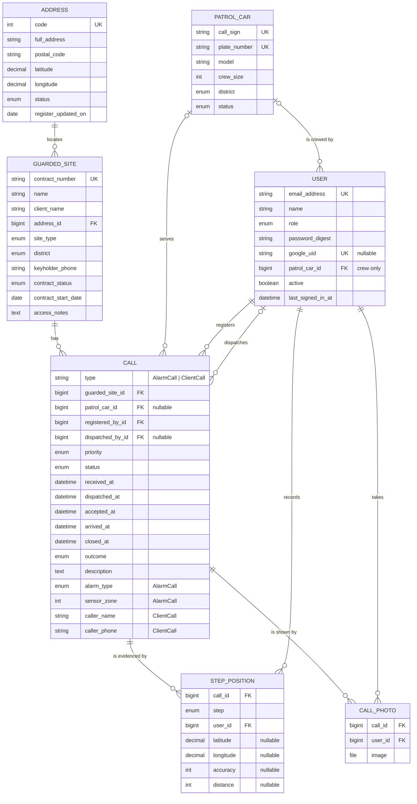
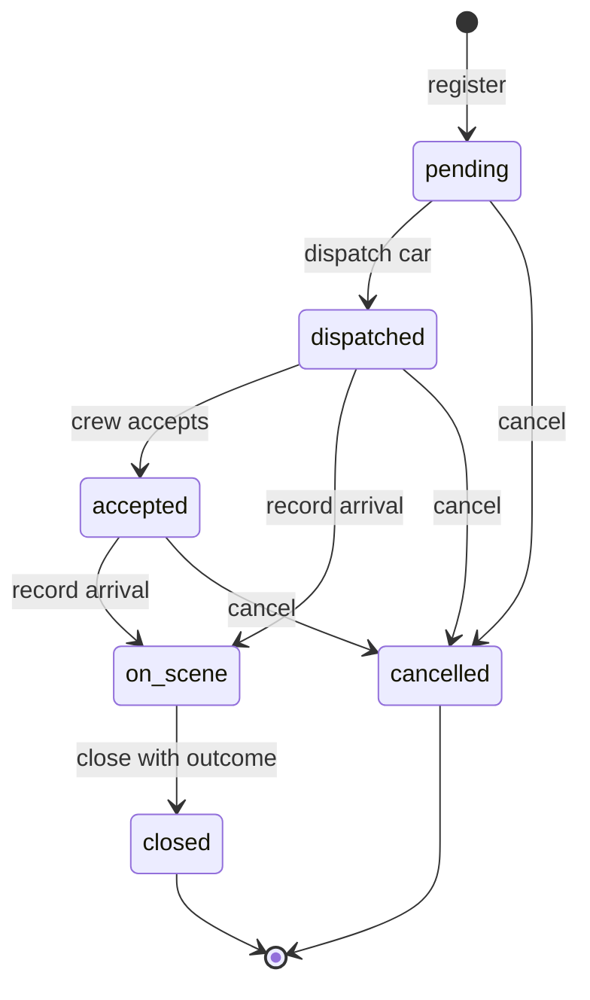

# Patrol Car Call Management System — Specification

## 1. Subject area

### 1.1 Overview

A private security company runs a monitoring centre that operates around the clock. Its clients include households, shops, offices and warehouses. Each client has an alarm system connected to the centre under a monitoring contract. Calls reach the centre in two ways:

- the **alarm system** at the site sends a signal: intrusion sensor, fire detector, panic button, tampering or power failure;
- a **client phones** the centre, for example to ask for a check of the premises.

The dispatcher registers the call and sends a free **patrol car** to the site. The crew reports its arrival, checks the premises and reports the result. The dispatcher then closes the call with an outcome, which ranges from a false alarm to a confirmed intrusion.

### 1.2 Problem

The dispatcher needs the following information on one screen:

- which calls are still waiting;
- which call has waited the longest;
- which cars are free;
- where the sites of the waiting calls are.

Management needs to know how fast crews reach the sites and which sites keep producing false alarms. The system keeps the register of sites, cars and calls, takes site addresses from the national address register, shows sites and active calls on a map, supports the whole life of a call from registration to closing, and calculates these figures.

### 1.3 Users

- **Dispatcher (monitoring centre operator)** — Registers calls, dispatches cars, records arrival and outcome, maintains the lists of sites and cars
- **Shift supervisor** — Reviews statistics and deletes outdated call records
- **Administrator** — Manages users and loads updates of the address register with a command (ADD-09)
- **Patrol crew** — Sees the call of its own car on a phone, gets a notice when the car is sent and reminders until it accepts the call, records the arrival and the closing itself with the position of its phone, takes photos on site, and opens the route to the site (CRW-01 … CRW-10)

Every user signs in (3.8). The administrator creates the accounts and gives each a role (BR-14); there is no self-registration.

### 1.4 Out of scope

- Automatic reception of signals from alarm panels. The dispatcher enters every call manually.
- Tracking of cars between the steps of a call, and route planning inside the system. The position of the crew's phone is recorded at Arrived and Close (CRW-07); the route opens in the phone's own navigation (CRW-08).
- Billing and contract fees.
- SMS and e-mail notifications. The only notice is the one on the crew's phone (CRW-04).
- Self-registration and password reset by e-mail. The administrator creates accounts and sets passwords.

### 1.5 Platform

Web application built with Ruby on Rails, Hotwire and PostgreSQL. The map is drawn with the MapLibre GL library from the system's own copy of OpenStreetMap data. Sign-in is built on the Rails authentication generator, with ALTCHA on the password form and sign-in with Google. The system runs on one server: the application, PostgreSQL and the proxy run in Docker containers deployed with Kamal, and the proxy serves HTTPS with a Let's Encrypt certificate. Demo data uses real addresses of public buildings from the address register together with fictitious client names and phone numbers; the repository and the demo database contain no real client data.

### 1.6 External data

- **State Address Register** open data, published daily by the State Land Service of Latvia on data.gov.lv (dataset `varis-atvertie-dati`, licence CC BY 4.0). The system uses the file of building and land addresses `aw_eka.csv`: UTF-8 with a byte order mark, comma-separated, every value in quotes. The file is downloaded when the system is set up and is never stored in the repository.
- **OpenStreetMap data for Latvia**: the extract `latvia-latest.osm.pbf` from Geofabrik, updated daily, licence ODbL. The system keeps its own copies and never calls public OpenStreetMap tile or search servers. It uses the data in two ways:
  - **map** — one vector tile file (PMTiles) of Latvia, built on the server by tilemaker from the extract, with the sea from the OSM water polygons (`water-polygons-split-4326.zip` from osmdata.openstreetmap.de, ODbL); both are downloaded when the map is built, and the file is served with the application; MapLibre GL draws it in the browser (STO-06);
  - **place search** — a Nominatim service loaded with the same extract (Docker image `mediagis/nominatim`), used to find emergency services near a site (FLT-08). The administrator of the machine sets its address.
- **Google sign-in** (OAuth 2.0): the application is registered in Google Cloud. Its client secret is kept only in the encrypted Rails credentials; the key that opens them is never in the repository.
- **ALTCHA**: an open-source check against bots that runs in the browser and on the application's own server, without an external service.
- Every map shows "© OpenMapTiles © OpenStreetMap contributors" in its corner, as the OpenMapTiles licence (CC BY 4.0, for the layer schema of the map) and the ODbL ask; every page with an address search shows the State Address Register as the source.

---

## 2. Objects and attributes

### 2.1 Classes

- `GuardedSite` — Premises under a monitoring contract. Own attributes: 10.
- `PatrolCar` — Patrol car with its crew. Own attributes: 6.
- `Address` — Building or land address from the State Address Register. Own attributes: 7.
- `User` — Person who signs in and works with the system. Own attributes: 8.
- `Call` — **Abstract** base for any call to the centre. Own attributes: 13.
  - `AlarmCall` — Call raised by the site's alarm system, **inherits** `Call`. Own attributes: 2.
  - `ClientCall` — Call made by the client by phone, **inherits** `Call`. Own attributes: 2.
- `StepPosition` — Where the crew's phone was at a step of a call. Own attributes: 7.
- `CallPhoto` — A photo the crew took on site of a call. Own attributes: 3.

Together: 7 object types stored in 7 database tables, 9 classes and 58 attributes, not counting `id`, `created_at` and `updated_at`. The technical tables `sessions` of the sign-in, `push_subscriptions` of the notices and the three tables of Active Storage that keep the photos' files are not subject-area objects. `AlarmCall` and `ClientCall` share the `calls` table: Rails single-table inheritance stores the class name in a `type` column.

### 2.2 `GuardedSite` — guarded premises

Examples are synthetic.

- `contract_number` — string, required. Unique regardless of letter case. Format `C-` followed by 5 digits. Example: `C-00042`.
- `name` — string, required. 2–100 characters. Example: `Warehouse No. 3`.
- `client_name` — string, required. 2–100 characters. Example: `Example Trade Ltd`.
- `address` — reference → `Address`, required. Chosen from the register by search (FLT-07). Only an address with status `existing` can be chosen (BR-11).
- `site_type` — enum `SiteType`, required. See 2.7. Example: `warehouse`.
- `district` — enum `District`, required. See 2.7. Example: `north`.
- `keyholder_phone` — string, required. `+` followed by 8–15 digits. Example: `+37100000001`.
- `contract_status` — enum `ContractStatus`, required. Default `active`. Example: `active`.
- `contract_start_date` — date, required. Must be a real calendar date. Example: `01.03.2026`.
- `access_notes` — text, optional. Up to 500 characters. Example: `Key box at the gate`.

### 2.3 `PatrolCar` — patrol car

Examples are synthetic.

- `call_sign` — string, required. Unique. 1–3 capital letters, a hyphen, then 1–3 digits. Example: `P-12`.
- `plate_number` — string, required. Unique. 2–10 characters: capital Latin letters, digits and hyphens. Stored in upper case. Example: `ZZ-0001`.
- `model` — string, required. 2–50 characters. Example: `Skoda Octavia`.
- `crew_size` — integer, required. 1–4. Example: `2`.
- `district` — enum `District`, required. Home district of the car. Example: `centre`.
- `status` — enum `CarStatus`, required. Default `available`. Only call operations set `dispatched` and `on_scene` (BR-5). Example: `available`.

### 2.4 `Address` — address from the State Address Register

Records are loaded from the register file (ADD-09) and are not edited by users. The register column is given in brackets. Examples are the first record of the register file.

- `code` — integer, required. Unique. Register code of the address, 9 digits (`KODS`). Example: `101000034`.
- `full_address` — string, required. Full address as written by the register (`STD`). Example: `"Riņņi", Vecates pag., Valmieras nov., LV-4211`.
- `postal_code` — string, optional. Format `LV-` followed by 4 digits (`ATRIB`). Example: `LV-4211`.
- `latitude` — decimal, required. Degrees, 6 decimal places, 55.6–58.1 (`DD_N`). Example: `57.769418`.
- `longitude` — decimal, required. Degrees, 6 decimal places, 20.9–28.3 (`DD_E`). Example: `25.156929`.
- `status` — enum `AddressStatus`, required. See 2.7 (`STATUSS`). Example: `existing`.
- `register_updated_on` — date, required. Last change of the record in the register (`DAT_MOD`, format `yyyy.mm.dd`). Example: `30.06.2021`.

### 2.5 `User` — person who works with the system

The administrator creates the accounts (BR-15). Examples are synthetic.

- `email_address` — string, required. Unique; stored in lower case. Must look like an e-mail address. Example: `dispatcher@example.com`.
- `name` — string, required. 2–100 characters. Example: `Demo Dispatcher`.
- `role` — enum `Role`, required. Default `dispatcher`. See 2.7. Example: `dispatcher`.
- `patrol_car` — reference → `PatrolCar`. Required for the role `crew`, empty for every other role: the car whose calls the crew works. Example: `P-12`.
- `password` — string, stored only as a hash. 12–72 characters. Needed for sign-in with a password (AUTH-01).
- `google_uid` — string, optional. Unique. Identifier of the Google account, stored at the first sign-in with Google (BR-15).
- `active` — boolean, required. Default `true`. An inactive user cannot sign in (BR-13). Example: `true`.
- `last_signed_in_at` — datetime, optional. Filled automatically at every sign-in.

`Session` — a technical record of one signed-in browser, created at sign-in and deleted at sign-out.

`PushSubscription` — a technical record of one phone that receives the crew's notices (CRW-04), belonging to the crew's sign-in on that phone (`Session`): the address its push service gave it and the two keys that encrypt a notice for it. Deleted when the crew turns the notices off on that phone or signs out on it, or when the push service no longer knows the phone.

### 2.6 `Call` (abstract) and its subclasses

Common attributes of `Call`:

- `guarded_site` — reference → `GuardedSite`, required. The site's contract must be `active` when the call is registered (BR-1).
- `patrol_car` — reference → `PatrolCar`, optional. Set when a car is dispatched.
- `priority` — enum `Priority`, required. The default depends on the subclass (BR-2). The dispatcher may change it.
- `status` — enum `CallStatus`, required. Default `pending`. Changes only through the operations in 2.10.
- `received_at` — datetime, required. Default is the current time. Cannot be in the future.
- `dispatched_at` — datetime, optional. Filled automatically. Not earlier than `received_at`.
- `accepted_at` — datetime, optional. Filled automatically when the crew accepts the call, or at the arrival if it was not accepted before (UPD-12, UPD-08). Not earlier than `dispatched_at`.
- `arrived_at` — datetime, optional. Filled automatically. Not earlier than `dispatched_at`.
- `closed_at` — datetime, optional. Filled automatically when the call is closed or cancelled. Not earlier than `received_at`.
- `outcome` — enum `Outcome`. Required when the status becomes `closed`; empty otherwise.
- `description` — text, optional. Up to 1000 characters.
- `registered_by` — reference → `User`, required. Filled automatically with the signed-in user when the call is registered.
- `dispatched_by` — reference → `User`, optional. Filled automatically with the signed-in user at dispatch.

`AlarmCall` — call raised by the site's alarm system:

- `alarm_type` — enum `AlarmType`, required. See 2.7.
- `sensor_zone` — integer, required. 1–99. Zone number on the alarm panel.

`ClientCall` — call made by the client by phone:

- `caller_name` — string, required. 2–100 characters.
- `caller_phone` — string, required. Same format as `keyholder_phone`.

An object of the base class `Call` cannot be created. Every call is either an `AlarmCall` or a `ClientCall`.

`StepPosition` — where the crew's phone was at a step of a call (CRW-07, BR-18):

- `call` — reference → `Call`, required.
- `step` — enum `StepName`, required. Example: `arrival`.
- `user` — reference → `User`, required: the crew user whose phone it was.
- `latitude`, `longitude` — decimal, optional, both or neither: empty when the position is unknown. Latitude −90…90, longitude −180…180. Example: `56.949600`, `24.105200`.
- `accuracy` — integer, optional. Metres, 0 or more, as the phone reports it. Example: `12`.
- `distance` — integer, optional. Metres from the site's address, worked out when the step is recorded. Example: `35`.

`CallPhoto` — a photo the crew took on site of a call (CRW-10, BR-19); its time is when it reached the server (`created_at`):

- `call` — reference → `Call`, required.
- `user` — reference → `User`, required: the crew user who sent it.
- `image` — file, required. A JPEG, PNG or WebP image of at most 5 MB, as the phone sent it after shrinking it to at most 1600 px on its longer side. Kept by Active Storage on the server's disk.

### 2.7 Enumerations

- **`SiteType`** — apartment, house, office, shop, warehouse
- **`District`** — centre, north, south, east, west
- **`ContractStatus`** — active, suspended
- **`CarStatus`** — available, dispatched, on_scene, out_of_service
- **`Priority`** — low, normal, high, critical (the last value is the most urgent)
- **`CallStatus`** — pending, dispatched, accepted, on_scene, closed, cancelled
- **`StepName`** — arrival, closing
- **`AlarmType`** — intrusion, fire, panic, tamper, power_failure
- **`Outcome`** — false_alarm, intrusion_confirmed, fire_confirmed, technical_fault, other
- **`AddressStatus`** — existing, deleted, erroneous (register values `EKS`, `DEL`, `ERR`)
- **`Role`** — dispatcher, supervisor, administrator, crew

### 2.8 Relationships

- `Address` — `GuardedSite` (`1 — 0..*`): Every site is at exactly one address. Several sites can share an address, for example shops in one building.
- `GuardedSite` — `Call` (`1 — 0..*`): Every call belongs to exactly one site. The site keeps its call history.
- `PatrolCar` — `Call` (`0..1 — 0..*`): A call is served by at most one car. A car serves many calls over time, but at most one active call at a time (BR-4).
- `GuardedSite` — `PatrolCar` (`* — *` through `Call`): Which cars have visited a site, and which sites a car has visited.
- `User` — `Call` as the registering user (`1 — 0..*`): Every call records who registered it.
- `User` — `Call` as the dispatching user (`0..1 — 0..*`): A dispatched call records who dispatched the car.
- `Call` — `StepPosition` (`1 — 0..2`): A call keeps where the crew's phone was at its arrival and at its closing, when the crew recorded them.
- `User` — `StepPosition` (`1 — 0..*`): Every position records the crew user whose phone it was.
- `Call` — `CallPhoto` (`1 — 0..*`): A call keeps the photos its crew took on site.
- `User` — `CallPhoto` (`1 — 0..*`): Every photo records the crew user who sent it.
- `PatrolCar` — `User` as its crew (`0..1 — 0..*`): A crew user belongs to exactly one car; a car can have several crew users, one per member or one shared.
- `Call` ◁— `AlarmCall`, `ClientCall` (inheritance): The subclasses share the common attributes and add their own.
- `GuardedSite.district` ~ `PatrolCar.district` (logical, no foreign key): When dispatching, free cars from the site's district are listed first.

### 2.9 Business rules

- **BR-1** — A call can be registered only for a site whose contract is `active`
- **BR-2** — Default priority. For an `AlarmCall`: panic or fire → critical, intrusion → high, tamper → normal, power_failure → low. For a `ClientCall`: normal
- **BR-3** — Only a car with status `available` can be dispatched
- **BR-4** — A car has at most one active call at a time. A call is active while its status is `pending`, `dispatched`, `accepted` or `on_scene`
- **BR-5** — The car's status follows its call: dispatch → `dispatched`, arrival → `on_scene`, close or cancel → `available`
- **BR-6** — A car can be put `out_of_service` only when it has no active call
- **BR-7** — Closed and cancelled calls are read-only. They can be deleted but not edited
- **BR-8** — Active calls are never deleted. They must be closed or cancelled first
- **BR-9** — A site or car that has calls cannot be deleted. The contract can be suspended or the car put out of service instead. A car with crew users cannot be deleted until they are moved to another car
- **BR-10** — Times are stored in UTC and displayed in Riga local time as `DD.MM.YYYY HH:MM`
- **BR-11** — Only an address with status `existing` can be chosen for a site
- **BR-12** — A register update never removes an address that a site uses. If the register marks it `deleted` or `erroneous`, the site keeps it and the site page shows a warning
- **BR-13** — Every page and every API request needs a signed-in, active user. Only the sign-in page, the app manifest, the Home Screen icon, the service worker that shows the crew's notices and the address that receives Traccar Client (API-11) are open to everyone; the manifest, the icon and the service worker hold no data, and the receiver gives none. A page knows the user by the browser session, an API request by the user's personal API key (USR-04)
- **BR-14** — Rights by role. A **dispatcher** works with calls (register, edit, dispatch, acceptance by radio, arrival, close, cancel) and maintains sites and cars. A **supervisor** can also delete calls (DEL-05 … DEL-08). An **administrator** can also manage users (USR-01 … USR-03) and load the address register (ADD-09). Every signed-in user but the crew can see all lists, pages, the map and the statistics. A **crew** user sees only the crew screen of its car and accepts that car's call and records its arrival and closing (CRW-01 … CRW-03), and turns on the notices of that car on its phone (CRW-04, CRW-05); nothing else, on the pages or through the API. Only a crew user turns notices on
- **BR-15** — There is no self-registration. Sign-in with Google succeeds only for an existing active user whose e-mail address equals the verified Google address; the first such sign-in stores `google_uid`
- **BR-16** — The password form needs a solved ALTCHA check; the server verifies the solution before it checks the password. More than 10 sign-in attempts from one address within 3 minutes are refused
- **BR-17** — A user who registered or dispatched calls cannot be deleted. The administrator makes the user inactive instead
- **BR-18** — The position of a crew's phone at a step is a record of the service: the crews' phones belong to the company. It is recorded at the crew's own Arrived and Close (CRW-07), kept with its call and deleted with it, also by the clean-up (DEL-07), and shown in full to the staff on the board, the map and the call page; the crew screen says that it is recorded. A step marked farther than 200 m from the site is shown as a warning (CRW-09). A crew user whose positions calls keep cannot be deleted; the administrator makes the user inactive instead
- **BR-19** — A photo of a call is a record of the service, like a position (BR-18). The crew of the call's car takes it while the car is on site, also from the closing dialog (CRW-10); it is kept with its call and deleted with it, also by the clean-up (DEL-07). Every signed-in user but the crew sees the photos on the call page; the crew sees those of its car's active call on its screen. The system sends a photo only to such a user, never at an open address (BR-13). A crew user whose photos calls keep cannot be deleted; the administrator makes the user inactive instead

### 2.10 Life of a call

**Acceptance time** is `accepted_at − dispatched_at`: how long the crew took to accept the call.

**Response time** is `arrived_at − received_at`: how long the client waited until the crew arrived.

**Handling time** is `closed_at − received_at`: how long the call took from receipt to its closing or cancellation. For an active call it is the time from receipt until now.

---

## 3. Functional requirements: operation → input data → expected result

Rows marked _(neg)_ or _(boundary)_ describe invalid or boundary input.

### 3.1 Add

- **ADD-01** Add a guarded site
  - Input data: `contract_number`, `name`, `client_name`, `address` (chosen from the register, FLT-07), `site_type`, `district`, `keyholder_phone`, `contract_start_date`, `access_notes` (optional). `contract_status` defaults to active
  - Expected result: The site is saved. Its page opens with the message "Site created", and the site appears in the site list
- **ADD-02** Add a site _(neg)_
  - Input data: The contract number already exists in any letter case, the name is empty, the phone is `12345`, or no address is chosen from the register
  - Expected result: Nothing is saved. The form is shown again with the entered values kept and an error message next to each wrong field
- **ADD-03** Add a patrol car
  - Input data: `call_sign`, `plate_number`, `model`, `crew_size`, `district`
  - Expected result: The car is saved with status `available` and appears in the car list and in the free-cars panel of the board
- **ADD-04** Add a car _(boundary)_
  - Input data: `crew_size` = 0 / 1 / 4 / 5
  - Expected result: 1 and 4 are accepted. 0 and 5 are rejected with the message "must be between 1 and 4"
- **ADD-05** Register an alarm call
  - Input data: Site (active contract), `alarm_type`, `sensor_zone`, `received_at` (default: now), `description` (optional)
  - Expected result: The call is saved with status `pending` and a priority set by BR-2 (e.g. panic → critical). It appears on the active-calls board of every open dispatcher screen without a page reload
- **ADD-06** Register an alarm call _(boundary)_
  - Input data: `sensor_zone` = 0 / 1 / 99 / 100; `received_at` = now + 1 minute
  - Expected result: Zones 1 and 99 are accepted. Zones 0 and 100 and a time in the future are rejected with a message
- **ADD-07** Register a client call
  - Input data: Site (active contract), `caller_name`, `caller_phone`, `priority` (default normal), `description`
  - Expected result: The call is saved with status `pending` and the chosen priority, and it appears on the board
- **ADD-08** Register a call for a suspended site _(neg)_
  - Input data: A site whose contract is `suspended`
  - Expected result: Rejected with the message "Contract C-00042 is suspended — call cannot be registered". Nothing is saved (BR-1)
- **ADD-09** Load the address register
  - Input data: A command run by the administrator with the register file `aw_eka.csv` and a city (default Riga)
  - Expected result: Addresses of the city are created or updated by `code`, and their status follows the register. The command prints "N added, M updated, K marked deleted or erroneous, S skipped". Addresses used by sites are never removed (BR-12). A second run with the same file reports 0 added and 0 updated
- **ADD-10** Load the address register _(neg / boundary)_
  - Input data: A file without a required column; a row without coordinates
  - Expected result: A missing column stops the load before any change, and the message lists the missing columns. A row without coordinates for a new address is skipped and counted in S. For an address already loaded, only its status follows the register: the register drops the coordinates of deleted and erroneous addresses, and BR-12 needs the new status

### 3.2 Delete

- **DEL-01** Delete a site without calls
  - Input data: Site + confirmation
  - Expected result: The site is deleted, the message "Site deleted" is shown, and the site is gone from the list
- **DEL-02** Delete a site that has calls _(neg)_
  - Input data: Site with N calls
  - Expected result: Refused with the message "Site has N calls and cannot be deleted; suspend the contract instead". Nothing is deleted (BR-9)
- **DEL-03** Delete a car without calls or crew users
  - Input data: Car + confirmation
  - Expected result: The car is deleted and is gone from the list and the board
- **DEL-04** Delete a car that has calls or crew users _(neg)_
  - Input data: Car with calls, or with crew users
  - Expected result: Refused with "Car has N calls and cannot be deleted; put it out of service instead", or "Car has N crew users and cannot be deleted; move them to another car first". Nothing is deleted (BR-9)
- **DEL-05** Delete one finished call
  - Input data: Call in status `closed` or `cancelled` + confirmation, from the call page
  - Expected result: The call is deleted with the message "Call deleted". Its site and car remain
- **DEL-06** Delete an active call _(neg)_
  - Input data: Call in status `pending`, `dispatched`, `accepted` or `on_scene`
  - Expected result: Refused with the message "Active call cannot be deleted; cancel or close it first" (BR-8)
- **DEL-07** **Delete calls by criteria** (clean-up of old records)
  - Input data: On the clean-up page, linked from the call list: "Received before" date D (required, today or earlier; calls received before 00:00 Riga time of D); statuses `closed` and/or `cancelled` (at least one); call type (optional); outcome (optional)
  - Expected result: Step 1: a preview shows "N calls match". Step 2: after confirmation exactly those N calls are deleted, with their positions and photos (BR-18, BR-19), and the message "N calls deleted" is shown. If the matching calls have changed since the preview, even to as many other calls, nothing is deleted and the new number is shown. Active calls are never deleted, even if they match the date
- **DEL-08** Delete by criteria _(neg / boundary)_
  - Input data: D is tomorrow; no status is chosen; nothing matches
  - Expected result: A future date gives "Received before cannot be in the future", a missing status "Choose closed, cancelled or both". When nothing matches, the message "No calls match" is shown and nothing is deleted

### 3.3 Update

- **UPD-01** Edit a site
  - Input data: Changed attributes
  - Expected result: The changes are saved. The same checks apply as in ADD-01/02
- **UPD-02** Suspend a contract
  - Input data: `contract_status` = suspended
  - Expected result: The change is saved. New calls for the site are refused (ADD-08). Active calls already in progress continue
- **UPD-03** Edit a car
  - Input data: Changed attributes
  - Expected result: The changes are saved. The same checks apply as in ADD-03/04
- **UPD-04** Put a car out of service
  - Input data: `status` = out_of_service
  - Expected result: Allowed only if the car has no active call. Otherwise it is refused with a reference to that call (BR-6). The car leaves the free-cars panel
- **UPD-05** Edit call details
  - Input data: `priority`, `description`, and the subclass attributes (`alarm_type`, `sensor_zone` / `caller_name`, `caller_phone`)
  - Expected result: Allowed while the call is active. For a closed or cancelled call, editing is refused (BR-7)
- **UPD-06** **Dispatch a car**
  - Input data: Call in status `pending`, and a car chosen from the list of available cars (cars from the site's district come first)
  - Expected result: The call becomes `dispatched`, `dispatched_at` = now and the car is set. The car becomes `dispatched`. Both changes are saved together (STO-02), and the board updates without a reload
- **UPD-07** Dispatch a car that is not free _(neg)_
  - Input data: The car is `dispatched`, `on_scene` or `out_of_service`, or another dispatcher took it a moment earlier
  - Expected result: Refused with the message "Car P-12 is not available". The call stays `pending` and nothing changes (BR-3, BR-4)
- **UPD-08** Record arrival
  - Input data: Call in status `dispatched` or `accepted`
  - Expected result: The call becomes `on_scene` and `arrived_at` = now; `accepted_at` = now too if the call was not accepted before. The car becomes `on_scene`. The response time is shown
- **UPD-09** Close a call
  - Input data: Call in status `on_scene`, `outcome` (required), closing note (optional, added to `description`)
  - Expected result: The call becomes `closed` and `closed_at` = now. The car becomes `available`. Without an outcome, closing is refused
- **UPD-10** Cancel a call
  - Input data: Call in status `pending`, `dispatched` or `accepted`, reason (optional)
  - Expected result: The call becomes `cancelled` and `closed_at` = now. If a car was dispatched, it becomes `available`
- **UPD-11** Wrong order of steps _(neg)_
  - Input data: For example, closing a `pending` call or recording arrival for a `cancelled` call
  - Expected result: Refused with a message that lists the actions allowed in the current status. Nothing changes
- **UPD-12** Record acceptance
  - Input data: Call in status `dispatched`; the crew presses _Accept the call_ on its screen (CRW-02), or the dispatcher presses _Accepted_ when the crew answers by radio
  - Expected result: The call becomes `accepted` and `accepted_at` = now; the car stays `dispatched`. A second acceptance of an accepted call, from a second phone of the crew or a second tap, is answered as the first and changes nothing. The reminders stop (CRW-06), and every open board, map and crew screen follows

### 3.4 Filter, search, sort

- **FLT-01** **Filter calls** (7 criteria)
  - Input data: Any combination of: status, priority, call type, district of the site, period (from–to, by `received_at`), site, car; and a text of at least 2 characters searched in the site name, contract number and caller name regardless of letter case and Latvian diacritics
  - Expected result: The table shows only the calls that match all the chosen criteria, together with the number found. The statistics (3.7) are calculated for the same calls: the list links to them with its filter, and a filter without a period gives the current month. The filter is kept in the page address, so it survives a reload. The list follows typing and every filter change without a button, and _Clear_ drops the filter
- **FLT-02** Filter by period _(boundary)_
  - Input data: from = to (one day); from is later than to
  - Expected result: For one day, all calls of that day from 00:00 to 23:59 Riga time are included. If from is later than to, the message "Period start is after period end" is shown and the list is not filtered
- **FLT-03** Filter with no matches
  - Input data: Criteria that no call matches
  - Expected result: An empty table with the message "No calls match the filter" and a link that resets the filter
- **FLT-04** Search sites by text
  - Input data: Text of at least 2 characters
  - Expected result: Sites whose contract number, name, client or address contains the text, regardless of letter case and Latvian diacritics. For a shorter text, the hint "Enter at least 2 characters" is shown
- **FLT-05** Filter sites
  - Input data: `site_type`, `district`, `contract_status`, combinable with FLT-04
  - Expected result: Only matching sites are listed, together with their count
- **FLT-06** Filter cars
  - Input data: `status`, `district`, and a text of at least 2 characters searched in the call sign, plate number and model regardless of letter case
  - Expected result: Only matching cars are listed, together with their count. The list follows typing and every filter change without a button, as DYN-05 does for sites, and _Clear_ drops the search and the filters
- **FLT-07** Search addresses in the register
  - Input data: Text of at least 3 characters
  - Expected result: Up to 10 addresses with status `existing` whose street and house (the part of the full address before the first comma, so not the city or the postal code) contain every word of the text, regardless of letter case and Latvian diacritics (`brivibas 1` finds `Brīvības iela 1`). An address where a word is a whole word of the street and house comes first (`kalpaka 1` lists `Kalpaka bulvāris 1` before `Kalpaka bulvāris 10`); then the order is by full address, `214` before `214A`. For a shorter text, the hint "Enter at least 3 characters" is shown
- **FLT-08** Nearby emergency services
  - Input data: A site, on the call page or the site page
  - Expected result: Up to 3 police stations, 3 fire stations and 3 hospitals within 10 km of the site, each with name, address and straight-line distance in km with one decimal, nearest first
- **FLT-09** Nearby services not available _(neg)_
  - Input data: The place search does not answer within 5 seconds, or finds nothing
  - Expected result: The message "Nearby services are not available now" or "None within 10 km". The rest of the page works as usual
- **SRT-01** **Sort calls** (9 criteria)
  - Input data: Any column: received time (default, newest first), priority (critical first), site name, call type, status, car, outcome, handling time, response time. Direction: ascending or descending
  - Expected result: The table is re-ordered. Call type, status and outcome follow the alphabetical order of their names. Calls without a car, an outcome or an arrival come last in either direction. Equal values are ordered by received time, newest first. Sorting combines with the active filter
- **SRT-02** Sort sites
  - Input data: Any column: contract number, name, client, address, type, district, contract status, contract start date; ascending or descending
  - Expected result: The table is re-ordered, and the order combines with the search and filter. Type, district and contract status follow the alphabetical order of their names
- **SRT-03** Sort cars
  - Input data: Any column: call sign, plate number, model, crew size, district, status; ascending or descending
  - Expected result: The table is re-ordered, and the order combines with the search and filters. District and status follow the alphabetical order of their names

### 3.5 Store

- **STO-01** Keep data
  - Input data: Any successful add, update or delete
  - Expected result: The change is written to PostgreSQL immediately. It is visible after a page reload and after the application restarts
- **STO-02** Change a call and its car together
  - Input data: Dispatch, arrival, close or cancel
  - Expected result: The call and the car change together or not at all. If saving fails, both stay as they were and an error message is shown
- **STO-03** Two dispatchers take the same car _(neg)_
  - Input data: Two dispatchers send the same car to two different calls at the same moment
  - Expected result: The first dispatch succeeds. The second is refused as in UPD-07. A car is never on two active calls
- **STO-04** Database refuses invalid records
  - Input data: A duplicate contract number, call sign or plate, or a call without a site, stored without going through the forms
  - Expected result: The database refuses the record (unique indexes, required columns, foreign keys). The application shows an error, and no partial record remains
- **STO-05** Load demo data
  - Input data: `bin/rails demo:load`, on top of the seeds (`bin/rails db:seed`, which it runs first)
  - Expected result: The database is filled with sites at real addresses of public buildings from the register, with fictitious client names and phones, synthetic cars and 150 finished calls of the last 60 days, and three demo users, one for each role but the crew, with `example.com` addresses. The command prints the password of each user it creates. No real client data. The calls go to the seed and demo sites and cars only. Running it again adds nothing and prints no password; open boards are not refreshed by the load. A demo e-mail address held by a user of another role, or a demo contract number held by another site, stops the command with the reason, and nothing is loaded
- **STO-06** Build the map file
  - Input data: Every night at 03:00 Riga time, a recurring task, which builds when the map file is missing or 30 days old or older; or `bin/rails map:build`, which builds whatever the age; or the main screen when there is no map file, at most once an hour
  - Expected result: The Latvia extract is downloaded, the water polygons only when the last download is a year old or older; a new file, named by the time of the build, is published only after a successful build, and the file before it stays for pages opened earlier, older ones are removed; on any failure the previous file and the previous sea stay and the failure is recorded with its reason. Two builds never run at the same time. The map file is served only to signed-in users (BR-13)

### 3.6 Display

- **DSP-01** Several objects as a table
  - Input data: Menu: Sites / Patrol cars / Calls, and Users for the administrator
  - Expected result: A table with the main attributes in each row. Enum values are shown in plain words, times in Riga local time. The call list also shows the handling time in whole minutes and the response time in minutes with one decimal (2.10); the handling time of an active call grows every minute without a reload
- **DSP-02** One object
  - Input data: Click on a table row
  - Expected result: **Site:** all attributes, a small map with its location and, under an active contract, a link that opens the main screen on the site, its call history as a table, the number of calls, and a warning when the register marks its address deleted or erroneous (BR-12). **Car:** all attributes, its current call, and its recent calls. **Call:** all attributes; the timeline received → dispatched → accepted → arrived → closed with the time between steps and the handling time; who registered the call and who dispatched the car; where the crew's phone was at Arrived and Close and how far from the site, in red with a ! sign when farther than 200 m (CRW-09), or "position unknown" (CRW-07); the crew's photos with their time and user, each opening in full (CRW-10); links to the site and the car; nearby emergency services (FLT-08)
- **DSP-03** Main screen: the active-calls board over the map (home page)
  - Input data: Open the application
  - Expected result: The map of DSP-05 fills the window under the menu. Over it, a panel lists the calls in status `pending`, `dispatched`, `accepted` or `on_scene` as cards, ordered by priority (critical first) and then by waiting time (longest first), with the waiting time of each call and its state of arrival: waiting for a car; the car sent and the call not accepted, with the minutes since the dispatch, framed in red after 5 minutes without acceptance; the call accepted and the car on the way, with the time of acceptance and the minutes since; or the car on site, with the time of arrival and how far from the site the crew's phone was (farther than 200 m, a warning of how far instead of the time of arrival), "by radio, no position" for an arrival the dispatcher recorded, or that the phone gave no position, each in words with its own sign; an arrival marked farther than 200 m from the site is framed in red (CRW-09); a call sent and not accepted has the step _Accepted_ for an acceptance by radio (UPD-12); a second panel shows every car and its status. Each panel and the legend can be minimized to a label and opened again; the label of the calls shows their number and how many are critical, and the choice stays across refreshes and visits. Choosing a call's site shows the site on the map with its details; clicking a marker opens the calls panel if it was minimized and marks the site's calls. A message after an action fades after a few seconds. In a window narrower than 48 rem or lower than 32 rem both panels are one sheet at the bottom with the tabs Calls and Cars, which the user raises and lowers. Every open screen updates without a reload when any dispatcher changes a call or a car
- **DSP-04** Hints and messages
  - Input data: Any form or action
  - Expected result: Every field has a label and a hint with an example of the format. Every action ends with a confirmation or an error message
- **DSP-05** Map of sites and calls
  - Input data: Open the application (the map of the main screen, DSP-03); or "Show on the big map" on a site page; the old address `/map` leads to the main screen
  - Expected result: A map of Latvia that opens on Riga, with a marker for every site with an active contract. A site with an active call is marked in the colour of the call's priority and its letter (C, H, N, L), with a dashed ring while the call waits for a car, a ? sign while the car is sent and the call not accepted (red after 5 minutes), a → sign while the call is accepted and the car on the way, and a ✓ sign once it is on site, amber when the crew's phone gave no position, or a red ! sign when the crew marked Arrived farther than 200 m from the site (CRW-09); any other marker is white. A legend explains the colours and the signs of arrival; the counts of the sites on the map and of those with an active call are shown. Street and place names are drawn in the browser's own font. Clicking a marker shows the site name with a link, its contract number and address, and its active call: priority, status, state of arrival, waiting time and a link. The attribution of 1.6 is shown. Opened from a site page, the map is centred on that site with its details shown. Without a map file yet the board still works, the map area says "Map is being prepared", and the screen starts the first build, unless one started within the last hour (STO-06)

### 3.7 Calculations

- **CALC-01** Calls by status and by outcome
  - Input data: Period (default: the current month) and optionally the FLT-01 filters
  - Expected result: The number of calls in each status and each outcome, plus the total
- **CALC-02** Average response time
  - Input data: Period and filters
  - Expected result: The average of `arrived_at − received_at` over the calls of the period that have an arrival, in minutes with one decimal. Shown overall, per priority and per car. With no arrivals in the period, "—" is shown, not an error. Next to it, the number of accepted calls and their average acceptance time `accepted_at − dispatched_at` (2.10), with "—" when none was accepted
- **CALC-03** Share of false alarms
  - Input data: Period and filters
  - Expected result: Closed calls with outcome `false_alarm` ÷ all closed calls × 100 %, with one decimal, and both counts. With no closed calls, "—" is shown
- **CALC-04** Sites with the most false alarms _(boundary)_
  - Input data: Period, filters, N from 1 to 50 (default 5)
  - Expected result: The N sites with the most `false_alarm` outcomes in the period, with their counts. Sites with equal counts are ordered by name; a site without a false alarm is not listed. An N outside 1–50 gives the message "Number of sites must be from 1 to 50", and 5 is used

### 3.8 Sign-in and users

- **AUTH-01** Sign in with a password
  - Input data: `email_address`, `password`, the solved ALTCHA check
  - Expected result: The board opens, or the crew screen for a crew user. `last_signed_in_at` is set
- **AUTH-02** Sign in with a password _(neg)_
  - Input data: A wrong password, an unknown address, an inactive user, or no ALTCHA solution
  - Expected result: A wrong password, an unknown address and an inactive user all get the same message "Try another email address or password." A missing or wrong ALTCHA solution gets "Verification failed. Try again." Nobody is signed in
- **AUTH-03** Too many sign-in attempts _(boundary)_
  - Input data: The 10th and the 11th attempt from one address within 3 minutes
  - Expected result: The 10th attempt is checked as usual. The 11th is refused with "Try again later." (BR-16)
- **AUTH-04** Sign in with Google
  - Input data: The Google account of an existing active user
  - Expected result: The board opens, or the crew screen for a crew user. At the first sign-in `google_uid` is stored (BR-15)
- **AUTH-05** Sign in with Google _(neg)_
  - Input data: A Google account whose address belongs to no active user
  - Expected result: Refused with "No account for this address. Ask the administrator." No user is created
- **AUTH-06** Sign out
  - Input data: _Sign out_ in the menu
  - Expected result: The session ends and the sign-in page opens. Any other page now leads to the sign-in page
- **AUTH-07** Action not allowed for the role _(neg)_
  - Input data: A dispatcher tries to delete calls by criteria or to open the users page
  - Expected result: Refused with "Not allowed for your role". Nothing changes (BR-14)
- **USR-01** Create a user
  - Input data: `email_address`, `name`, `role`, `password` (administrator only); a `patrol_car` for the role `crew`
  - Expected result: The user is saved and can sign in. A crew user without a car, or another role with a car, is refused with the reason at the field
- **USR-02** Change the role or deactivate a user
  - Input data: A new `role`, or `active` = false
  - Expected result: The change is saved. An inactive user's sessions end, the API key stops working for good, and further sign-in is refused (BR-13)
- **USR-03** Delete a user _(neg)_
  - Input data: A user who registered or dispatched calls, or a crew user whose positions or photos calls keep
  - Expected result: Refused with a suggestion to deactivate the user instead. Nothing is deleted (BR-17, BR-18, BR-19)
- **USR-04** Issue an API key
  - Input data: _Issue a new key_ on the API key page, opened from the header (every signed-in user but the crew, for themselves)
  - Expected result: A new key is shown once; afterwards the page shows only when it was issued. The previous key stops working. Only a digest of the key is stored

- **CRW-01** Crew screen
  - Input data: A crew user signs in, or opens the application
  - Expected result: The crew screen of its car opens, laid out for a phone: the car's call sign and status; the car's active call with its priority, the site's name, address and contract number, the call type with the sensor zone or the caller, the keyholder's phone as a link to call, the access notes, the waiting time and the state of arrival; a small map of the site. _Accept the call_ while the car is sent and the call not accepted, _Arrived_ once accepted, _Close_ while it is on scene. _Route_ opens the phone's navigation at the site (CRW-08). "No call for P-12" when the car has none. The screen follows every change without a reload (DYN-15). Added to the Home Screen from any browser, the application shows the shield: an iPhone adding it from a browser other than Safari asks `/apple-touch-icon.png` or `/apple-touch-icon-precomposed.png`, which answer the icon, kept a day
- **CRW-02** The crew accepts the call, records the arrival and closes it
  - Input data: _Accept the call_; _Arrived_; _Close_ with the outcome and an optional note
  - Expected result: As UPD-12, UPD-08 and UPD-09: the call and the car change, and every open board, map and crew screen follows
- **CRW-03** The crew outside its screen _(neg)_
  - Input data: A crew user opens any other page, or tries to dispatch, cancel or edit a call, or to step the call of another car, on a page or through the API
  - Expected result: Any other page leads to the crew screen. A step that is not the crew's is refused with "Not allowed for your role" (`403` through the API). Nothing changes
- **CRW-04** Notices on the crew's phone
  - Input data: On the crew screen, _Turn on notices_; the phone asks for permission and the crew allows it. On an iPhone, iOS 17.2 or later (the oldest Safari the application admits) with the application added to the Home Screen; on Android, Chrome. Later the dispatcher sends the car to a call, on a page or through the API
  - Expected result: The screen says "Notices are on for this phone". When the car is sent, every phone of its crew with notices on shows a notice, also with the application closed and the screen locked: "Critical call: Demo Office 1" over the site's address. A tap on it opens the crew screen. A notice waits at most one hour for a phone that is offline. A phone the push service no longer knows is forgotten at the next notice. A phone whose push service fails, or keeps the server waiting more than 10 seconds to connect or to answer, keeps its notices for the next call, and the other phones are told all the same. If the server's two keys are not one pair, no phone is told or forgotten and the failure is recorded
- **CRW-05** Notices off, blocked or unavailable _(neg)_
  - Input data: _Turn off notices_; or the crew signs out on the phone; or the crew refuses the permission; or the browser cannot show notices, as on an iPhone where the application is not added to the Home Screen; or a user other than the crew sends a phone's subscription; or a subscription names a push service other than Apple's, Google's, Mozilla's or Microsoft's
  - Expected result: _Turn off notices_ forgets the phone: "Notices are off for this phone". Signing out forgets it too: no new notice is sent to a phone nobody is signed in on (one the push service already took for an offline phone may still arrive within its hour). After a new sign-in on a phone whose browser still allows notices, the screen turns them on for that sign-in and says so. A refused permission: "Notices are blocked on this phone; allow them in the phone's settings". A browser without notices: "This browser cannot show notices. On an iPhone, add the application to the Home Screen and open it from there". The crew screen works as before in every case. A user other than the crew is refused with "Not allowed for your role", and an unknown push service with "Endpoint is not the push service of a known browser"; nothing is stored, and the server sends notices to no other address
- **CRW-06** Reminders until the call is accepted
  - Input data: The car is sent and its crew does not accept the call
  - Expected result: Every minute the phones of the car's crew with notices on get a reminder, each a notice of its own, so that the phone sounds again: "Reminder 2 — Critical call: Demo Office 1" over the site's address and "not accepted for 2 min". At most 5 reminders; they stop as soon as the call is accepted, the arrival is recorded or the call is cancelled, and a reminder waits at most its minute for a phone that is offline. While the call waits, the crew screen says that a reminder sounds every minute while notices are on; after the fifth, that the reminders have stopped. After the fifth, the dispatcher's card is framed in red and says "P-12 has not accepted for 5 min · reminders stopped", and the marker's ? sign turns red on every open screen
- **CRW-07** Where the crew's phone was at its steps
  - Input data: The crew presses _Arrived_ or _Close_ on its screen; the phone asks once for permission to use its position
  - Expected result: The step goes as before, and its call keeps the phone's latitude, longitude and accuracy and the distance from the site in metres (BR-18). Without permission, without a position within 10 seconds, or in a browser without positions, the step goes all the same and is kept as "position unknown". The crew screen says that Arrived and Close record where the phone is. A step the dispatcher records on the board keeps no position
- **CRW-08** Route to the site
  - Input data: _Route_ on the crew screen of a call
  - Expected result: Google Maps opens with directions by car to the site's coordinates, in its app when the phone has it, otherwise in the browser
- **CRW-09** Warning when the crew marks a step far from the site
  - Input data: The crew presses _Arrived_ or _Close_ with its phone farther than 200 m from the site's address
  - Expected result: Every open board shows at once, without a reload, the call's card framed in red with "P-12 marked Arrived 1.4 km from the site · accuracy 12 m" and a red ! sign, and the site's marker a red ! sign; the call page shows the step's position in red with "farther than 200 m". At 200 m or nearer the card says "P-12 on site since 10:13 · 40 m from the site" with a green ✓. An arrival whose position is unknown shows an amber ✓ and "the phone gave no position"; an arrival the dispatcher recorded shows a green ✓ and "by radio, no position". A far Close is seen on the call page: the closed call has left the board. The crew screen shows the crew the same line as the card. On the board, the map and the crew screen distances under a kilometre are in metres, longer ones in kilometres with one decimal; the call page gives metres. There is no sound
- **CRW-10** Photos on site
  - Input data: On the crew screen of a call on scene, _Take photo_ (the phone's camera, or several photos from its library at once), or _Add photo_ in the closing dialog
  - Expected result: Each photo is shrunk on the phone to at most 1600 px on its longer side and goes to the call with the time and the crew user (BR-19). The crew screen shows the photos with their time and "N taken"; the closing dialog shows them small with "N photos attached"; the call page shows them to the staff. A file that is not a JPEG, PNG or WebP image of at most 5 MB is refused with "Photo must be a JPEG, PNG or WebP image of at most 5 MB", and nothing of that choice is kept. While photos are on their way the screen says "Sending photos…", the steps wait and a refresh of the screen waits too; photos that did not reach the server stay chosen with "Photos not sent; check the connection and send them again." and _Send again_, also after the screen refreshes. Only the crew of the call's car adds photos, and only while the car is on site

---

## 4. Web interface, API and data storage

### 4.1 Dynamic elements

A dynamic element is a part of the page that changes in the browser in response to a user action or to new data, without loading a new page.

- **DYN-01** Live active-calls board
  - Event → change on the page: Any dispatcher registers, dispatches, closes or cancels a call → its card appears, changes or disappears on every open screen
  - Related requirement: DSP-03, ADD-05
- **DYN-02** Live cars panel
  - Event → change on the page: A car changes status → its status label changes, and the car enters or leaves the list of free cars on every open screen
  - Related requirement: DSP-03, UPD-06
- **DYN-03** Waiting-time counters
  - Event → change on the page: Once a minute → the waiting time of every active call on the board and its handling time in the call list are recalculated in the browser, without a request to the server
  - Related requirement: DSP-01, DSP-03
- **DYN-04** Call form that follows the call type
  - Event → change on the page: Choosing _alarm_ or _client_ → only the fields of that type are shown. Choosing an alarm type → the priority field takes the BR-2 default
  - Related requirement: ADD-05, ADD-07, BR-2
- **DYN-05** Site search while typing
  - Event → change on the page: Typing 2 or more characters, or changing a filter → the site list and its count are reloaded without pressing a button, and the page address is updated. Fewer characters → the hint from FLT-04. _Clear_ drops the search and the filters
  - Related requirement: FLT-04, FLT-05
- **DYN-06** Filtering and sorting of calls in place
  - Event → change on the page: Changing a filter or clicking a column header → only the table and the count are reloaded, and the page address is updated. On the statistics page a filter change reloads only the results in the same way
  - Related requirement: FLT-01, SRT-01, CALC-01 … CALC-04
- **DYN-07** Dispatch dialog
  - Event → change on the page: Clicking _Dispatch_ → a dialog lists the free cars, the site's district first. After the choice the dialog closes and the call's card changes
  - Related requirement: UPD-06, UPD-07
- **DYN-08** Preview of deletion by criteria
  - Event → change on the page: Changing any criterion → the number "N calls match" is recalculated before the confirmation
  - Related requirement: DEL-07
- **DYN-09** Field checks while typing
  - Event → change on the page: Leaving a field with a wrong format → a message appears next to the field before the form is sent. The server still checks everything
  - Related requirement: DSP-04, ADD-02
- **DYN-10** Animation of a new critical call
  - Event → change on the page: A call with priority `critical` appears on the board → its card is highlighted by a short CSS animation
  - Related requirement: DSP-03, BR-2
- **DYN-11** Address suggestions while typing
  - Event → change on the page: Typing 3 or more characters in the address field → up to 10 suggestions appear under the field. Choosing one fills the address and shows the point on a small map
  - Related requirement: FLT-07, ADD-01
- **DYN-12** Live map
  - Event → change on the page: A call is registered, dispatched, closed or cancelled → the colour of its site's marker changes on every open map, the main screen and the small map of a site page
  - Related requirement: DSP-05, DYN-01
- **DYN-13** Nearby services loaded in place
  - Event → change on the page: The call page opens at once → the list of nearby emergency services fills its section when the place search answers. A slow answer never delays the page
  - Related requirement: FLT-08, FLT-09
- **DYN-14** ALTCHA check on the sign-in form
  - Event → change on the page: The sign-in form opens → the browser solves the check and shows a mark; the _Sign in_ button waits for the solution
  - Related requirement: AUTH-01, BR-16
- **DYN-15** Live crew screen
  - Event → change on the page: The dispatcher sends the car, or its call is closed or cancelled anywhere → the crew screen shows the new call, or the note that there is none, without a reload. The screen comes back into view — the phone is unlocked, the application opened again or a notice tapped → the screen asks for the current state, since the changes sent while it was out of view are not sent again. A step still waiting for the server is let finish first. Without the network, or with the server out of reach, the screen keeps what it shows and asks again when the network is back, or after 15 seconds
  - Related requirement: CRW-01, CRW-04, DYN-01
- **DYN-16** Notice switch on the crew screen
  - Event → change on the page: The crew screen opens, or _Turn on notices_ or _Turn off notices_ → the browser asks the phone, and the screen says whether notices are on, off, blocked or unavailable, without a reload
  - Related requirement: CRW-04, CRW-05

Technique: Turbo Streams over a WebSocket for DYN-01, DYN-02, DYN-10, DYN-12 and DYN-15; Turbo Frames for DYN-05 … DYN-08, DYN-11 and DYN-13; Stimulus controllers for DYN-03, DYN-04, DYN-09, DYN-16, the return of DYN-15 into view and for the MapLibre GL maps; the ALTCHA web component for DYN-14; a service worker and the Web Push protocol (RFC 8030, encrypted by RFC 8291, signed by VAPID, RFC 8292) for the notices of CRW-04.

### 4.2 REST API

Base path `/api/v1`, JSON in and out; the receiver of Traccar Client (API-11) alone lies outside it and answers without a body. The API applies the same checks and business rules as the pages (2.2–2.9). A site is returned together with its address and coordinates. Every request carries the personal API key of an active user as `Authorization: Bearer <key>` (BR-13, USR-04); without a valid key the answer is `401`, and an action the role may not take gets `403` "Not allowed for your role" (BR-14). An error comes as `{"error": "…"}`, wrong data as `{"errors": {"field": ["message", …]}}`. The fields of a record come at the top level of a JSON body; a body sent as JSON (`Content-Type: application/json`) that cannot be read gets `400` `{"error": "The request body is not valid JSON"}`.

- **API-01** `GET /api/v1/sites`, `/api/v1/patrol_cars`, `/api/v1/calls`
  - Input data: The filter and sort parameters of FLT-01, FLT-04 … FLT-06 and SRT-01 … SRT-03
  - Expected result: `200` and a JSON list together with the number of records found. A search text shorter than 2 characters is left out, as on the pages; a period whose start is after its end gives `422` with the message of FLT-02
- **API-02** `GET /api/v1/{resource}/{id}`
  - Input data: id
  - Expected result: `200` and the object. `404` `{"error": "Not found"}` when it does not exist
- **API-03** `POST /api/v1/sites`, `/api/v1/patrol_cars`, `/api/v1/calls`
  - Input data: The attributes of ADD-01, ADD-03, ADD-05 or ADD-07; for a call also `kind`, `alarm` (the default, as on the form) or `client`. The user of the key registers the call; its status, car, steps and outcome are never taken from the body
  - Expected result: `201` and the created object. `422` with an error for each wrong field and the same messages as the forms (ADD-02, ADD-08)
- **API-04** `PATCH /api/v1/{resource}/{id}`
  - Input data: Changed attributes
  - Expected result: `200` and the changed object. `422` for wrong data or for a closed or cancelled call (BR-7)
- **API-05** `DELETE /api/v1/{resource}/{id}`
  - Input data: id
  - Expected result: `204`. `422` `{"error": "…"}` with the reason when BR-8 or BR-9 forbids the deletion; `403` for a dispatcher deleting a call (BR-14)
- **API-06** `POST /api/v1/calls/{id}/dispatch`, `/accept`, `/arrival`, `/close`, `/cancel`
  - Input data: `patrol_car_id` for dispatch, `outcome` for close, an optional reason for cancel; from the crew, the optional `latitude`, `longitude` and `accuracy` of its phone for arrival and close (CRW-07)
  - Expected result: `200` and the call in its new status. `409` `{"error": "Car P-12 is not available"}` when the car is not available (UPD-07, STO-03). `422` `{"error": "…"}` for a wrong order of steps with the steps possible now (UPD-11), or a closing without an outcome. `400` without `patrol_car_id` for dispatch, `404` for a car that does not exist
- **API-07** `GET /api/v1/statistics`
  - Input data: Period and the FLT-01 filters; `top`, the N of CALC-04
  - Expected result: `200` and the results of CALC-01 … CALC-04 with the period they cover (the current month in Riga time without one). A value shown as "—" on the page is `null`. A wrong N or a reversed period gives `422` with the message of the page
- **API-08** A change made through the API
  - Input data: Any successful API-03 … API-06
  - Expected result: Every open board is updated exactly as after a change on the pages (DYN-01, DYN-02)
- **API-09** `GET /api/v1/addresses?q=`
  - Input data: Search text, as in FLT-07
  - Expected result: `200` and up to 10 addresses with code, full address, postal code and coordinates. `422` `{"errors": {"q": ["Enter at least 3 characters"]}}` when the text is shorter than 3 characters
- **API-10** `GET /api/v1/sites/{id}/nearby_services`
  - Input data: Site id
  - Expected result: `200` and the lists of FLT-08 by kind. `503` when the place search does not answer (FLT-09). `404` when the site does not exist
- **API-11** `GET` or `POST /traccar`, outside the base path and without a key: what the free Traccar Client app on a crew's phone sends, as its _Server URL_ names it
  - Input data: Whatever the app sends: a query string, a form or JSON
  - Expected result: `200` without a body, also for a body that is not valid JSON, so that the app takes the position as delivered. The method, the query string, the media type, the body (its first 2000 bytes) and the app's user agent (its first 200 bytes) go to the application log as one line each, line breaks and control characters written as text; nothing goes to the database. More than 30 requests within a minute from one address are answered `429`

### 4.3 Look and stylesheets

**Page frame**

- Every page has a header with the system name, the sign-in page included. A signed-in user also sees the menu (DSP-01), their name and role, and _Sign out_.
- In a window narrower than 48 rem (768 px) the menu opens from a _Menu_ button. At a width of 360 px no page scrolls sideways.
- Text is 16 px in the system font of the device; no web fonts are downloaded. Times and counts use digits of equal width.

**Forms** (DSP-04)

- One column. The label stands above its field, the hint with an example of the format between the label and the field. An optional field says "(optional)" in its label.
- A field is as wide as its expected content: names, e-mail addresses, passwords and searches up to 40 characters; phone numbers 18; codes such as the contract number, the call sign or the sensor zone as wide as their format.
- A wrong field shows its message above the field and a red border; the form starts with a list of all errors, each linked to its field.
- Fields and form buttons are 44 px high, buttons in tables 36 px (WCAG 2.2, 2.5.8 asks for at least 24 px).

**Labels and the board** (DSP-03)

- A priority is a filled rectangle with the priority in words; the status of a call or a car is a rounded outline with the status in words. Colour is never the only sign (WCAG 2.2, 1.4.1).
- A board card holds the priority, the site with its contract number and address, the call type with the sensor zone or the caller, the status, the state of arrival with the car, the waiting time with the time received, and the next action: _Dispatch_; _Accepted_ and _Arrived_ for a call sent and not accepted; _Arrived_; or _Close_. Cards of `critical` calls have a light red background. The calls panel lies over the left side of the map with the legend under it, the cars panel over the right side, leaving the zoom buttons and the credit uncovered.
- In a window narrower than 48 rem or lower than 32 rem the two panels are one sheet at the bottom of the map with the tabs Calls and Cars; the Calls tab counts the calls and the critical ones, and the legend opens only on request, above the sheet.

**Colours.** Text has a contrast of at least 4.5:1 against its background, borders of fields and buttons at least 3:1 (WCAG 2.2, 1.4.3 and 1.4.11). A spec computes every pair from the Sass colour variables.

- Text `#1F2328` on white: 15.80:1; on the page ground `#F6F8FA`: 14.84:1
- Hints and secondary text `#59636E` on white: 6.11:1; on the page ground: 5.74:1; on a `critical` row `#FFEBE9`: 5.33:1
- Header `#1C2B39`: the system name in white 14.44:1, menu links `#D1D9E0` 10.12:1
- Links and main buttons `#0B5CAD`: on white 6.67:1; white text on the button 6.67:1
- Borders of fields and buttons `#6E7781` on white: 4.55:1
- Error messages `#B60205` on white: 7.00:1; alert message on `#FFEBE9`: 6.10:1; notice `#116329` on `#DAFBE1`: 6.64:1
- Priority `critical`: white on `#B60205`, 7.00:1; `high`: white on `#9A6700`, 4.87:1; `normal`: `#0550AE` on `#DDF4FF`, 6.68:1; `low`: `#116329` on `#DAFBE1`, 6.64:1
- A car sent and the call not accepted: `#7D4E00` on `#FFF8C5`, 6.58:1; white on the sign `#9A6700`, 4.87:1
- Status on white: `pending` `#24292F` on `#EAEEF2`, 12.57:1; `dispatched` `#0550AE`, 7.59:1; `accepted` `#1A7F37`, 5.08:1; `on_scene` `#6639BA`, 7.34:1; `available` and `closed` `#116329`, 7.39:1; `out_of_service` and `cancelled` `#59636E` with a dashed outline, 6.11:1

**Stylesheets**

- **Pre-processor: Sass, SCSS syntax.** Variables for the colours of priorities and statuses; mixins for the status labels; nesting; one partial file per page group (board, forms, tables) joined in one main file.
- **Post-processor: PostCSS** with Autoprefixer (browser prefixes) and minification of the result.
- The compiled CSS is a build result and is not stored in the repository.

### 4.4 Data storage

- **PostgreSQL** holds addresses, sites, cars, calls and users (2.8), the positions of the crew's phones at their steps (2.6, BR-18), the records of the crew's photos (2.6, BR-19), and the phones that receive the crew's notices (2.5).
- **Photos**: Active Storage keeps their files on the server's disk, in a volume of their own that outlives a new version of the application. The system sends each only to a signed-in user allowed to see its call (BR-13, BR-19).
- **Notices** pass through the push service of the phone's browser (Apple, Google, Mozilla or Microsoft), encrypted for the phone, so the service cannot read them. The server signs them with its own key pair, kept in the encrypted production credentials.
- **Own copy of OpenStreetMap data**: the PMTiles file and the Nominatim database are built from the Geofabrik extract when the system is set up and are updated from it. Neither is stored in the repository. Tests use recorded answers of the place search and need no running Nominatim.
- **Call event log** in a NoSQL document database: one document for each change of a call (status before and after, time, car, note). The log is read-only and adds a change history to the call page (DSP-02).

---

## Glossary

- **Monitoring centre** — Round-the-clock room of the security company where dispatchers receive calls
- **Guarded site** — Client premises covered by a monitoring contract
- **Call** — Any request for a patrol: an alarm signal or a client's phone call
- **Dispatch** — Assigning a free patrol car to a call
- **Response time** — Time from receiving the call to the crew's arrival at the site
- **Handling time** — Time from receiving the call to its closing or cancellation
- **False alarm** — A call where the crew found no intrusion, fire or other threat
- **State Address Register** — The official register of addresses in Latvia, published as open data
- **Nominatim** — Open-source search service over OpenStreetMap data
- **PMTiles** — A single-file archive of map tiles
- **ALTCHA** — An open-source check against bots: the browser solves a small computing task, no external service is involved
- **OAuth 2.0** — The standard way to sign in with an account of another service, here Google
- **API key** — A secret string that a program sends with every API request in place of a password
