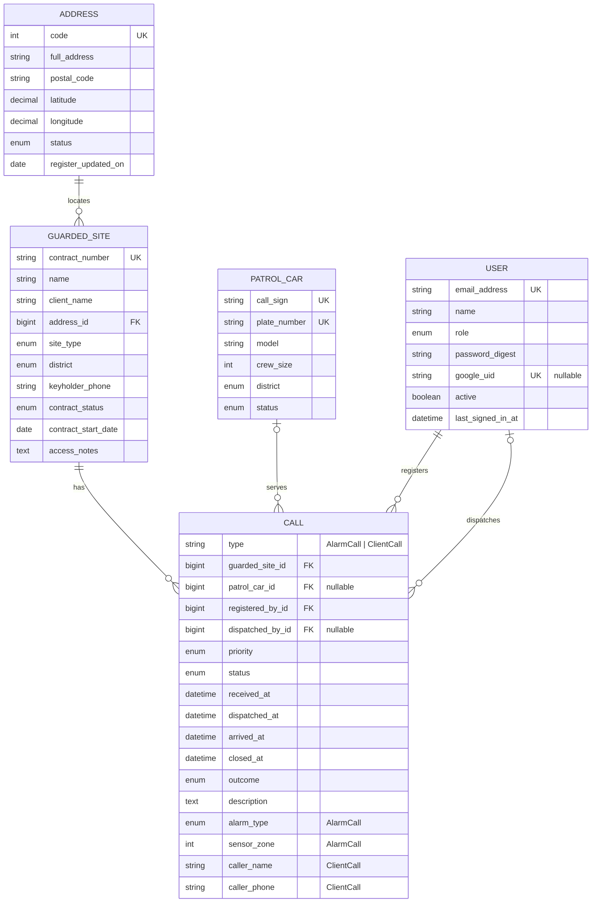
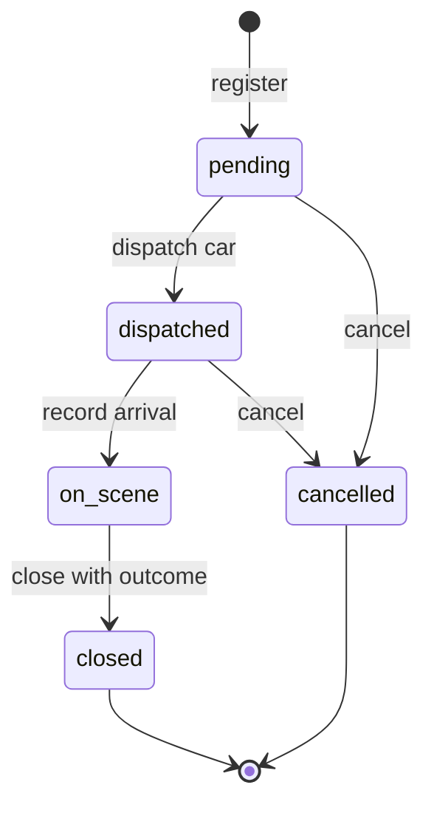

# Patrol Car Call Management System — Specification

## 1. Subject area

### 1.1 Overview

A private security company runs a monitoring centre that operates around the clock. Its clients include households, shops, offices and warehouses. Each client has an alarm system connected to the centre under a monitoring contract. Calls reach the centre in two ways:

- the **alarm system** at the site sends a signal: intrusion sensor, fire detector, panic button, tampering or power failure;
- a **client phones** the centre, for example to ask for a check of the premises.

The dispatcher registers the call and sends a free **patrol car** to the site. The crew reports its arrival, checks the premises and reports the result. The dispatcher then closes the call with an outcome, which ranges from a false alarm to a confirmed intrusion.

### 1.2 Problem

The dispatcher needs the following information on one screen:

- which calls are still waiting;
- which call has waited the longest;
- which cars are free;
- where the sites of the waiting calls are.

Management needs to know how fast crews reach the sites and which sites keep producing false alarms. The system keeps the register of sites, cars and calls, takes site addresses from the national address register, shows sites and active calls on a map, supports the whole life of a call from registration to closing, and calculates these figures.

### 1.3 Users

- **Dispatcher (monitoring centre operator)** — Registers calls, dispatches cars, records arrival and outcome, maintains the lists of sites and cars
- **Shift supervisor** — Reviews statistics and deletes outdated call records
- **Administrator** — Manages users and loads updates of the address register with a command (ADD-09)

Every user signs in (3.8). The administrator creates the accounts and gives each a role (BR-14); there is no self-registration.

### 1.4 Out of scope

- Automatic reception of signals from alarm panels. The dispatcher enters every call manually.
- GPS tracking of cars and route planning. The map shows sites and calls only.
- Billing and contract fees.
- SMS, e-mail or phone notifications.
- Self-registration and password reset by e-mail. The administrator creates accounts and sets passwords.

### 1.5 Platform

Web application built with Ruby on Rails, Hotwire and PostgreSQL. The map is drawn with the MapLibre GL library from the system's own copy of OpenStreetMap data. Sign-in is built on the Rails authentication generator, with ALTCHA on the password form and sign-in with Google. The system runs on one server: the application, PostgreSQL and the proxy run in Docker containers deployed with Kamal, and the proxy serves HTTPS with a Let's Encrypt certificate. Demo data uses real addresses of public buildings from the address register together with fictitious client names and phone numbers; the repository and the demo database contain no real client data.

### 1.6 External data

- **State Address Register** open data, published daily by the State Land Service of Latvia on data.gov.lv (dataset `varis-atvertie-dati`, licence CC BY 4.0). The system uses the file of building and land addresses `aw_eka.csv`: UTF-8 with a byte order mark, comma-separated, every value in quotes. The file is downloaded when the system is set up and is never stored in the repository.
- **OpenStreetMap data for Latvia**: the extract `latvia-latest.osm.pbf` from Geofabrik, updated daily, licence ODbL. The system keeps its own copy and never calls public OpenStreetMap servers:
  - **map** — one vector tile file (PMTiles) built from the extract and served with the application; MapLibre GL draws it in the browser;
  - **place search** — a Nominatim service loaded with the same extract (Docker image `mediagis/nominatim`), used to find emergency services near a site (FLT-08). The administrator of the machine sets its address.
- **Google sign-in** (OAuth 2.0): the application is registered in Google Cloud. Its client secret is kept only in the encrypted Rails credentials; the key that opens them is never in the repository.
- **ALTCHA**: an open-source check against bots that runs in the browser and on the application's own server, without an external service.
- Every page with a map shows "© OpenStreetMap contributors"; every page with an address search shows the State Address Register as the source.

---

## 2. Objects and attributes

### 2.1 Classes

- `GuardedSite` — Premises under a monitoring contract. Own attributes: 10.
- `PatrolCar` — Patrol car with its crew. Own attributes: 6.
- `Address` — Building or land address from the State Address Register. Own attributes: 7.
- `User` — Person who signs in and works with the system. Own attributes: 7.
- `Call` — **Abstract** base for any call to the centre. Own attributes: 12.
  - `AlarmCall` — Call raised by the site's alarm system, **inherits** `Call`. Own attributes: 2.
  - `ClientCall` — Call made by the client by phone, **inherits** `Call`. Own attributes: 2.

Together: 5 object types stored in 5 database tables, 7 classes and 46 attributes, not counting `id`, `created_at` and `updated_at`. The technical `sessions` table of the sign-in is not a subject-area object. `AlarmCall` and `ClientCall` share the `calls` table: Rails single-table inheritance stores the class name in a `type` column.

### 2.2 `GuardedSite` — guarded premises

Examples are synthetic.

- `contract_number` — string, required. Unique regardless of letter case. Format `C-` followed by 5 digits. Example: `C-00042`.
- `name` — string, required. 2–100 characters. Example: `Warehouse No. 3`.
- `client_name` — string, required. 2–100 characters. Example: `Example Trade Ltd`.
- `address` — reference → `Address`, required. Chosen from the register by search (FLT-07). Only an address with status `existing` can be chosen (BR-11).
- `site_type` — enum `SiteType`, required. See 2.7. Example: `warehouse`.
- `district` — enum `District`, required. See 2.7. Example: `north`.
- `keyholder_phone` — string, required. `+` followed by 8–15 digits. Example: `+37100000001`.
- `contract_status` — enum `ContractStatus`, required. Default `active`. Example: `active`.
- `contract_start_date` — date, required. Must be a real calendar date. Example: `01.03.2026`.
- `access_notes` — text, optional. Up to 500 characters. Example: `Key box at the gate`.

### 2.3 `PatrolCar` — patrol car

Examples are synthetic.

- `call_sign` — string, required. Unique. 1–3 capital letters, a hyphen, then 1–3 digits. Example: `P-12`.
- `plate_number` — string, required. Unique. 2–10 characters: capital Latin letters, digits and hyphens. Stored in upper case. Example: `ZZ-0001`.
- `model` — string, required. 2–50 characters. Example: `Skoda Octavia`.
- `crew_size` — integer, required. 1–4. Example: `2`.
- `district` — enum `District`, required. Home district of the car. Example: `centre`.
- `status` — enum `CarStatus`, required. Default `available`. Only call operations set `dispatched` and `on_scene` (BR-5). Example: `available`.

### 2.4 `Address` — address from the State Address Register

Records are loaded from the register file (ADD-09) and are not edited by users. The register column is given in brackets. Examples are the first record of the register file.

- `code` — integer, required. Unique. Register code of the address, 9 digits (`KODS`). Example: `101000034`.
- `full_address` — string, required. Full address as written by the register (`STD`). Example: `"Riņņi", Vecates pag., Valmieras nov., LV-4211`.
- `postal_code` — string, optional. Format `LV-` followed by 4 digits (`ATRIB`). Example: `LV-4211`.
- `latitude` — decimal, required. Degrees, 6 decimal places, 55.6–58.1 (`DD_N`). Example: `57.769418`.
- `longitude` — decimal, required. Degrees, 6 decimal places, 20.9–28.3 (`DD_E`). Example: `25.156929`.
- `status` — enum `AddressStatus`, required. See 2.7 (`STATUSS`). Example: `existing`.
- `register_updated_on` — date, required. Last change of the record in the register (`DAT_MOD`, format `yyyy.mm.dd`). Example: `30.06.2021`.

### 2.5 `User` — person who works with the system

The administrator creates the accounts (BR-15). Examples are synthetic.

- `email_address` — string, required. Unique; stored in lower case. Must look like an e-mail address. Example: `dispatcher@example.com`.
- `name` — string, required. 2–100 characters. Example: `Demo Dispatcher`.
- `role` — enum `Role`, required. Default `dispatcher`. See 2.7. Example: `dispatcher`.
- `password` — string, stored only as a hash. 12–72 characters. Needed for sign-in with a password (AUTH-01).
- `google_uid` — string, optional. Unique. Identifier of the Google account, stored at the first sign-in with Google (BR-15).
- `active` — boolean, required. Default `true`. An inactive user cannot sign in (BR-13). Example: `true`.
- `last_signed_in_at` — datetime, optional. Filled automatically at every sign-in.

`Session` — a technical record of one signed-in browser, created at sign-in and deleted at sign-out.

### 2.6 `Call` (abstract) and its subclasses

Common attributes of `Call`:

- `guarded_site` — reference → `GuardedSite`, required. The site's contract must be `active` when the call is registered (BR-1).
- `patrol_car` — reference → `PatrolCar`, optional. Set when a car is dispatched.
- `priority` — enum `Priority`, required. The default depends on the subclass (BR-2). The dispatcher may change it.
- `status` — enum `CallStatus`, required. Default `pending`. Changes only through the operations in 2.10.
- `received_at` — datetime, required. Default is the current time. Cannot be in the future.
- `dispatched_at` — datetime, optional. Filled automatically. Not earlier than `received_at`.
- `arrived_at` — datetime, optional. Filled automatically. Not earlier than `dispatched_at`.
- `closed_at` — datetime, optional. Filled automatically when the call is closed or cancelled. Not earlier than `received_at`.
- `outcome` — enum `Outcome`. Required when the status becomes `closed`; empty otherwise.
- `description` — text, optional. Up to 1000 characters.
- `registered_by` — reference → `User`, required. Filled automatically with the signed-in user when the call is registered.
- `dispatched_by` — reference → `User`, optional. Filled automatically with the signed-in user at dispatch.

`AlarmCall` — call raised by the site's alarm system:

- `alarm_type` — enum `AlarmType`, required. See 2.7.
- `sensor_zone` — integer, required. 1–99. Zone number on the alarm panel.

`ClientCall` — call made by the client by phone:

- `caller_name` — string, required. 2–100 characters.
- `caller_phone` — string, required. Same format as `keyholder_phone`.

An object of the base class `Call` cannot be created. Every call is either an `AlarmCall` or a `ClientCall`.

### 2.7 Enumerations

- **`SiteType`** — apartment, house, office, shop, warehouse
- **`District`** — centre, north, south, east, west
- **`ContractStatus`** — active, suspended
- **`CarStatus`** — available, dispatched, on_scene, out_of_service
- **`Priority`** — low, normal, high, critical (the last value is the most urgent)
- **`CallStatus`** — pending, dispatched, on_scene, closed, cancelled
- **`AlarmType`** — intrusion, fire, panic, tamper, power_failure
- **`Outcome`** — false_alarm, intrusion_confirmed, fire_confirmed, technical_fault, other
- **`AddressStatus`** — existing, deleted, erroneous (register values `EKS`, `DEL`, `ERR`)
- **`Role`** — dispatcher, supervisor, administrator

### 2.8 Relationships

- `Address` — `GuardedSite` (`1 — 0..*`): Every site is at exactly one address. Several sites can share an address, for example shops in one building.
- `GuardedSite` — `Call` (`1 — 0..*`): Every call belongs to exactly one site. The site keeps its call history.
- `PatrolCar` — `Call` (`0..1 — 0..*`): A call is served by at most one car. A car serves many calls over time, but at most one active call at a time (BR-4).
- `GuardedSite` — `PatrolCar` (`* — *` through `Call`): Which cars have visited a site, and which sites a car has visited.
- `User` — `Call` as the registering user (`1 — 0..*`): Every call records who registered it.
- `User` — `Call` as the dispatching user (`0..1 — 0..*`): A dispatched call records who dispatched the car.
- `Call` ◁— `AlarmCall`, `ClientCall` (inheritance): The subclasses share the common attributes and add their own.
- `GuardedSite.district` ~ `PatrolCar.district` (logical, no foreign key): When dispatching, free cars from the site's district are listed first.

### 2.9 Business rules

- **BR-1** — A call can be registered only for a site whose contract is `active`
- **BR-2** — Default priority. For an `AlarmCall`: panic or fire → critical, intrusion → high, tamper → normal, power_failure → low. For a `ClientCall`: normal
- **BR-3** — Only a car with status `available` can be dispatched
- **BR-4** — A car has at most one active call at a time. A call is active while its status is `pending`, `dispatched` or `on_scene`
- **BR-5** — The car's status follows its call: dispatch → `dispatched`, arrival → `on_scene`, close or cancel → `available`
- **BR-6** — A car can be put `out_of_service` only when it has no active call
- **BR-7** — Closed and cancelled calls are read-only. They can be deleted but not edited
- **BR-8** — Active calls are never deleted. They must be closed or cancelled first
- **BR-9** — A site or car that has calls cannot be deleted. The contract can be suspended or the car put out of service instead
- **BR-10** — Times are stored in UTC and displayed in Riga local time as `DD.MM.YYYY HH:MM`
- **BR-11** — Only an address with status `existing` can be chosen for a site
- **BR-12** — A register update never removes an address that a site uses. If the register marks it `deleted` or `erroneous`, the site keeps it and the site page shows a warning
- **BR-13** — Every page and every API request needs a signed-in, active user. Only the sign-in page is open to everyone
- **BR-14** — Rights by role. A **dispatcher** works with calls (register, edit, dispatch, arrival, close, cancel) and maintains sites and cars. A **supervisor** can also delete calls (DEL-05 … DEL-08). An **administrator** can also manage users (USR-01 … USR-03) and load the address register (ADD-09). Every signed-in user can see all lists, pages, the map and the statistics
- **BR-15** — There is no self-registration. Sign-in with Google succeeds only for an existing active user whose e-mail address equals the verified Google address; the first such sign-in stores `google_uid`
- **BR-16** — The password form needs a solved ALTCHA check; the server verifies the solution before it checks the password. More than 10 sign-in attempts from one address within 3 minutes are refused
- **BR-17** — A user who registered or dispatched calls cannot be deleted. The administrator makes the user inactive instead

### 2.10 Life of a call

**Response time** is `arrived_at − received_at`: how long the client waited until the crew arrived.

---

## 3. Functional requirements: operation → input data → expected result

Rows marked _(neg)_ or _(boundary)_ describe invalid or boundary input.

### 3.1 Add

- **ADD-01** Add a guarded site
  - Input data: `contract_number`, `name`, `client_name`, `address` (chosen from the register, FLT-07), `site_type`, `district`, `keyholder_phone`, `contract_start_date`, `access_notes` (optional). `contract_status` defaults to active
  - Expected result: The site is saved. Its page opens with the message "Site created", and the site appears in the site list
- **ADD-02** Add a site _(neg)_
  - Input data: The contract number already exists in any letter case, the name is empty, the phone is `12345`, or no address is chosen from the register
  - Expected result: Nothing is saved. The form is shown again with the entered values kept and an error message next to each wrong field
- **ADD-03** Add a patrol car
  - Input data: `call_sign`, `plate_number`, `model`, `crew_size`, `district`
  - Expected result: The car is saved with status `available` and appears in the car list and in the free-cars panel of the board
- **ADD-04** Add a car _(boundary)_
  - Input data: `crew_size` = 0 / 1 / 4 / 5
  - Expected result: 1 and 4 are accepted. 0 and 5 are rejected with the message "must be between 1 and 4"
- **ADD-05** Register an alarm call
  - Input data: Site (active contract), `alarm_type`, `sensor_zone`, `received_at` (default: now), `description` (optional)
  - Expected result: The call is saved with status `pending` and a priority set by BR-2 (e.g. panic → critical). It appears on the active-calls board of every open dispatcher screen without a page reload
- **ADD-06** Register an alarm call _(boundary)_
  - Input data: `sensor_zone` = 0 / 1 / 99 / 100; `received_at` = now + 1 minute
  - Expected result: Zones 1 and 99 are accepted. Zones 0 and 100 and a time in the future are rejected with a message
- **ADD-07** Register a client call
  - Input data: Site (active contract), `caller_name`, `caller_phone`, `priority` (default normal), `description`
  - Expected result: The call is saved with status `pending` and the chosen priority, and it appears on the board
- **ADD-08** Register a call for a suspended site _(neg)_
  - Input data: A site whose contract is `suspended`
  - Expected result: Rejected with the message "Contract C-00042 is suspended — call cannot be registered". Nothing is saved (BR-1)
- **ADD-09** Load the address register
  - Input data: A command run by the administrator with the register file `aw_eka.csv` and a city (default Riga)
  - Expected result: Addresses of the city are created or updated by `code`, and their status follows the register. The command prints "N added, M updated, K marked deleted or erroneous, S skipped". Addresses used by sites are never removed (BR-12). A second run with the same file reports 0 added and 0 updated
- **ADD-10** Load the address register _(neg / boundary)_
  - Input data: A file without a required column; a row without coordinates
  - Expected result: A missing column stops the load before any change, and the message lists the missing columns. A row without coordinates for a new address is skipped and counted in S. For an address already loaded, only its status follows the register: the register drops the coordinates of deleted and erroneous addresses, and BR-12 needs the new status

### 3.2 Delete

- **DEL-01** Delete a site without calls
  - Input data: Site + confirmation
  - Expected result: The site is deleted, the message "Site deleted" is shown, and the site is gone from the list
- **DEL-02** Delete a site that has calls _(neg)_
  - Input data: Site with N calls
  - Expected result: Refused with the message "Site has N calls and cannot be deleted; suspend the contract instead". Nothing is deleted (BR-9)
- **DEL-03** Delete a car without calls
  - Input data: Car + confirmation
  - Expected result: The car is deleted and is gone from the list and the board
- **DEL-04** Delete a car that has calls _(neg)_
  - Input data: Car with calls
  - Expected result: Refused with a suggestion to put the car out of service. Nothing is deleted (BR-9)
- **DEL-05** Delete one finished call
  - Input data: Call in status `closed` or `cancelled` + confirmation
  - Expected result: The call is deleted. Its site and car remain
- **DEL-06** Delete an active call _(neg)_
  - Input data: Call in status `pending`, `dispatched` or `on_scene`
  - Expected result: Refused with the message "Active call cannot be deleted; cancel or close it first" (BR-8)
- **DEL-07** **Delete calls by criteria** (clean-up of old records)
  - Input data: "Received before" date D (required, today or earlier); statuses `closed` and/or `cancelled` (at least one); call type (optional); outcome (optional)
  - Expected result: Step 1: a preview shows "N calls match". Step 2: after confirmation exactly those N calls are deleted and the message "N calls deleted" is shown. Active calls are never deleted, even if they match the date
- **DEL-08** Delete by criteria _(neg / boundary)_
  - Input data: D is tomorrow; no status is chosen; nothing matches
  - Expected result: A future date or a missing status is rejected with a message. When nothing matches, the message "No calls match" is shown and nothing is deleted

### 3.3 Update

- **UPD-01** Edit a site
  - Input data: Changed attributes
  - Expected result: The changes are saved. The same checks apply as in ADD-01/02
- **UPD-02** Suspend a contract
  - Input data: `contract_status` = suspended
  - Expected result: The change is saved. New calls for the site are refused (ADD-08). Active calls already in progress continue
- **UPD-03** Edit a car
  - Input data: Changed attributes
  - Expected result: The changes are saved. The same checks apply as in ADD-03/04
- **UPD-04** Put a car out of service
  - Input data: `status` = out_of_service
  - Expected result: Allowed only if the car has no active call. Otherwise it is refused with a reference to that call (BR-6). The car leaves the free-cars panel
- **UPD-05** Edit call details
  - Input data: `priority`, `description`, and the subclass attributes (`alarm_type`, `sensor_zone` / `caller_name`, `caller_phone`)
  - Expected result: Allowed while the call is active. For a closed or cancelled call, editing is refused (BR-7)
- **UPD-06** **Dispatch a car**
  - Input data: Call in status `pending`, and a car chosen from the list of available cars (cars from the site's district come first)
  - Expected result: The call becomes `dispatched`, `dispatched_at` = now and the car is set. The car becomes `dispatched`. Both changes are saved together (STO-02), and the board updates without a reload
- **UPD-07** Dispatch a car that is not free _(neg)_
  - Input data: The car is `dispatched`, `on_scene` or `out_of_service`, or another dispatcher took it a moment earlier
  - Expected result: Refused with the message "Car P-12 is not available". The call stays `pending` and nothing changes (BR-3, BR-4)
- **UPD-08** Record arrival
  - Input data: Call in status `dispatched`
  - Expected result: The call becomes `on_scene` and `arrived_at` = now. The car becomes `on_scene`. The response time is shown
- **UPD-09** Close a call
  - Input data: Call in status `on_scene`, `outcome` (required), closing note (optional, added to `description`)
  - Expected result: The call becomes `closed` and `closed_at` = now. The car becomes `available`. Without an outcome, closing is refused
- **UPD-10** Cancel a call
  - Input data: Call in status `pending` or `dispatched`, reason (optional)
  - Expected result: The call becomes `cancelled` and `closed_at` = now. If a car was dispatched, it becomes `available`
- **UPD-11** Wrong order of steps _(neg)_
  - Input data: For example, closing a `pending` call or recording arrival for a `cancelled` call
  - Expected result: Refused with a message that lists the actions allowed in the current status. Nothing changes

### 3.4 Filter, search, sort

- **FLT-01** **Filter calls** (7 criteria)
  - Input data: Any combination of: status, priority, call type, district of the site, period (from–to, by `received_at`), site, car
  - Expected result: The table shows only the calls that match all the chosen criteria, together with the number found. The statistics (3.7) are calculated for the same calls. The filter is kept in the page address, so it survives a reload
- **FLT-02** Filter by period _(boundary)_
  - Input data: from = to (one day); from is later than to
  - Expected result: For one day, all calls of that day from 00:00 to 23:59 Riga time are included. If from is later than to, the message "Period start is after period end" is shown and the list is not filtered
- **FLT-03** Filter with no matches
  - Input data: Criteria that no call matches
  - Expected result: An empty table with the message "No calls match the filter" and a link that resets the filter
- **FLT-04** Search sites by text
  - Input data: Text of at least 2 characters
  - Expected result: Sites whose contract number, name, client or address contains the text, regardless of letter case and Latvian diacritics. For a shorter text, the hint "Enter at least 2 characters" is shown
- **FLT-05** Filter sites
  - Input data: `site_type`, `district`, `contract_status`, combinable with FLT-04
  - Expected result: Only matching sites are listed, together with their count
- **FLT-06** Filter cars
  - Input data: `status`, `district`
  - Expected result: Only matching cars are listed
- **FLT-07** Search addresses in the register
  - Input data: Text of at least 3 characters
  - Expected result: Up to 10 addresses with status `existing` whose street and house (the part of the full address before the first comma, so not the city or the postal code) contain every word of the text, regardless of letter case and Latvian diacritics (`brivibas 1` finds `Brīvības iela 1`). An address where a word is a whole word of the street and house comes first (`kalpaka 1` lists `Kalpaka bulvāris 1` before `Kalpaka bulvāris 10`); then the order is by full address, `214` before `214A`. For a shorter text, the hint "Enter at least 3 characters" is shown
- **FLT-08** Nearby emergency services
  - Input data: A site, on the call page or the site page
  - Expected result: Up to 3 police stations, 3 fire stations and 3 hospitals within 10 km of the site, each with name, address and straight-line distance in km with one decimal, nearest first
- **FLT-09** Nearby services not available _(neg)_
  - Input data: The place search does not answer within 5 seconds, or finds nothing
  - Expected result: The message "Nearby services are not available now" or "None within 10 km". The rest of the page works as usual
- **SRT-01** **Sort calls** (4 criteria)
  - Input data: Column: received time (default, newest first), priority (critical first), status, site name. Direction: ascending or descending
  - Expected result: The table is re-ordered. Equal values are ordered by received time, newest first. Sorting combines with the active filter
- **SRT-02** Sort sites
  - Input data: Name, contract number, contract start date
  - Expected result: The table is re-ordered, and the order combines with the search and filter
- **SRT-03** Sort cars
  - Input data: Call sign, status
  - Expected result: The table is re-ordered

### 3.5 Store

- **STO-01** Keep data
  - Input data: Any successful add, update or delete
  - Expected result: The change is written to PostgreSQL immediately. It is visible after a page reload and after the application restarts
- **STO-02** Change a call and its car together
  - Input data: Dispatch, arrival, close or cancel
  - Expected result: The call and the car change together or not at all. If saving fails, both stay as they were and an error message is shown
- **STO-03** Two dispatchers take the same car _(neg)_
  - Input data: Two dispatchers send the same car to two different calls at the same moment
  - Expected result: The first dispatch succeeds. The second is refused as in UPD-07. A car is never on two active calls
- **STO-04** Database refuses invalid records
  - Input data: A duplicate contract number, call sign or plate, or a call without a site, stored without going through the forms
  - Expected result: The database refuses the record (unique indexes, required columns, foreign keys). The application shows an error, and no partial record remains
- **STO-05** Load demo data
  - Input data: Seed command
  - Expected result: The database is filled with sites at real addresses of public buildings from the register, with fictitious client names and phones, synthetic cars and calls, and three demo users, one per role, with `example.com` addresses. The seed command prints their passwords. No real client data

### 3.6 Display

- **DSP-01** Several objects as a table
  - Input data: Menu: Sites / Patrol cars / Calls, and Users for the administrator
  - Expected result: A table with the main attributes in each row. Enum values are shown in plain words, times in Riga local time
- **DSP-02** One object
  - Input data: Click on a table row
  - Expected result: **Site:** all attributes, a small map with its location, its call history as a table, the number of calls, and a warning when the register marks its address deleted or erroneous (BR-12). **Car:** all attributes, its current call, and its recent calls. **Call:** all attributes; the timeline received → dispatched → arrived → closed with the time between steps; who registered the call and who dispatched the car; links to the site and the car; nearby emergency services (FLT-08)
- **DSP-03** Active-calls board (home page)
  - Input data: Open the application
  - Expected result: Calls in status `pending`, `dispatched` or `on_scene`, ordered by priority (critical first) and then by waiting time (longest first), with the waiting time of each call. Next to them, a panel shows every car and its status. Every open screen updates without a reload when any dispatcher changes a call or a car
- **DSP-04** Hints and messages
  - Input data: Any form or action
  - Expected result: Every field has a label and a hint with an example of the format. Every action ends with a confirmation or an error message
- **DSP-05** Map of sites and calls
  - Input data: Menu: Map
  - Expected result: A map of Riga with a marker for every site with an active contract. A site with an active call is marked in the colour of the call's priority. Clicking a marker shows the site name, its address and its active call with a link. The OpenStreetMap attribution is shown

### 3.7 Calculations

- **CALC-01** Calls by status and by outcome
  - Input data: Period (default: the current month) and optionally the FLT-01 filters
  - Expected result: The number of calls in each status and each outcome, plus the total
- **CALC-02** Average response time
  - Input data: Period and filters
  - Expected result: The average of `arrived_at − received_at` over calls with an arrival in the period, in minutes with one decimal. Shown overall, per priority and per car. With no arrivals in the period, "—" is shown, not an error
- **CALC-03** Share of false alarms
  - Input data: Period
  - Expected result: Closed calls with outcome `false_alarm` ÷ all closed calls × 100 %, with one decimal. With no closed calls, "—" is shown
- **CALC-04** Sites with the most false alarms
  - Input data: Period, N (default 5)
  - Expected result: The N sites with the most `false_alarm` outcomes in the period. Sites with equal counts are ordered by name

### 3.8 Sign-in and users

- **AUTH-01** Sign in with a password
  - Input data: `email_address`, `password`, the solved ALTCHA check
  - Expected result: The board opens. `last_signed_in_at` is set
- **AUTH-02** Sign in with a password _(neg)_
  - Input data: A wrong password, an unknown address, an inactive user, or no ALTCHA solution
  - Expected result: A wrong password, an unknown address and an inactive user all get the same message "Try another email address or password." A missing or wrong ALTCHA solution gets "Verification failed. Try again." Nobody is signed in
- **AUTH-03** Too many sign-in attempts _(boundary)_
  - Input data: The 10th and the 11th attempt from one address within 3 minutes
  - Expected result: The 10th attempt is checked as usual. The 11th is refused with "Try again later." (BR-16)
- **AUTH-04** Sign in with Google
  - Input data: The Google account of an existing active user
  - Expected result: The board opens. At the first sign-in `google_uid` is stored (BR-15)
- **AUTH-05** Sign in with Google _(neg)_
  - Input data: A Google account whose address belongs to no active user
  - Expected result: Refused with "No account for this address. Ask the administrator." No user is created
- **AUTH-06** Sign out
  - Input data: _Sign out_ in the menu
  - Expected result: The session ends and the sign-in page opens. Any other page now leads to the sign-in page
- **AUTH-07** Action not allowed for the role _(neg)_
  - Input data: A dispatcher tries to delete calls by criteria or to open the users page
  - Expected result: Refused with "Not allowed for your role". Nothing changes (BR-14)
- **USR-01** Create a user
  - Input data: `email_address`, `name`, `role`, `password` (administrator only)
  - Expected result: The user is saved and can sign in
- **USR-02** Change the role or deactivate a user
  - Input data: A new `role`, or `active` = false
  - Expected result: The change is saved. An inactive user's sessions end and further sign-in is refused (BR-13)
- **USR-03** Delete a user _(neg)_
  - Input data: A user who registered or dispatched calls
  - Expected result: Refused with a suggestion to deactivate the user instead. Nothing is deleted (BR-17)

---

## 4. Web interface, API and data storage

### 4.1 Dynamic elements

A dynamic element is a part of the page that changes in the browser in response to a user action or to new data, without loading a new page.

- **DYN-01** Live active-calls board
  - Event → change on the page: Any dispatcher registers, dispatches, closes or cancels a call → the row appears, changes or disappears on every open screen
  - Related requirement: DSP-03, ADD-05
- **DYN-02** Live cars panel
  - Event → change on the page: A car changes status → its status label changes, and the car enters or leaves the list of free cars on every open screen
  - Related requirement: DSP-03, UPD-06
- **DYN-03** Waiting-time counters
  - Event → change on the page: Once a minute → the waiting time of every active call on the board is recalculated in the browser, without a request to the server
  - Related requirement: DSP-03
- **DYN-04** Call form that follows the call type
  - Event → change on the page: Choosing _alarm_ or _client_ → only the fields of that type are shown. Choosing an alarm type → the priority field takes the BR-2 default
  - Related requirement: ADD-05, ADD-07, BR-2
- **DYN-05** Site search while typing
  - Event → change on the page: Typing 2 or more characters → the site list is filtered without pressing a button. Fewer characters → the hint from FLT-04
  - Related requirement: FLT-04
- **DYN-06** Filtering and sorting of calls in place
  - Event → change on the page: Changing a filter or clicking a column header → only the table and the count are reloaded, and the page address is updated
  - Related requirement: FLT-01, SRT-01
- **DYN-07** Dispatch dialog
  - Event → change on the page: Clicking _Dispatch_ → a dialog lists the free cars, the site's district first. After the choice the dialog closes and the call row changes
  - Related requirement: UPD-06, UPD-07
- **DYN-08** Preview of deletion by criteria
  - Event → change on the page: Changing any criterion → the number "N calls match" is recalculated before the confirmation
  - Related requirement: DEL-07
- **DYN-09** Field checks while typing
  - Event → change on the page: Leaving a field with a wrong format → a message appears next to the field before the form is sent. The server still checks everything
  - Related requirement: DSP-04, ADD-02
- **DYN-10** Animation of a new critical call
  - Event → change on the page: A call with priority `critical` appears on the board → its row is highlighted by a short CSS animation
  - Related requirement: DSP-03, BR-2
- **DYN-11** Address suggestions while typing
  - Event → change on the page: Typing 3 or more characters in the address field → up to 10 suggestions appear under the field. Choosing one fills the address and shows the point on a small map
  - Related requirement: FLT-07, ADD-01
- **DYN-12** Live map
  - Event → change on the page: A call is registered, dispatched, closed or cancelled → the colour of its site's marker changes on every open map
  - Related requirement: DSP-05, DYN-01
- **DYN-13** Nearby services loaded in place
  - Event → change on the page: The call page opens at once → the list of nearby emergency services fills its section when the place search answers. A slow answer never delays the page
  - Related requirement: FLT-08, FLT-09
- **DYN-14** ALTCHA check on the sign-in form
  - Event → change on the page: The sign-in form opens → the browser solves the check and shows a mark; the _Sign in_ button waits for the solution
  - Related requirement: AUTH-01, BR-16

Technique: Turbo Streams over a WebSocket for DYN-01, DYN-02, DYN-10 and DYN-12; Turbo Frames for DYN-05 … DYN-08, DYN-11 and DYN-13; Stimulus controllers for DYN-03, DYN-04, DYN-09 and for the MapLibre GL maps; the ALTCHA web component for DYN-14.

### 4.2 REST API

Base path `/api/v1`, JSON in and out. The API applies the same checks and business rules as the pages (2.2–2.9). A site is returned together with its address and coordinates. Every request needs a signed-in user (BR-13); without one the answer is `401`.

- **API-01** `GET /api/v1/sites`, `/api/v1/patrol_cars`, `/api/v1/calls`
  - Input data: The filter and sort parameters of FLT-01, FLT-04 … FLT-06 and SRT-01 … SRT-03
  - Expected result: `200` and a JSON list together with the number of records found
- **API-02** `GET /api/v1/{resource}/{id}`
  - Input data: id
  - Expected result: `200` and the object. `404` when it does not exist
- **API-03** `POST /api/v1/sites`, `/api/v1/patrol_cars`, `/api/v1/calls`
  - Input data: The attributes of ADD-01, ADD-03, ADD-05 or ADD-07
  - Expected result: `201` and the created object. `422` with an error for each wrong field and the same messages as the forms (ADD-02, ADD-08)
- **API-04** `PATCH /api/v1/{resource}/{id}`
  - Input data: Changed attributes
  - Expected result: `200` and the changed object. `422` for wrong data or for a closed or cancelled call (BR-7)
- **API-05** `DELETE /api/v1/{resource}/{id}`
  - Input data: id
  - Expected result: `204`. `422` with the reason when BR-8 or BR-9 forbids the deletion
- **API-06** `POST /api/v1/calls/{id}/dispatch`, `/arrival`, `/close`, `/cancel`
  - Input data: `patrol_car_id` for dispatch, `outcome` for close, an optional reason for cancel
  - Expected result: `200` and the call in its new status. `409` when the car is not available (UPD-07, STO-03). `422` for a wrong order of steps (UPD-11)
- **API-07** `GET /api/v1/statistics`
  - Input data: Period and the FLT-01 filters
  - Expected result: `200` and the results of CALC-01 … CALC-04. A value shown as "—" on the page is `null`
- **API-08** A change made through the API
  - Input data: Any successful API-03 … API-06
  - Expected result: Every open board is updated exactly as after a change on the pages (DYN-01, DYN-02)
- **API-09** `GET /api/v1/addresses?q=`
  - Input data: Search text, as in FLT-07
  - Expected result: `200` and up to 10 addresses with code, full address, postal code and coordinates. `422` when the text is shorter than 3 characters
- **API-10** `GET /api/v1/sites/{id}/nearby_services`
  - Input data: Site id
  - Expected result: `200` and the lists of FLT-08 by kind. `503` when the place search does not answer (FLT-09). `404` when the site does not exist

### 4.3 Look and stylesheets

**Page frame**

- Every page has a header with the system name, the sign-in page included. A signed-in user also sees the menu (DSP-01), their name and role, and _Sign out_.
- In a window narrower than 48 rem (768 px) the menu opens from a _Menu_ button. At a width of 360 px no page scrolls sideways.
- Text is 16 px in the system font of the device; no web fonts are downloaded. Times and counts use digits of equal width.

**Forms** (DSP-04)

- One column. The label stands above its field, the hint with an example of the format between the label and the field. An optional field says "(optional)" in its label.
- A field is as wide as its expected content: names, e-mail addresses, passwords and searches up to 40 characters; phone numbers 18; codes such as the contract number, the call sign or the sensor zone as wide as their format.
- A wrong field shows its message above the field and a red border; the form starts with a list of all errors, each linked to its field.
- Fields and form buttons are 44 px high, buttons in tables 36 px (WCAG 2.2, 2.5.8 asks for at least 24 px).

**Labels and the board** (DSP-03)

- A priority is a filled rectangle with the priority in words; the status of a call or a car is a rounded outline with the status in words. Colour is never the only sign (WCAG 2.2, 1.4.1).
- A board row holds the priority, the site with its contract number and address, the call type with the sensor zone or the caller, the status, the car, the waiting time with the time received, and the next action: _Dispatch_, _Arrived_ or _Close_. Rows of `critical` calls have a light red background. The cars panel stands to the right of the calls.
- In a window narrower than 48 rem every call is a card in the same order, followed by the cars.

**Colours.** Text has a contrast of at least 4.5:1 against its background, borders of fields and buttons at least 3:1 (WCAG 2.2, 1.4.3 and 1.4.11). A spec computes every pair from the Sass colour variables.

- Text `#1F2328` on white: 15.80:1; on the page ground `#F6F8FA`: 14.84:1
- Hints and secondary text `#59636E` on white: 6.11:1; on the page ground: 5.74:1; on a `critical` row `#FFEBE9`: 5.33:1
- Header `#1C2B39`: the system name in white 14.44:1, menu links `#D1D9E0` 10.12:1
- Links and main buttons `#0B5CAD`: on white 6.67:1; white text on the button 6.67:1
- Borders of fields and buttons `#6E7781` on white: 4.55:1
- Error messages `#B60205` on white: 7.00:1; alert message on `#FFEBE9`: 6.10:1; notice `#116329` on `#DAFBE1`: 6.64:1
- Priority `critical`: white on `#B60205`, 7.00:1; `high`: white on `#9A6700`, 4.87:1; `normal`: `#0550AE` on `#DDF4FF`, 6.68:1; `low`: `#116329` on `#DAFBE1`, 6.64:1
- Status on white: `pending` `#24292F` on `#EAEEF2`, 12.57:1; `dispatched` `#0550AE`, 7.59:1; `on_scene` `#6639BA`, 7.34:1; `available` `#116329`, 7.39:1; `out_of_service` `#59636E` with a dashed outline, 6.11:1

**Stylesheets**

- **Pre-processor: Sass, SCSS syntax.** Variables for the colours of priorities and statuses; mixins for the status labels; nesting; one partial file per page group (board, forms, tables) joined in one main file.
- **Post-processor: PostCSS** with Autoprefixer (browser prefixes) and minification of the result.
- The compiled CSS is a build result and is not stored in the repository.

### 4.4 Data storage

- **PostgreSQL** holds addresses, sites, cars, calls and users (2.8).
- **Own copy of OpenStreetMap data**: the PMTiles file and the Nominatim database are built from the Geofabrik extract when the system is set up and are updated from it. Neither is stored in the repository. Tests use recorded answers of the place search and need no running Nominatim.
- **Call event log** in a NoSQL document database: one document for each change of a call (status before and after, time, car, note). The log is read-only and adds a change history to the call page (DSP-02).

---

## Glossary

- **Monitoring centre** — Round-the-clock room of the security company where dispatchers receive calls
- **Guarded site** — Client premises covered by a monitoring contract
- **Call** — Any request for a patrol: an alarm signal or a client's phone call
- **Dispatch** — Assigning a free patrol car to a call
- **Response time** — Time from receiving the call to the crew's arrival at the site
- **False alarm** — A call where the crew found no intrusion, fire or other threat
- **State Address Register** — The official register of addresses in Latvia, published as open data
- **Nominatim** — Open-source search service over OpenStreetMap data
- **PMTiles** — A single-file archive of map tiles
- **ALTCHA** — An open-source check against bots: the browser solves a small computing task, no external service is involved
- **OAuth 2.0** — The standard way to sign in with an account of another service, here Google
